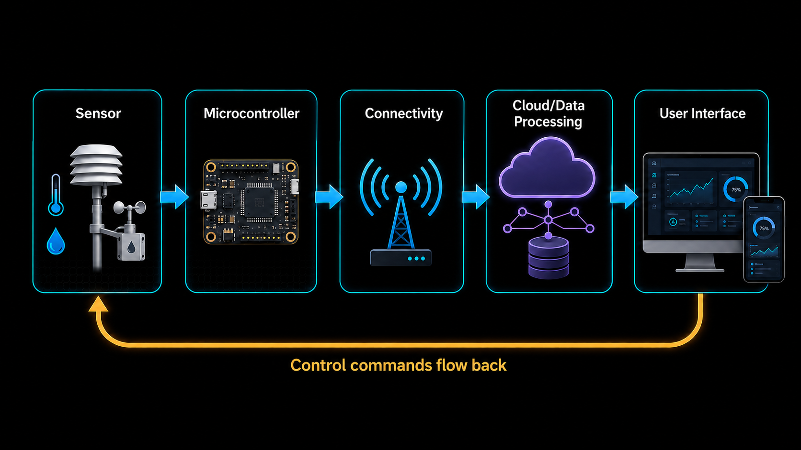

# Introduction to IoT
## What is IoT?
The Internet of Things (IoT) refers to the network of physical objects or "things" that are embedded with sensors, software, and other technologies to connect and exchange data with other devices and systems over the internet. These "things" can include a wide range of devices such as smart home appliances, wearable fitness trackers, industrial machinery, and even vehicles.

## Key Components of IoT
An IoT system is built from a small set of layers that work together to turn a physical measurement into a useful action or insight:

1. **Devices/Sensors**: These are the physical objects that collect data from the environment. They can be anything from temperature sensors, motion detectors, to smart thermostats.
2. **Microcontroller/Processor**: This is the brain of the IoT device, responsible for processing the data collected by the sensors. It can be a simple microcontroller or a more powerful processor depending on the complexity of the device.
3. **Connectivity**: This refers to the communication protocols and networks that allow devices to connect and exchange data. Common *network-level* options include Wi-Fi, Bluetooth/BLE, Zigbee, LoRa, and cellular (4G/5G, NB-IoT). Sitting on top of these, *application-level* protocols such as MQTT, CoAP, and HTTP define how the actual data messages are formatted and exchanged — MQTT in particular is widely used in IoT because it's lightweight and suited to low-power devices.
4. **Data Processing**: Once the data is collected, it needs to be processed and analyzed. This can be done locally on the device (edge computing) or in the cloud.
5. **User Interface**: This is how users interact with the IoT system, which can be through mobile apps, web interfaces, or voice commands.

### Example: Smart Thermostat Walkthrough
- **Sensor** reads the current room temperature.
- **Microcontroller** compares it against the target temperature set by the user.
- **Connectivity** (e.g. Wi-Fi + MQTT) sends the reading to the cloud and receives any new settings.
- **Data Processing** in the cloud logs the history and can trigger alerts (e.g. "furnace not responding").
- **User Interface** (mobile app) displays the current temperature and lets the user adjust the target.

## What is an Embedded System?
An embedded system is a specialised computing system that is designed to perform dedicated functions or tasks within a larger system. Key characteristics include:

- **Composition**: Typically consists of a microcontroller or microprocessor, memory, input/output interfaces, and software tailored to the specific application.
- **Where they're found**: A wide range of devices, from household appliances and automotive systems to industrial machinery and medical equipment.
- **Defining traits**: Real-time operation, reliability, and efficiency in performing specific tasks (as opposed to general-purpose computing).

## What is a Microcontroller?
A microcontroller is a compact integrated circuit designed to govern a specific operation in an embedded system.

- **Composition**: Combines a processor core, memory, and programmable input/output peripherals on a single chip.
- **Function**: Allows the device to read sensor data, make decisions, and control actuators without needing separate external components.
- **Why they matter for IoT**: Because they are small, low-cost, and low-power, microcontrollers are the "brain" behind most IoT devices, such as the Arduino boards used in this course.

## Applications of IoT
1. **Smart Homes**: IoT devices can automate and control home appliances, lighting, security systems, and more, providing convenience and energy efficiency.
2. **Healthcare**: IoT can be used for remote patient monitoring, fitness tracking, and managing chronic diseases.
3. **Industrial IoT (IIoT)**: In manufacturing and industrial settings, IoT can optimize operations, monitor equipment health, and improve safety.
4. **Agriculture**: IoT can help farmers monitor soil conditions, weather, and crop health to improve yields and reduce waste.
5. **Transportation**: IoT can be used for fleet management, traffic monitoring, and improving vehicle safety.
6. **Smart Cities**: IoT can enhance urban living by improving traffic management, waste management, and energy efficiency.
## Challenges of IoT
1. **Security**: With the increasing number of connected devices, security is a major concern. IoT devices can be vulnerable to hacking and data breaches.
2. **Privacy**: The collection of large amounts of data by IoT devices raises concerns about user privacy and data protection.
3. **Interoperability**: With a wide variety of devices and protocols, ensuring that different IoT devices can work together can be challenging.
4. **Scalability**: As the number of IoT devices grows, managing and scaling the infrastructure to support them can be difficult.
5. **Power Consumption**: Many IoT devices are battery-powered, and managing power consumption is crucial for their longevity and functionality.

## Glossary
- **IoT (Internet of Things)**: Network of physical devices that collect and exchange data over the internet.
- **Embedded System**: A dedicated computing system built to perform specific functions within a larger device.
- **Microcontroller (MCU)**: A single-chip computer combining a processor, memory, and I/O peripherals, used to control embedded/IoT devices.
- **Edge Computing**: Processing data locally on or near the device rather than sending it to the cloud.
- **IIoT (Industrial IoT)**: Application of IoT technologies in manufacturing and industrial settings.
- **MQTT/CoAP**: Lightweight application-layer messaging protocols commonly used for IoT communication.

