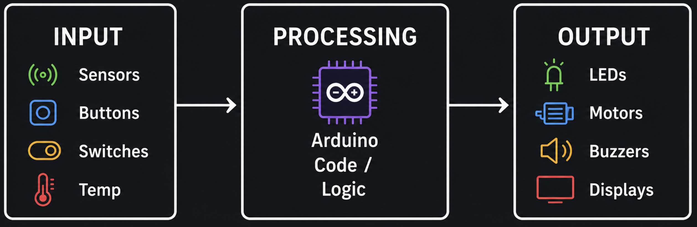
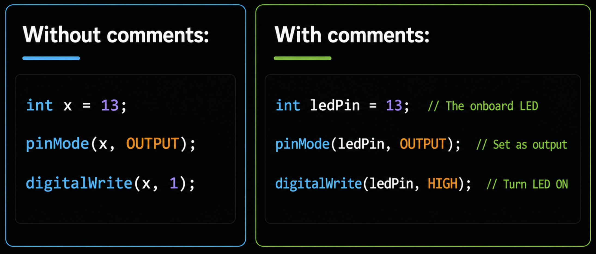

# Week 1 - Introduction to IoT Programming

## Introduction

### The IoT Programming Workflow
Every IoT program follows the same three-step pattern:




| Step | What it means | Example |
|------|--------------|---------|
| **Input** | The device reads data from the environment | A temperature sensor sends a reading |
| **Process** | The program makes a decision or calculation | If temperature > 30, set alert = true |
| **Output** | The device acts on the result | Turn on the red LED or buzzer |

This pattern applies to every IoT project from a simple blinking LED to a smart home system.


---


### Variables and Data Types
A **variable** is a named container that stores a value in your program's memory. You can think of it like a labeled box the label is the variable's name, and the contents are its value.

### Declaring Variables

In the Arduino programming language (C/C++)  used across most microcontroller boards, including ESP32, ESP8266, and STM32 you declare a variable by specifying its **type**, **name**, and optionally an **initial value**.

**Syntax:**

```
dataType variableName = value;
```

**Example:**

```cpp
int temperature = 25;       // a box labeled "temperature" holding the number 25
String name = "sensor";     // a box labeled "name" holding the text "sensor"
```


- **Type** :— what kind of data it holds (int for whole numbers, float for decimals, String for text, bool for true/false)
- **Name** :— how you refer to it in code
- **Value** :— the data stored inside, which can change during the program

**Example:**
```cpp
int ledPin = 13;       // declare and assign
ledPin = 7;            // change (vary) its value later
```
That's why it's called a "variable"  its value can vary over time as your program runs.


### Data Types

A **data type** tells the program what kind of value a variable will hold. Choosing the right type matters because microcontrollers have limited memory  using the smallest type that fits your data keeps your program efficient.

> **Note:** Exact sizes depend on the board. The table below shows values for **AVR boards (Uno/Nano)**. On **ESP32/ESP8266/STM32**, `int` is 4 bytes (same range as `long`) and `double` is a true 8-byte double with more precision than `float`  always check your board if memory or precision is tight.

| Type | Size (AVR) | Range (AVR) | Best for | Example |
|------|------|-------|----------|---------|
| `int` | 2 bytes | -32,768 to 32,767 | Most whole numbers | `int count = 10;` |
| `long` | 4 bytes | -2,147,483,648 to 2,147,483,647 | Very large numbers, timestamps | `long big = 99999;` |
| `float` | 4 bytes | ±3.4e-38 to ±3.4e+38 | Decimal numbers | `float temp = 22.5;` |
| `double` | 4 bytes | Same as float on AVR (8 bytes, more precise, on ESP32/ARM) | Decimal numbers | `double x = 3.14;` |
| `char` | 1 byte | -128 to 127 (used to hold ASCII character codes 0–127) | Single characters | `char letter = 'A';` |
| `String` | varies | Any text | Words and sentences | `String s = "Hi";` |
| `bool` | 1 byte | `true` or `false` | On/off, yes/no states | `bool on = true;` |
| `byte` | 1 byte | 0 to 255 | Small positive numbers, pin values | `byte b = 255;` |


**Examples:**

```cpp
int age = 17;                // whole number
float temperature = 23.5;   // decimal number
String name = "Ali";         // text
bool isOn = true;            // true or false
char grade = 'A';            // single character
```

**Declaring without assigning a value (assign later):**

```cpp
int score;          // declared but no value yet
score = 95;         // assigned a value later
```

**Declaring multiple variables of the same type:**

```cpp
int x = 1, y = 2, z = 3;
```

### Variable Naming Rules

When naming variables, you must follow these rules:


| Rule | Valid | Invalid |
|------|-------|---------|
| Must start with a letter or underscore | `sensor`, `_count` | `1pin`, `9value` |
| Can only contain letters, numbers, and underscores | `led_pin`, `temp2` | `my-var`, `room temp` |
| Cannot use reserved words | `myInt`, `ledState` | `int`, `void`, `if`, `return` |
| Names are case-sensitive | `myVar` ≠ `myvar` ≠ `MYVAR` | — |

**Best practices (not required but make your code easier to read):**

- Use **camelCase** for variable names: `ledPin`, `roomTemperature`, `buttonPressed`
- Use **UPPER_CASE** for constants: `MAX_SPEED`, `LED_PIN`
- Choose **descriptive names** that explain what the variable stores

**Good vs Bad examples:**

```cpp
// ✓ GOOD names (clear, descriptive)
int ledPin = 13;
float roomTemperature = 22.5;
bool doorIsOpen = false;
int buttonCount = 0;
float sensorVoltage = 3.3;

// ✗ BAD names (avoid these)
int x = 13;           // What is x? Not descriptive
int a1b2 = 22;        // Not readable at all
int 1pin = 13;        // ERROR: Cannot start with a number
int my var = 5;       // ERROR: Cannot have spaces
int float = 10;       // ERROR: "float" is a reserved word
```

### Variable Scope

**Scope** determines where in your code a variable can be accessed. In C/C++, any microcontroller program written with the Arduino framework has two main scopes:

| Scope | Declared | Accessible | Lifetime |
|-------|----------|------------|----------|
| **Global** | Outside all functions (top of file) | Everywhere in the program | Entire program runtime |
| **Local** | Inside a function or block `{ }` | Only inside that function/block | Destroyed when the function/block ends |

**Basic example:**

```cpp
int globalVar = 10;    // Global — accessible EVERYWHERE

void setup() {
    int localVar = 5;  // Local — only accessible INSIDE setup()
    Serial.println(globalVar);  // ✓ Works
    Serial.println(localVar);   // ✓ Works
}

void loop() {
    Serial.println(globalVar);  // ✓ Works (global)
    Serial.println(localVar);   // ✗ ERROR! localVar does not exist here
}
```

**Block scope (inside if, for, while):**

```cpp
void loop() {
    int sensorValue = 13;  // local to loop()

    if (sensorValue > 500) {
        int warning = 1;    // local to this if-block only
        Serial.println(warning);  // ✓ Works
    }

    Serial.println(warning);  // ✗ ERROR! warning does not exist here
}
```

**Why scope matters — a practical example:**

```cpp
int count = 0;  // Global: keeps its value between loop() cycles

void loop() {
    count++;    // increases by 1 each time loop() runs
    Serial.println(count);  // prints 1, 2, 3, 4...

    int temp = 13;  // Local: created fresh every loop() cycle
}
```

> **Tip:** Use **local** variables whenever possible. Only use **global** variables when you need to share data between functions or keep a value between `loop()` cycles.

### Constants (Values that Never Change)

A **constant** is a variable whose value is **locked** once set, it cannot be changed anywhere in the program. 

Use constants for values that should stay fixed, like pin numbers or physical values.

**Why use constants instead of regular variables?**

| | Variable | Constant |
|--|----------|----------|
| Can change value? | Yes | No — locked at declaration |
| Risk of accidental change? | Yes | No — compiler catches it |
| Best for | Values that change (sensor readings, counters) | Fixed values (pin numbers, thresholds) |

**Syntax — use the `const` keyword:**

```cpp
const dataType NAME = value;
```

**Examples:**

```cpp
const int LED_PIN = 13;           // pin number never changes
const int BUTTON_PIN = 2;         // pin number never changes
const int MAX_SPEED = 255;        // PWM maximum value
```

**What happens if you try to change a constant:**

```cpp
const int LED_PIN = 13;
LED_PIN = 12;  // ✗ COMPILE ERROR! Cannot modify a constant
```

**Example - constants vs variables together:**

```cpp
const int SENSOR_PIN = 6;      // constant: pin won't change
const int THRESHOLD = 500;      // constant: limit won't change

int sensorValue = 0;            // variable: reading changes every cycle

void loop() {
    sensorValue = analogRead(SENSOR_PIN);  // variable updates each loop

    if (sensorValue > THRESHOLD) {
        Serial.println("Above threshold!");
    }
}
```

**Another way to define constants — `#define`:**

```cpp
#define LED_PIN 13
#define MAX_SPEED 255
```

> **Note:** 

**Naming convention:** Use **UPPER_CASE** with underscores for constants to visually distinguish them from regular variables.

---

### How to Choose the Right Type

Use this flowchart to pick the smallest data type that fits your value:


### Example: Variables in a Circuit
Open this Wokwi simulation to see variables and data types used in a working circuit:
https://wokwi.com/projects/470387372012322817

---
## Comments

Comments are notes written **for humans** the compiler ignores them completely. They don't affect how your program runs or how much memory it uses.

### Why Use Comments?

Comments help you and others **understand** your code. Without them, even your own code becomes confusing after a few weeks:





### Main reasons to use comments:

| Reason | Example |
|--------|---------|
| Explain **why** something is done | `// Wait 2 sec for sensor to stabilise` |
| Describe your **project** at the top | `// Smart fan that turns on above 30°C` |
| Label **pin connections** | `// Pin 9 → fan motor via transistor` |
| Explain **formulas** | `// TMP36 formula: C = (V - 0.5) * 100` |
| Temporarily **disable** code for testing | `// digitalWrite(LED, HIGH);` |

### Two Types of Comments

#### Single-Line Comment `//`

Everything after `//` on that line is ignored:

```cpp
// This entire line is a comment
int ledPin = 13;   // This part after // is a comment, the code before it still runs
```

#### Multi-Line Comment `/* */`

Everything between `/*` and `*/` is ignored can span many lines:

```cpp
/* This is a
   multi-line comment.
   It can span as many lines as you need.
   Great for longer explanations. */
```

**Comparison:**

| | Single-Line `//` | Multi-Line `/* */` |
|--|---|---|
| **Syntax** | `// comment` | `/* comment */` |
| **Spans multiple lines?** | No - one line only | Yes |
| **Best for** | Short notes next to code | Project headers, long explanations |
| **Can be nested?** | Yes | No — `/* /* */ */` causes an error |

### Using Comments to Disable Code (Commenting Out)

A very useful technique instead of **deleting** code you're not sure about, you "comment it out" to temporarily disable it. The compiler **skips** anything inside a comment, so the code is turned off but still there you can bring it back instantly by removing the comment markers.

**How it works:**

```cpp
// This line runs:
digitalWrite(LED, HIGH);

// This line does NOT run (it's commented out):
// digitalWrite(LED, LOW);
```


### When to use commenting out:

| Situation | What to do |
|-----------|------------|
| **Debugging** :- find which line causes a bug | Comment out lines one by one until the bug disappears |
| **Testing** :- try different approaches | Comment out version A, uncomment version B |
| **Save code for later** | Keep old code as reference while trying something new |

**Debugging example:**

Your LED isn't working. Comment out sections to isolate the problem:

```cpp
void loop() {
    int val = 12;

    // Step 1: Comment out everything, test just the LED
    digitalWrite(LED, HIGH);
    delay(500);
    digitalWrite(LED, LOW);
    delay(500);

    // Step 2: If LED works above, uncomment these one by one to find the bug
    // if (val > 500) {
    //     digitalWrite(LED, HIGH);
    // } else {
    //     digitalWrite(LED, LOW);
    // }
}
```

If the LED blinks in Step 1, the wiring is fine  the bug is in your `if` logic.

> **Tip:** 

In the IDE, you can quickly comment/uncomment selected lines with the shortcut **Ctrl + /** (Windows) or **Cmd + /** (Mac).


### Comment Best Practices

Follow these rules to write comments that are actually **helpful**, not just clutter:

---

**1. Explain WHY, not WHAT:**

The code already shows *what* it does. Your comment should explain *why* it does it:

```cpp
// ✗ BAD — states the obvious (we can already see i + 1)
i = i + 1;  // Add 1 to i

// ✓ GOOD — explains the purpose
i = i + 1;  // Move to next sensor in the array
```

```cpp
// ✗ BAD — repeats the code
delay(2000);  // delay 2000 milliseconds

// ✓ GOOD — explains the reason
delay(2000);  // wait for sensor to stabilise after power-on
```

---

**2. Comment complex formulas:**

If someone can't understand a line just by reading it, add a comment:

```cpp
// ✓ GOOD — you won't remember this formula next week
float celsius = (voltage - 0.5) * 100;  // TMP36 sensor formula: C = (V - 0.5) * 100

// ✓ GOOD — explains a non-obvious calculation
int distance = duration * 0.034 / 2;  // speed of sound = 0.034 cm/μs, divide by 2 for round trip
```

---

**3. Label pin assignments at the top:**

Group all pin definitions together with comments describing the physical wiring:

```cpp
// ✓ GOOD — easy to see wiring at a glance
const int LED_RED   = 3;   // Red LED — RGB module pin 1
const int LED_GREEN = 5;   // Green LED — RGB module pin 2
const int LED_BLUE  = 6;   // Blue LED — RGB module pin 3
const int BUZZER    = 8;   // Piezo buzzer — positive leg
const int TEMP_SENSOR = A0; // TMP36 — middle pin (Vout)
```

---

**4. Use section dividers for long sketches:**

Organise your code into labeled sections so it's easy to navigate:

```cpp
// ===== PIN DEFINITIONS =====
const int LED_PIN = 13;
const int BUTTON_PIN = 2;

// ===== GLOBAL VARIABLES =====
int buttonCount = 0;
bool ledState = false;

// ===== SETUP =====
void setup() { ... }

// ===== MAIN LOOP =====
void loop() { ... }

// ===== HELPER FUNCTIONS =====
void blinkLED() { ... }
void readSensor() { ... }
```

---

**5. Don't over-comment obvious code:**

Too many comments are just as bad as no comments — they create clutter and make code harder to read:

```cpp
// ✗ BAD — every line doesn't need a comment
int x = 5;           // set x to 5
pinMode(13, OUTPUT);  // set pin 13 as output
delay(1000);          // wait 1000 milliseconds

// ✓ GOOD — comment only what adds value
int retryCount = 5;               // max retries before giving up
pinMode(BUZZER_PIN, OUTPUT);
delay(1000);                       // allow sensor warm-up time
```

---

**6. Keep comments up to date:**

When you change code, update the comments too. Wrong comments are worse than no comments:

```cpp
// ✗ BAD — comment says pin 13 but code uses pin 9
int ledPin = 9;  // LED connected to pin 13

// ✓ GOOD — comment matches the code
int ledPin = 9;  // LED connected to pin 9
```

---

**7. Use TODO comments for unfinished work:**

Mark things you plan to fix or add later so you don't forget:

```cpp
// TODO: add error handling for sensor disconnect
float temp = readTemperature();

// TODO: replace delay with millis() for non-blocking timing
delay(1000);
```

---

## Program Structure and Execution

### Program Structure
Every program written with the Arduino framework — regardless of which board it runs on — has exactly two required functions:

```cpp
void setup() {
  // Runs ONCE when the board powers on or resets
  // Used to configure pins, start Serial, initialise components
}

void loop() {
  // Runs REPEATEDLY after setup() finishes
  // Contains the main program logic
}
```

A sketch (Arduino's term for a program file) is built from four parts, always in this order:

1. **Library includes** (`#include`) — optional
2. **Global variable declarations** — optional but common
3. **`setup()`** — required, runs once
4. **`loop()`** — required, runs forever


#### `setup()` 

- Called exactly **once**, right after the board powers on or is reset (e.g. pressing the reset button, opening the Serial Monitor, or re-uploading code).
- This is where you do **one-time configuration**:
  - `pinMode()` — declare each pin as `INPUT` or `OUTPUT`
  - `Serial.begin()` — open the serial connection
  - Initialising sensor/library objects (e.g. `dht.begin()`, `servo.attach()`)
  - Setting starting values for variables 
- Takes no parameters — `()` is empty because the framework calls it with nothing.

#### `loop()` in detail

- Called **repeatedly**, forever, immediately after `setup()` finishes.
- Each pass through `loop()` is one "cycle" of your program — this is effectively the `PROCESS` and `OUTPUT` stages from the Input → Process → Output pattern above.
- There's no way to "exit" `loop()` and go back to `setup()` — the only way `setup()` runs again is a physical reset or re-upload.
- Because it runs continuously, anything with `delay()` inside blocks the *entire* board — no other code runs during that pause.

#### Where variables and includes fit

- `#include` statements must come **before** they're used, so by convention they go at the very top of the file.
- Global variables (declared outside `setup()`/`loop()`) are visible in **both** functions — that's why a pin number declared at the top can be used in `setup()` for `pinMode()` and reused anywhere in `loop()`. Variables declared *inside* `setup()` or `loop()` are local and disappear once that function call ends (though `setup()`'s locals only matter once, and `loop()`'s locals are recreated every cycle).

#### Common mistakes

- Forgetting `void` or misspelling `setup`/`loop` (e.g. `Setup()`) — the compiler won't find the required functions and errors out.
- Putting `pinMode()` in `loop()` instead of `setup()` — it still works, but wastefully reconfigures the pin thousands of times per second.
- Doing one-time work (like printing a start-up banner) inside `loop()` — it'll print repeatedly instead of once.

### The Serial Monitor
The Serial Monitor is a tool in the Arduino IDE that lets you send and receive text between your board and your computer. It is useful for testing and debugging.

```cpp
Serial.begin(115200);       // Start serial communication (in setup) — pick a baud rate and use it consistently
Serial.println("Hello!");   // Print a line of text
Serial.print(temperature);  // Print a value without a new line
```

> **Note:** The baud rate is up to you, as long as the Serial Monitor is set to the same value. `9600` is a common default on Uno/Nano-family boards; `115200` is common on ESP32/ESP8266 and other faster boards.

---


### Example: Device Start-Up Message and LED Blink

This program prints a start-up message to the Serial Monitor and blinks the built-in LED to confirm the device is running.


```cpp
int ledPin = LED_BUILTIN;   // LED_BUILTIN automatically maps to the correct pin for your specific board
String deviceName = "IoT-Device-01";

void setup() {
  Serial.begin(115200);                    // Start serial communication (match this to your Serial Monitor's baud rate)
  pinMode(ledPin, OUTPUT);                 // Set LED pin as output

  Serial.println("=== Device Starting ===");
  Serial.print("Device name: ");
  Serial.println(deviceName);
  Serial.println("Status: ONLINE");
  Serial.println("=======================");
}

void loop() {
  digitalWrite(ledPin, HIGH);              // LED on
  Serial.println("LED: ON");
  delay(1000);

  digitalWrite(ledPin, LOW);              // LED off
  Serial.println("LED: OFF");
  delay(1000);
}
```

### Code Walkthrough

| Line | Explanation |
|------|-------------|
| `int ledPin = LED_BUILTIN;` | Declares a variable holding the board's built-in LED pin number |
| `String deviceName = "IoT-Device-01";` | Declares a String variable for the device name |
| `Serial.begin(115200)` | Opens a serial connection at 115200 bits per second — must match the Serial Monitor's baud rate |
| `pinMode(ledPin, OUTPUT)` | Configures the built-in LED pin as an output |
| `Serial.print()` | Prints text without a new line at the end |
| `Serial.println()` | Prints text and moves to a new line |
| `void loop()` | Everything inside runs continuously |


## Guided Build: Step by Step

Open this Wokwi simulation https://wokwi.com/projects/470517127243328513

Build the same program step by step. 

### Step 1 - Declare your variables
```cpp
int ledPin = 13;
String deviceName = "MyIoTDevice";
```

### Step 2 - Write the `setup()` function
```cpp
void setup() {
  Serial.begin(115200);
  pinMode(ledPin, OUTPUT);
  Serial.println("Device is starting...");
  Serial.print("Name: ");
  Serial.println(deviceName);
}
```

### Step 3 - Write the `loop()` function
```cpp
void loop() {
  digitalWrite(ledPin, HIGH);
  Serial.println("ON");
  delay(500);

  digitalWrite(ledPin, LOW);
  Serial.println("OFF");
  delay(500);
}
```

### Step 4 - Upload and open the Serial Monitor

### Questions
- What data type would you use to store a decimal temperature reading?
- What is the difference between `Serial.print()` and `Serial.println()`?
- What happens if you remove `Serial.begin(9600)` from `setup()`?
- What does `void` mean at the start of `setup()` and `loop()`?

**Try it:** Change the `deviceName` variable to your own name and change the blink interval to 250 ms. Upload and observe the result.

---


## Vocabulary
| Term | Definition |
|------|-----------|
| Input → Process → Output | The three-stage pattern every IoT program follows — read data, make a decision, act on the result |
| Variable | A named storage location that holds a value in memory |
| Data type | Specifies what kind of value a variable can hold (e.g., int, float, bool) |
| `int` | Integer — stores whole numbers |
| `long` | Stores whole numbers larger than `int`'s range allows |
| `float` | Floating point — stores decimal numbers |
| `double` | Stores decimal numbers; same precision as `float` on most Arduino boards, more precise on ARM/Xtensa boards |
| `char` | Stores a single character, held internally as an ASCII code |
| `String` | Stores a sequence of characters (text) |
| `bool` | Boolean — stores true or false |
| `byte` | Stores small positive whole numbers, 0 to 255 |
| Reserved word | A word the Arduino language already uses (e.g. `int`, `void`, `if`) that can't be used as a variable name |
| camelCase | Naming style for variables — first word lowercase, each following word capitalised (e.g. `ledPin`) |
| UPPER_CASE | Naming convention for constants, words separated by underscores (e.g. `MAX_SPEED`) |
| Scope | Determines where in the code a variable can be accessed — global or local |
| Global variable | Declared outside all functions; accessible everywhere and keeps its value for the program's entire runtime |
| Local variable | Declared inside a function or block; only accessible there and destroyed once it ends |
| Constant | A variable whose value is locked at declaration and can never be changed |
| `const` | Keyword used to declare a constant (e.g. `const int LED_PIN = 13;`) |
| `#define` | Alternative way to define a constant by text substitution before compiling; not type-checked like `const` |
| Comment | Text in code that is ignored by the compiler, used to explain the code |
| Commenting out | Temporarily disabling a line of code by turning it into a comment, without deleting it |
| `#include` | Imports a library into the program |
| Sketch | Arduino's term for a program file |
| `setup()` | Arduino function that runs once at start-up |
| `loop()` | Arduino function that runs continuously |
| `pinMode()` | Configures a pin as `INPUT` or `OUTPUT`, usually called in `setup()` |
| `digitalWrite()` | Sets a digital pin `HIGH` or `LOW`, e.g. to turn an LED on or off |
| `LED_BUILTIN` | Built-in constant that automatically points to the correct onboard LED pin for your specific board |
| Serial Monitor | Tool in the Arduino IDE for sending/receiving text over USB |
| Baud rate | The speed of serial communication, set with `Serial.begin()` and must match the Serial Monitor's setting |
| Compile | The process of converting code into instructions the microcontroller can execute |
