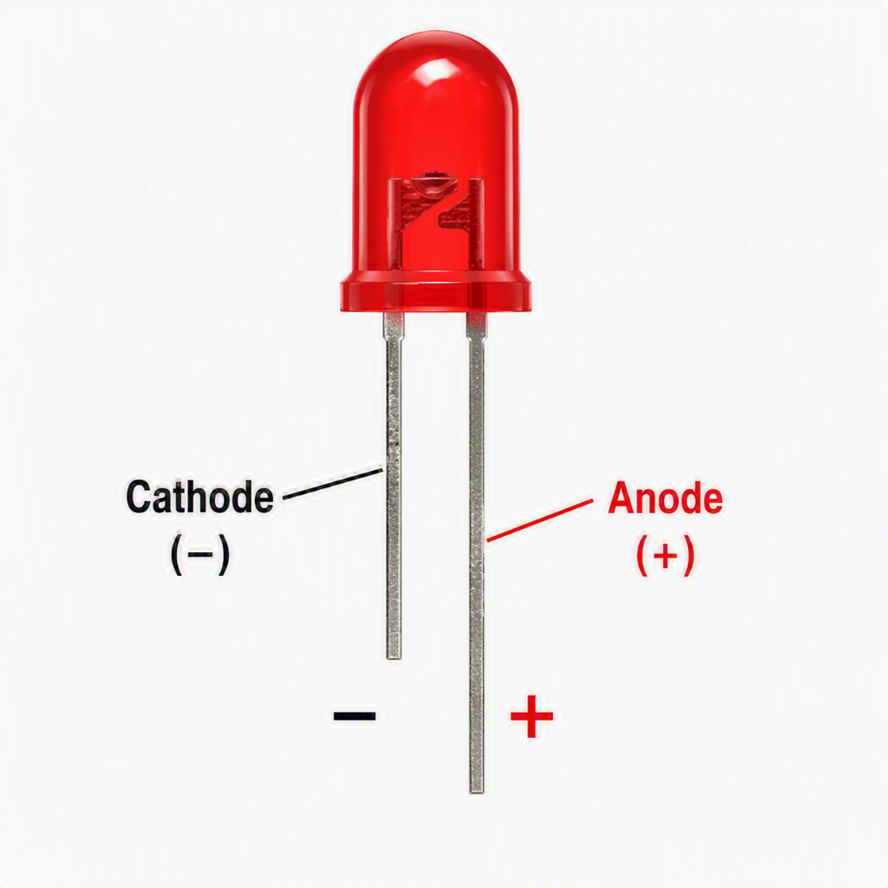
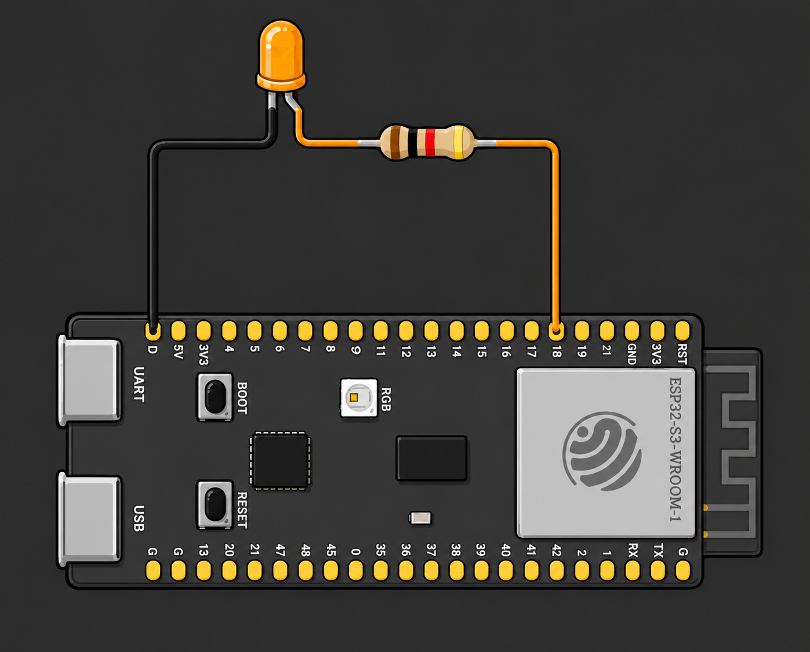
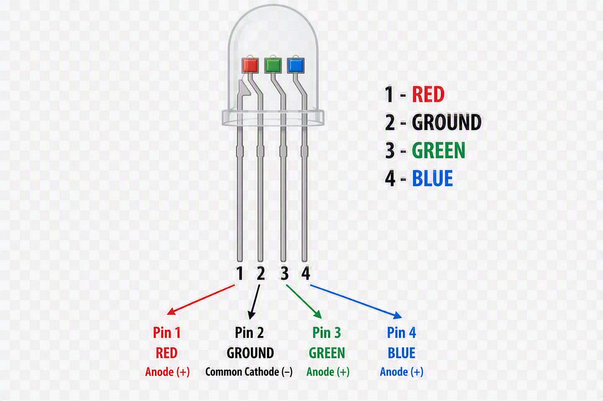
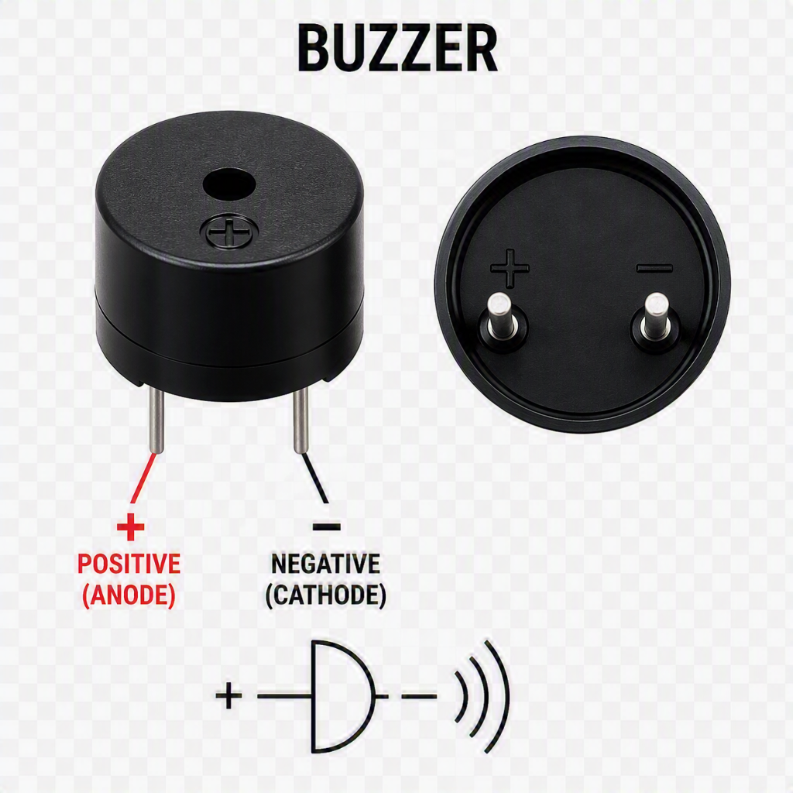
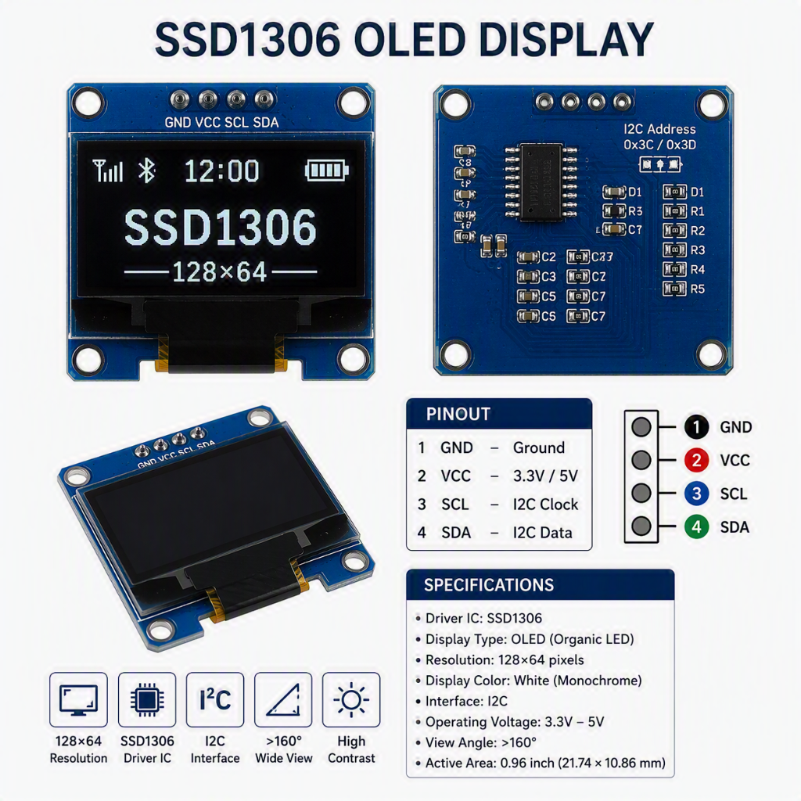

# Digital Output and Function

### What is a Digital Output?
A **digital output** is a signal sent from a microcontroller to an output device. The signal is either **HIGH** (on) or **LOW** (off) — there are only two states, which is why it is called *digital*.

### Common Output Devices
| Device | What it does |
|--------|-------------|
| LED | Emits light when powered |
| RGB LED | Emits red, green, or blue light (or mixed colours) |
| Buzzer | Produces a sound when powered |
| OLED display | Displays text, graphics, and sensor readings; usually controlled using I²C or SPI |


> **Discussion:** What output devices have you seen or used in everyday life that might be controlled by a microcontroller?


## Functions


A **function** is a named, reusable block of code that performs a specific task. Instead of writing the same instructions repeatedly, you group them together, give the function a name, and run the entire block whenever you `call` that name.

You've actually already been using functions without necessarily calling them that. `pinMode(...)`, `digitalWrite(...)`, and `delay(...)` are all functions someone else already wrote the code inside them, and you simply call them to make something happen.

### Why Do We Need Functions?
- **Avoid repetition** :- write the code once, reuse it as many times as needed (this is the "Don't Repeat Yourself" principle)
- **Organisation** :— break a large program into smaller, manageable pieces that each do one clear job
- **Readability** :— a well-named function (e.g. `blinkLED()`) explains what a block of code does without needing to read every line
- **Easier debugging** :— if something goes wrong, you only need to fix the code in one place, not everywhere it was copied


### Types of Functions
- **Built-in (library) functions** — already written for you, provided by the Arduino core or a library. Examples: `pinMode()`, `digitalWrite()`, `delay()`, `tone()`, `Serial.println()`
- **User-defined functions** — functions you write yourself for a specific task in your sketch
  - **`void` functions** — perform an action but don't return a value, e.g. `void blinkLED()`
  - **Value-returning functions** — perform a calculation or check and send a result back, e.g. `int readSensor()`
- **Functions with parameters** — accept input values so the same function can behave differently each time, e.g. `blinkLED(500)` vs `blinkLED(1000)`
- **Functions without parameters** — always perform the exact same fixed task, e.g. `turnOffAllLEDs()`
- **`setup()` and `loop()`** — special functions required in every Arduino sketch. You don't call these yourself; the Arduino core calls `setup()` once automatically, then calls `loop()` repeatedly forever

### Functions Without Parameters
A function without parameters always does exactly the same thing every time it's called — nothing can be passed in to change its behaviour.

**Syntax:**
```cpp
void functionName() {
  // Instructions
}
```

**Example:**
```cpp

int ledPin =13;

void ledOn() {
  digitalWrite(ledPin, HIGH);   
  delay(500);
 
}

void ledOff(){
  digitalWrite(ledPin, LOW);
  delay(500);
}

void setup() {
  pinMode(ledPin, OUTPUT);

}

void loop() {
  ledOn();
  ledOff();
}
```

### Functions With Parameters
A function with parameters accepts input values inside its `()`, so it can behave differently depending on what's passed in when it's called.

**Syntax:**
```cpp

void functionName(parameterType parameterName) {
  // code that uses parameterName
}
```

**Example:**
```cpp
void blinkLED(int pin, int onTime) {
  digitalWrite(pin, HIGH);
  delay(onTime);       // uses whatever value was passed in
  digitalWrite(pin, LOW);
  delay(onTime);
}

void setup() {
  pinMode(13, OUTPUT);
  
}

void loop() {
  blinkLED(13, 200);    // fast blink — 200 ms on/off
  blinkLED(13, 1000);   // slow blink — 1000 ms on/off
}
```

>Open this Wokwi simulation and write the example code : https://wokwi.com/projects/471424435764738049

>Notice `blinkBuiltInLED()` always blinks the same fixed pin at the same fixed speed, while `blinkLED(pin, onTime)` can blink any pin at any speed — that flexibility is what parameters provide.

### Function with a return value
A function with a return value performs a task and sends a result back to the part of the program that called it.
**Syntax**
```cpp
returnType functionName(parameters) {
  // Code to perform a specific task
  return value; // Only required when returning a value
}
```


| Part | Meaning |
|------|---------|
| `returnType` | The type of value the function sends back when it finishes — e.g. `int`, `float`, `bool`. Use `void` if it doesn't send anything back |
| `functionName` | The name used to call the function — should describe what it does, e.g. `blinkLED` |
| `(parameters)` | Values passed into the function to customise what it does — can be empty, e.g. `()` |
| `{ }` | The function **body** — the block of code that runs each time the function is called |
| `return` | Sends a value back to wherever the function was called from (only used in non-`void` functions) |

> Open this Wokwi simulation and write the example code : https://wokwi.com/projects/471203038764774401
>
>
### Example 


```cpp
const int LED_PIN = 2;

// This function turns the LED on or off
// and returns its new state
bool controlLED(bool turnOn) {
  digitalWrite(LED_PIN, turnOn);

  return turnOn;
}

void setup() {
  Serial.begin(115200);
  pinMode(LED_PIN, OUTPUT);
}

void loop() {
  // Turn the LED ON
  bool ledState = controlLED(true);

  Serial.print("LED state: ");
  Serial.println(ledState); // Prints 1 (ON)

  delay(1000);

  // Turn the LED OFF
  ledState = controlLED(false);

  Serial.print("LED state: ");
  Serial.println(ledState); // Prints 0 (OFF)

  delay(1000);
}
```

| Line | Explanation |
|------|-------------|
| `bool controlLED(bool turnOn) {` | **Defines** a function called `controlLED` that takes one parameter, `turnOn`, and returns a `bool` |
| `digitalWrite(LED_PIN, turnOn);` | Inside the function body — sets `LED_PIN` HIGH or LOW depending on the `turnOn` value passed in |
| `return turnOn;` | Sends the value of `turnOn` back to wherever the function was called from, confirming the new state |
| `bool ledState = controlLED(true);` | **Calls** `controlLED`, passing in `true`. The value it returns (`true`) is stored in `ledState` |
| `Serial.println(ledState);` | Prints the returned value (`1` for ON, `0` for OFF) to the Serial Monitor |

Because `turnOn` is a parameter, the same function can turn the LED either on or off — e.g. `controlLED(false)` — without writing a separate function for each state.


---

### GPIO Pins
GPIO stands for **General Purpose Input/Output**. These are the numbered pins on the microcontroller board that you connect your components to. Each pin can be configured as either an **input** (reading a sensor) or an **output** (controlling a device).

### HIGH and LOW Signals
- `HIGH` → The pin outputs **3.3 V** (the ESP32-S3's logic level) → the device turns **ON**
- `LOW` → The pin outputs **0 V** → the device turns **OFF**

### The `delay()` Function
The `delay()` function pauses the program for a specified number of milliseconds.
- `delay(1000)` pauses for **1 second**
- `delay(500)` pauses for **0.5 seconds**

> **Limitation of `delay()`:** While the program is paused, it cannot do anything else — it cannot read a button, update a display, or respond to a sensor. This is called **blocking**.



### What is an LED?
An **LED (Light Emitting Diode)** is a small electronic component that produces light when electric current flows through it. Unlike a regular light bulb, it has no filament to heat up light is produced directly by the movement of electrons inside a semiconductor material, which makes LEDs efficient, long-lasting, and cool to the touch.

**How it works:**
- An LED is a **diode**, meaning current can only flow through it in one direction — from the **anode (+)** to the **cathode (−)**.
- When current flows the correct way, electrons release energy in the form of **light** (this is called electroluminescence).
- If wired backwards, the LED simply will not light up (it won't be damaged).
- A **resistor** is needed in series with the LED to limit the current without one, too much current flows through and the LED burns out almost instantly.

**Real-world examples:**
- Indicator lights on phone chargers, routers, and power strips
- Traffic lights and pedestrian crossing signals
- Car tail lights, indicators, and daytime running lights
- TV and monitor backlighting
- Household LED light bulbs and strip lighting
- Status lights on appliances (e.g., washing machine "done" light)

---


### LED Circuit Diagram
```
ESP32-S3 GPIO18 ──── 220Ω Resistor ──── LED (+) ──── LED (-) ──── GND
```


> The resistor protects the LED from receiving too much current and burning out. A **220 Ω** resistor is a safe choice for a 3.3 V ESP32-S3 with a standard LED.


##  LED Blink 
### Circuit Setup
**Components required:**
- ESP32-S3 development board
- 1 × LED
- 1 × 220 Ω resistor
- Jumper wires
- Breadboard

**Wiring steps:**
1. Insert the LED into the breadboard. The **longer leg** (anode, +) faces the resistor side.
2. Connect the 220 Ω resistor between the LED's anode and the ESP32-S3's **GPIO13**.
3. Connect the LED's **shorter leg** (cathode, −) to the ESP32-S3's **GND** pin.

### Code — LED Blink
```cpp
// Define which pin the LED is connected to
int ledPin = 13;

void setup() {
  // Set pin 13 as an output
  pinMode(ledPin, OUTPUT);
}

void loop() {
  digitalWrite(ledPin, HIGH);   // Turn the LED on
  delay(1000);                  // Wait 1 second
  digitalWrite(ledPin, LOW);    // Turn the LED off
  delay(1000);                  // Wait 1 second
}
```

### Code Walkthrough
| Line | Explanation |
|------|-------------|
| `int ledPin = 13;` | Creates a variable to store the pin number — makes the code easier to change later |
| `void setup()` | Runs once when the Arduino starts up |
| `pinMode(ledPin, OUTPUT)` | Tells the ESP32-S3 that GPIO13 is sending signals out |
| `void loop()` | Runs over and over continuously |
| `digitalWrite(ledPin, HIGH)` | Sends 3.3 V to GPIO13, turning the LED on |
| `delay(1000)` | Pauses for 1000 ms (1 second) |
| `digitalWrite(ledPin, LOW)` | Sends 0 V to GPIO13, turning the LED off |

---


## What is an RGB LED?
An **RGB LED** is essentially three LEDs — **red**, **green**, and **blue** — packaged together in a single component, each with its own leg so it can be controlled independently. By mixing different brightness levels of these three colours, you can produce almost any colour, including white.

**How it works:**
- Inside the package are three separate LED dies (red, green, blue) sharing one common leg — either a **common cathode** (shared −, each colour turns on when its pin is driven HIGH) or a **common anode** (shared +, each colour turns on when its pin is driven LOW).
- Turning colours on/off in combination uses **additive colour mixing** — e.g., red + blue = magenta, red + green + blue = white, all off = no light.
- Using `digitalWrite()` only lets each colour be fully on or fully off, giving 8 possible colours (2×2×2). Using `analogWrite()` (PWM) instead lets each colour be dimmed independently, giving a much wider range of colours.
- Like any LED, each colour channel needs its own current-limiting **resistor** to avoid burning it out.

**Real-world examples:**
- RGB LED strips for home and mood lighting
- Status/notification lights on routers, consoles, and speakers (e.g., colour-coded connection status)
- PC case, keyboard, and mouse RGB lighting
- Smart bulbs that change colour from an app
- Stage and theatre lighting effects
### Example Code
```cpp
const int blueLedpin = 17;
const int greenLedpin = 18;
const int redLedpin = 14;

void setup() {
  // put your setup code here, to run once:
  Serial.begin(115200);
  Serial.println("Hello, ESP32-S3!");
  pinMode(blueLedpin, OUTPUT);
  pinMode(greenLedpin, OUTPUT);
  pinMode(redLedpin, OUTPUT);
}

void loop() {
  
  digitalWrite(blueLedpin, HIGH);
  delay(1000); 
  digitalWrite(blueLedpin, LOW);
  delay(1000); 
  
  digitalWrite(greenLedpin, HIGH);
  delay(1000); 
  digitalWrite(greenLedpin, LOW);
  delay(1000); 

  digitalWrite(redLedpin, HIGH);
  delay(1000); 
  digitalWrite(redLedpin, LOW);
  delay(1000); 


}

```

> Open this Wokwi simulation and write the example code  : https://wokwi.com/projects/471148488746813441
### Code Walkthrough
| Line | Explanation |
|------|-------------|
| `const int blueLedpin = 17;` / `greenLedpin = 18;` / `redLedpin = 14;` | Stores the pin number for each colour channel — `const` because these values never change |
| `Serial.begin(115200);` | Starts serial communication at 115200 baud, so messages can be sent to the Serial Monitor |
| `Serial.println("Hello, ESP32-S3!");` | Sends a one-time startup message to the Serial Monitor to confirm the board is running |
| `pinMode(blueLedpin, OUTPUT)` (×3) | Configures all three colour pins as outputs |
| `void loop()` | Runs over and over continuously |
| `digitalWrite(blueLedpin, HIGH)` / `delay(1000)` | Turns the blue LED on and holds it for 1 second |
| `digitalWrite(blueLedpin, LOW)` / `delay(1000)` | Turns the blue LED off and waits 1 second before moving to the next colour |
| `digitalWrite(greenLedpin, HIGH/LOW)` pair | Repeats the same on/wait/off/wait pattern for green |
| `digitalWrite(redLedpin, HIGH/LOW)` pair | Repeats the same on/wait/off/wait pattern for red, then the loop repeats from blue |

> Note: only one colour pin is ever HIGH at a time in this code, so the colours flash one after another rather than mixing — it does not produce combined colours like magenta or white.

---


## What is a Buzzer?
A **buzzer** is a small electronic component that produces sound when an electric current passes through it. It converts electrical energy into mechanical vibration, and that vibration moves air to create an audible tone.

**How it works:**
- Inside the buzzer is a small diaphragm (a thin disc) that vibrates rapidly to produce sound waves.
- There are two main types:
  - **Active buzzer** — has a built-in oscillator circuit. You just apply a steady HIGH signal (e.g., `digitalWrite(buzzerPin, HIGH)`) and it produces a fixed-pitch tone on its own.
  - **Passive buzzer** — has no built-in oscillator. You must supply the oscillating signal yourself (e.g., using `tone()`), which lets you control the pitch and play different notes/melodies.
- Like an LED, most buzzers have polarity (+ and −) and should be wired the correct way round.

**Real-world examples:**
- Microwave and oven "finished" beep
- Smoke and carbon monoxide detector alarms
- Car seatbelt and reverse-parking warning beeps
- Doorbells
- Keyboard/keypad click feedback (e.g., ATMs, door entry systems)
- Alarm clocks

**Example code — simple beep (passive buzzer):**
```cpp
int buzzerPin = 8;

void setup() {
  pinMode(buzzerPin, OUTPUT);
}

void loop() {
  tone(buzzerPin, 1000);   // Play a 1000 Hz tone (higher pitch)
  delay(500);              // Hold the tone for 0.5 seconds
  tone(buzzerPin, 500);    // Change to a 500 Hz tone (lower pitch)
  delay(1000);             // Hold the tone for 1 second, then repeat
}
```


> `tone(pin, frequency)` makes the buzzer vibrate at a specific frequency (pitch) — higher Hz values produce higher-pitched sounds. `noTone(pin)` stops it. This only works with a **passive** buzzer, since an active buzzer already has its own fixed pitch built in.
>
> Open this Wokwi simulation and write the example code  : https://wokwi.com/projects/471143969108828161

**Code Walkthrough:**
| Line | Explanation |
|------|-------------|
| `int buzzerPin = 8;` | Creates a variable to store the pin number — makes the code easier to change later |
| `void setup()` | Runs once when the Arduino starts up |
| `pinMode(buzzerPin, OUTPUT)` | Tells the Arduino that pin 8 is sending signals out |
| `void loop()` | Runs over and over continuously |
| `tone(buzzerPin, 1000)` | Plays a tone at 1000 Hz — a higher pitch |
| `delay(500)` | Keeps the tone playing for 500 ms (0.5 seconds) |
| `tone(buzzerPin, 500)` | Changes the tone to 500 Hz — a lower pitch |
| `delay(1000)` | Keeps the lower tone playing for 1000 ms (1 second) before the loop repeats |

---



### What is an OLED Display (SSD1306)?
An **OLED (Organic Light-Emitting Diode) display** is a small screen made of pixels that each produce their own light — unlike an LCD, it needs no backlight. The **SSD1306** is the name of the driver chip built into most small, cheap OLED modules (commonly 0.96" screens with a resolution of 128×64 pixels), and it's the chip that actually receives commands and draws pixels to the screen.

**How it works:**
- Each pixel on the display is an individual organic compound that lights up when current passes through it. Pixels can be switched on or off (or dimmed) independently, which is why OLEDs have deep blacks and high contrast — an "off" pixel produces no light at all.
- The Arduino doesn't control each pixel directly. Instead, it sends commands and image data to the **SSD1306 driver chip** over a communication protocol — usually **I²C** (2 wires: SDA and SCL) or sometimes **SPI** (4+ wires, faster).
- The driver chip stores the image data in its own memory and continuously refreshes the screen so the image stays visible.

**What's needed to run it:**
- An OLED module with an SSD1306 chip (check I²C or SPI version, and its resolution, e.g., 128×64)
- Wiring: for I²C — **VCC**, **GND**, **SDA**, **SCL**. On the ESP32-S3, SDA/SCL default to GPIO8/GPIO9 but can be remapped to almost any GPIO pin in code via `Wire.begin(sda, scl)` — unlike an Arduino Uno, where SDA/SCL are hardwired to fixed pins (A4/A5) and can't be reassigned.
  - **SDA (Serial Data)** — carries the actual data bits back and forth between the Arduino and the SSD1306 chip. Only one wire is used for data in both directions, since I²C devices take turns sending.
  - **SCL (Serial Clock)** — carries the clock signal the Arduino generates to keep both devices in sync, so they agree on when to read each bit on SDA. The Arduino is the "master" and always drives this clock.
  - Together, these two wires are what let I²C use just 2 signal lines (instead of 4+ for SPI) to talk to one or even many devices, since each device on the bus is told apart by its unique I²C address (e.g., `0x3C`) rather than a separate wire.
- **Library support** — the Arduino IDE doesn't know how to talk to the SSD1306 out of the box, so two libraries are typically installed via the Library Manager:
  - `Adafruit_SSD1306` — handles low-level communication with the driver chip
  - `Adafruit_GFX` — provides drawing functions (text, shapes, lines) that `Adafruit_SSD1306` relies on
- The display's **I²C address** (commonly `0x3C` or `0x3D`) must be set correctly in code to match the module

**Real-world examples:**
- Status displays on 3D printers and CNC machines
- Small readouts on IoT sensor stations (e.g., showing temperature, humidity)
- Menu/settings screens on synthesizers and audio equipment
- Battery and signal indicators on portable devices

**Example code — display text (128×64 I²C SSD1306):**

```cpp

#include <Wire.h> 
#include <Adafruit_GFX.h> 
#include <Adafruit_SSD1306.h> 

#define SCREEN_WIDTH 128
#define SCREEN_HEIGHT 64
#define SDA_PIN 8 
#define SCL_PIN 9 

// Create an OLED display object using the I2C Wire connection
Adafruit_SSD1306 display(
  SCREEN_WIDTH,   // Screen width
  SCREEN_HEIGHT,  // Screen height
  &Wire           // I2C communication object
);

void setup() {
  
  Wire.begin(SDA_PIN, SCL_PIN); // Start I2C communication using the selected SDA and SCL pins

  // Start the OLED display
  display.begin(
    SSD1306_SWITCHCAPVCC,
    0x3C
  );

  display.clearDisplay(); // Clear anything stored in the display buffer
  display.setTextColor(SSD1306_WHITE); // Set the text colour to white
  display.setTextSize(1);  // Set the text size to the smallest standard size
  
  display.setCursor(0, 0); // Position the cursor at x = 0 and y = 0
  display.print("My name is: "); // Print text without moving to a new line
  display.println("...."); // Enter your name between the quotation marks

  
  display.setCursor(5, 10); // Position the cursor at x = 5 and y = 10
  display.println("Hello IoT!"); // Display a greeting

  
  display.setCursor(10, 20); // Position the cursor at x = 10 and y = 20
  display.println("HI"); // Display another message

  
  display.display(); // Send the display buffer to the physical OLED screen
}

void loop() {
}
```
> `display.println()` only writes to an internal memory buffer — nothing appears on the screen until `display.display()` is called, which sends that buffer to the SSD1306 chip.
>
>  Open this Wokwi simulation and write the example code  :  https://wokwi.com/projects/471146805345898497

**Code Walkthrough:**
| Line | Explanation |
|------|-------------|
| `#include <Wire.h>` | Loads the library that handles I²C communication over SDA/SCL |
| `#include <Adafruit_GFX.h>` | Loads the graphics library that provides drawing functions (text, shapes, lines) |
| `#include <Adafruit_SSD1306.h>` | Loads the driver library that knows how to send commands to the SSD1306 chip |
| `#define SCREEN_WIDTH 128` / `SCREEN_HEIGHT 64` | Sets constants for the display's resolution, used when creating the display object |
| `#define SDA_PIN 8` / `SCL_PIN 9` | Chooses which GPIO pins carry the I²C data and clock lines — remapping pins like this only works on boards such as the ESP32, not a standard Arduino Uno |
| `Adafruit_SSD1306 display(SCREEN_WIDTH, SCREEN_HEIGHT, &Wire);` | Creates a `display` object sized to the screen, using the `Wire` (I²C) interface |
| `Wire.begin(SDA_PIN, SCL_PIN)` | Starts I²C communication on the chosen SDA/SCL pins — must run before `display.begin()` so the display can be reached |
| `display.begin(SSD1306_SWITCHCAPVCC, 0x3C)` | Initializes the display at I²C address `0x3C` and starts its internal charge pump for power |
| `display.clearDisplay()` | Clears the internal buffer so old content doesn't appear behind new content |
| `display.setTextColor(SSD1306_WHITE)` | Sets pixels drawn by text to be lit (white/on) rather than off |
| `display.setTextSize(1)` | Sets the text size multiplier — `1` is the smallest, normal-size font |
| `display.setCursor(0, 0)` | Moves the text cursor to the top-left corner before drawing |
| `display.print("My name is: ")` | Writes text into the buffer without moving to a new line, so the next `print`/`println` continues on the same line |
| `display.println("....")` | Writes text into the buffer and moves the cursor to the start of the next line |
| `display.setCursor(5, 10)` / `display.println("Hello IoT!")` | Repositions the cursor, then writes a second line of text at that position |
| `display.setCursor(10, 20)` / `display.println("HI")` | Repositions the cursor again, then writes a third line of text |
| `display.display()` | Sends the buffer's contents to the SSD1306 chip so everything drawn so far actually appears on screen |
| `void loop()` | Runs over and over, but is left empty here since all three lines of text are static and only need to be drawn once in `setup()` |


## Vocabulary
| Term | Definition |
|------|-----------|
| Function | A named, reusable block of code that performs a specific task |
| Parameter | A value passed into a function so it can behave differently each time it's called |
| Return value | The value a function sends back to the code that called it |
| `void` | Used as a function's return type to show it doesn't send a value back |
| Built-in function | A function already written and provided by the Arduino core or a library, e.g. `pinMode()` |
| User-defined function | A function written by the programmer for a specific task in their own sketch |
| GPIO | General Purpose Input/Output — programmable pins on a microcontroller |
| Digital signal | A signal that is either HIGH (on) or LOW (off) |
| HIGH | A pin voltage of 3.3 V — turns a device on |
| LOW | A pin voltage of 0 V — turns a device off |
| Blocking | Describes code (like `delay()`) that pauses the whole program, so nothing else can run until it finishes |
| `pinMode()` | Function that sets a pin as input or output |
| `digitalWrite()` | Function that sets a pin to HIGH or LOW |
| `delay()` | Function that pauses the program for a set time in milliseconds |
| Resistor | A component that limits the flow of current to protect other components |
| Diode | A component that only allows current to flow in one direction |
| LED | Light Emitting Diode — produces light when current flows through it in the correct direction |
| Electroluminescence | The release of light that happens when current passes through an LED's semiconductor material |
| Anode | The positive (+) leg of an LED — current flows in here |
| Cathode | The negative (−) leg of an LED — current flows out here |
| RGB LED | A component containing three LEDs (red, green, blue) in one package, controlled independently to mix colours |
| Common cathode | An RGB LED wiring type with one shared negative leg — each colour turns on when its pin is driven HIGH |
| Common anode | An RGB LED wiring type with one shared positive leg — each colour turns on when its pin is driven LOW |
| PWM | Pulse Width Modulation — rapidly switching a pin on/off to simulate a variable voltage, used by `analogWrite()` to dim LEDs |
| Buzzer | A component that produces sound by vibrating a diaphragm when current passes through it |
| Active buzzer | A buzzer with a built-in oscillator — produces a fixed-pitch sound directly from a HIGH signal |
| Passive buzzer | A buzzer with no built-in oscillator — needs a signal like `tone()` to produce sound, allowing pitch control |
| `tone()` / `noTone()` | Functions that start and stop a specific frequency (pitch) on a passive buzzer |
| OLED | Organic Light-Emitting Diode display — a screen whose pixels each produce their own light, needing no backlight |
| SSD1306 | The driver chip built into most small OLED modules; receives commands and draws pixels to the screen |
| I²C | Inter-Integrated Circuit — a 2-wire communication protocol (SDA + SCL) used to talk to devices like the SSD1306 |
| SPI | Serial Peripheral Interface — a faster, 4+ wire communication protocol, sometimes used instead of I²C |
| SDA | Serial Data — the I²C wire that carries data between the microcontroller and a device |
| SCL | Serial Clock — the I²C wire that carries the timing signal keeping sender and receiver in sync |
