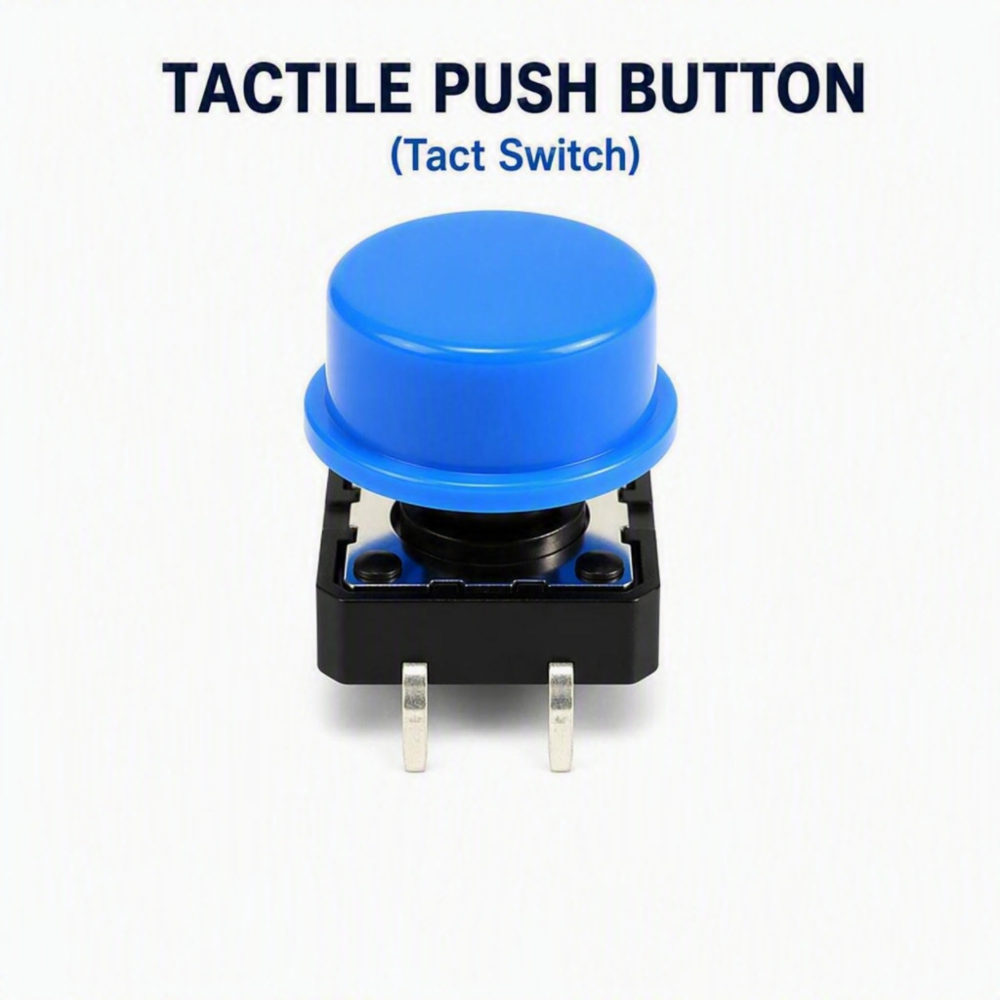
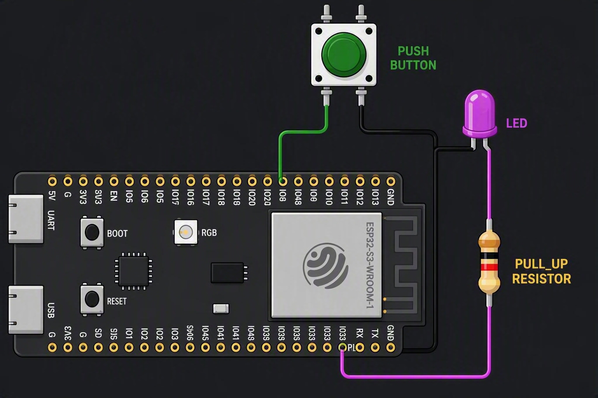
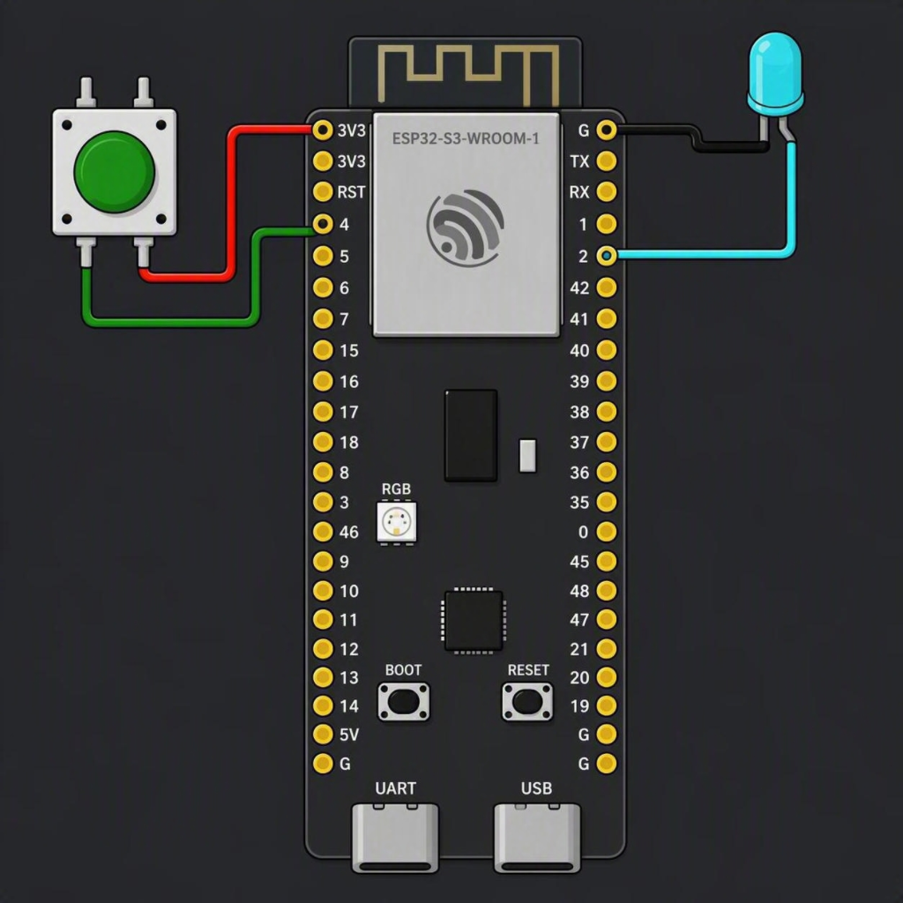
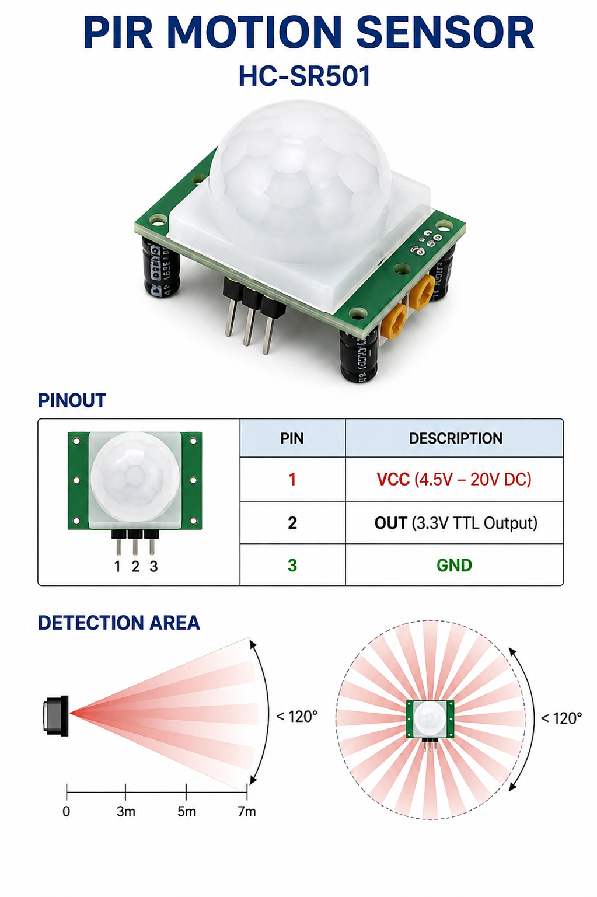
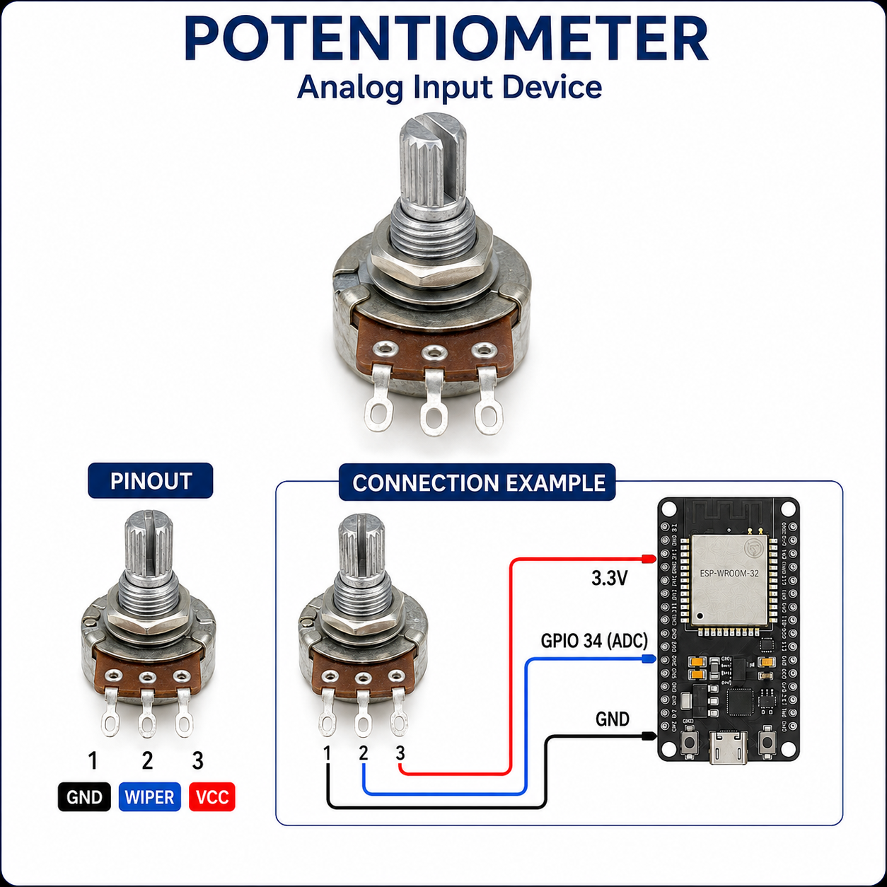
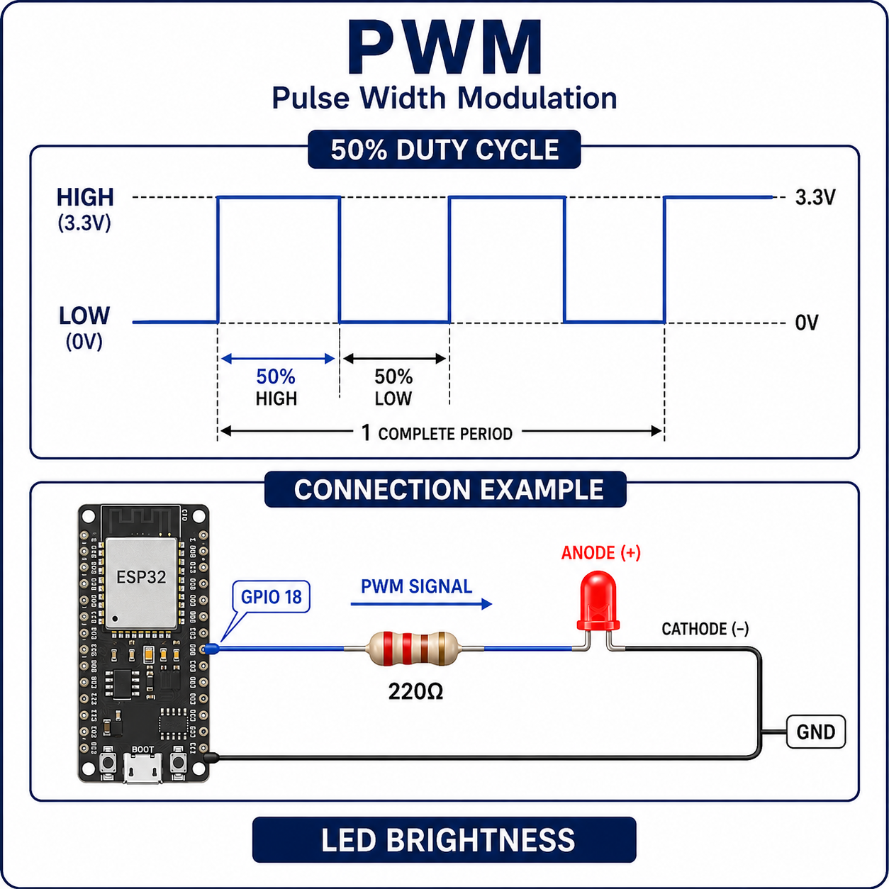
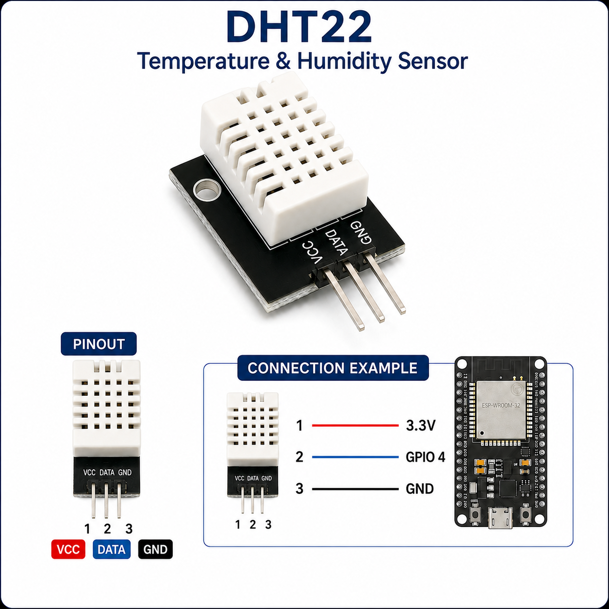

# Weeks 3: Reading Inputs


**Digital input.** A GPIO pin configured as an input reports HIGH or LOW depending on the voltage present, a button press typically pulls the pin to one state, and releasing it returns to the other. Reading an input pin in code returns that current state as a value your program can check.

### Buttons and debouncing
Physical buttons are mechanical when pressed, the contacts can bounce and register several rapid ON/OFF transitions before settling, even though the user pressed it once. "Debouncing" means adding a short delay or check after detecting a change, so your program treats several rapid transitions as a single press. Without debouncing, one physical button press can be misread as many.

#### How it works
A push button is two metal contacts held apart by a spring. Pressing it physically closes the circuit, connecting the input pin to the opposite rail. The "bounce" happens because the spring-loaded contacts briefly vibrate against each other on impact, producing several very fast open/close transitions before settling  all within a few milliseconds, invisible to a person but very visible to a microcontroller reading thousands of times per second.

#### Real-world use in industry
Emergency-stop (E-stop) buttons on industrial machinery, elevator call buttons, PLC digital input modules on factory control panels, vending machine keypads, and safety interlock switches on machine guards and access doors.



**Simple example:**
```cpp
const int BUTTON_PIN = 4;
const int LED_PIN = 2;

void setup() {
  Serial.begin(115200);
  pinMode(BUTTON_PIN, INPUT_PULLUP);
  pinMode(LED_PIN, OUTPUT);
  digitalWrite(LED_PIN, LOW); // Make sure the LED is off when the program starts
}

void loop() {
  
  int buttonState = digitalRead(BUTTON_PIN); // Read the current button state.

  // Check whether the button is pressed.
  if (buttonState == LOW) {
    digitalWrite(LED_PIN, HIGH);
    Serial.println("Button pressed - LED on");
  }
  else {
    
    digitalWrite(LED_PIN, LOW);
    Serial.println("Button released - LED off");
  }

  delay(100);
}
```

#### Pull-up and pull-down resistors

A digital input pin that isn't connected to anything definite is said to be **floating**  its voltage isn't held at a clear HIGH or LOW, so it can pick up electrical noise from nearby wires and return random, unreliable readings from `digitalRead()`, even when nothing is happening. A button only makes a solid connection when it's pressed; when it's *not* pressed, the pin needs something to hold it at a known level.

#### Pull-up resistor
Connects the pin to power (3.3V) by default, so the pin reads HIGH when nothing is pressed. The button is wired so that pressing it connects the pin directly to GND, pulling the reading LOW. Because "not pressed" reads HIGH and "pressed" reads LOW, condition logic for a pull-up button is the *opposite* of what often expect you check `buttonState == LOW` to detect a press.




> 
> Open Wokwi simulation and write the example code  : https://wokwi.com/projects/471650376634155009
>

**Example Code**

```cpp
const int BUTTON_PIN = 4;
const int LED_PIN = 2;

void setup() {
  Serial.begin(115200);  
  pinMode(BUTTON_PIN, INPUT_PULLUP); // Button is connected between GPIO 4 and GND.

  pinMode(LED_PIN, OUTPUT);
  digitalWrite(LED_PIN, LOW);
}

void loop() {
  int buttonState = digitalRead(BUTTON_PIN);

  // INPUT_PULLUP means LOW when pressed.
  if (buttonState == LOW) { 
    digitalWrite(LED_PIN, HIGH);
    Serial.println("Button pressed");
  }
  else {
    digitalWrite(LED_PIN, LOW);
    Serial.println("Button released");
  }

  delay(100);
}
```

#### Pull-down resistor
Does the same job in reverse. It connects the pin to GND by default, so the pin reads LOW when nothing is pressed. The button is then wired so that pressing it connects the pin directly to power (3.3V), pulling the reading HIGH. With a pull-down, condition logic matches what usually expect first  "pressed" really does mean HIGH, so you check `buttonState == HIGH` to detect a press.

Most microcontrollers, including the ESP32, have both built in, so you don't need to add an external resistor, you enable one in software with `INPUT_PULLUP` or `INPUT_PULLDOWN`. 




**Example Code (Pull_Dwon)**
```cpp
const int BUTTON_PIN = 4;
const int LED_PIN = 2;

void setup() {
 
  Serial.begin(115200);
  pinMode(BUTTON_PIN, INPUT_PULLDOWN);  // Button is connected between GPIO 4 and VCC.
  pinMode(LED_PIN, OUTPUT);
  
  digitalWrite(LED_PIN, LOW); // Make sure the LED starts off
}

void loop() {
  // Read the current button state
  int buttonState = digitalRead(BUTTON_PIN);

  // With a pull-down resistor, pressed means HIGH
  if (buttonState == HIGH) {
    digitalWrite(LED_PIN, HIGH);
    Serial.println("Button pressed - LED on");
  } else {
    digitalWrite(LED_PIN, LOW);
    Serial.println("Button released - LED off");
  }
  
  delay(1000); // Simple button debounce delay
}
```
>
> Open Wokwi simulation and write the example code  : https://wokwi.com/projects/471764128219380737
> 
**Other equipment this applies to:** the same idea shows up anywhere a digital input can otherwise float — mechanical switches, reed switches, rotary encoders, and some relay/limit-switch modules. Sensors that actively drive their own output (like most PIR motion sensors) don't need a pull-up or pull-down, since they always output a clear HIGH or LOW themselves rather than relying on a mechanical contact.

##### Comparison

| Feature | Pull-up (`INPUT_PULLUP`) | Pull-down (`INPUT_PULLDOWN`) |
|---|---|---|
| Internal resistor connection | GPIO to 3.3 V | GPIO to GND |
| Button wiring | GPIO to button to GND | 3.3 V to button to GPIO |
| Button released | `HIGH` | `LOW` |
| Button pressed | `LOW` | `HIGH` |
| Pressed condition | `buttonState == LOW` | `buttonState == HIGH` |
| ESP32 configuration | `pinMode(pin, INPUT_PULLUP);` | `pinMode(pin, INPUT_PULLDOWN);` |
| External resistor needed on supported ESP32 GPIO pins | No | No |

Not every board supports an *internal* pull-down the way it supports `INPUT_PULLUP` (classic Arduino Uno/Nano, for example, only has an internal pull-up) in that case you'd add an external pull-down resistor to GND instead. Internal pull resistors are also only available on supported GPIO pins, check the documentation for the specific board and pin when choosing an input.

#### Wiring for the two-button 

| Component | With `INPUT_PULLUP` | With `INPUT_PULLDOWN` |
|---|---|---|
| Red button | GPIO 4 to button to GND | 3.3 V to button to GPIO 4 |
| Green button | GPIO 5 to button to GND | 3.3 V to button to GPIO 5 |
| Red LED | GPIO 6 to 330 Ω resistor to LED anode; LED cathode to GND | Same connection |
| Green LED | GPIO 13 to 330 Ω resistor to LED anode; LED cathode to GND | Same connection |

#### Button readings

| Button action | Pull-up reading | Pull-down reading |
|---|---:|---:|
| Red button released | `HIGH` | `LOW` |
| Red button pressed | `LOW` | `HIGH` |
| Green button released | `HIGH` | `LOW` |
| Green button pressed | `LOW` | `HIGH` |

---
### PIR motion sensors 
A PIR (Passive Infrared) sensor detects changes in infrared radiation caused by movement (such as a person walking past) and outputs a digital HIGH while motion is detected. Unlike a button, a PIR sensor's output can stay HIGH for a period after the triggering movement, which matters when you write logic that responds to it.

### How it works
inside the sensor is a pyroelectric element that generates a small voltage when it detects a change in infrared (heat) radiation. A Fresnel lens on the front splits the sensor's field of view into several zones; as a warm body (like a person) moves between zones, the element sees a rapidly *changing* IR signal rather than a steady one, and onboard circuitry compares that against the background reading to decide whether real motion occurred. A static heat source — a radiator, or a person standing still — produces little change and typically won't retrigger the output.

#### Real-world use in industry
motion-activated lighting in warehouses, offices and car parks (a major source of energy savings), intruder alarm systems, occupancy sensors for smart-building HVAC control, automatic doors, and triggering CCTV recording only when movement is present.




**Example Code:**
```cpp
const int pir_pin = 6;

void setup() {
  Serial.begin(115200);
  pinMode(pir_pin, INPUT);
}

void loop() {
  bool motion = digitalRead(pir_pin) == HIGH;
  if (motion) {
    Serial.println("Motion detected");
  }
  else{
    Serial.println("Motion is not detected");
  }
  delay(200);
}

```
>
> Open Wokwi simulation and write the example code  : https://wokwi.com/projects/471761963797804033
>

---


## Potentiometers and analog input



A potentiometer is a variable resistor with three pins: the two outer pins connect to power (3.3V) and GND, and the middle "wiper" pin connects to an analog input pin. Turning the knob changes the voltage at the wiper anywhere between 0V and 3.3V. Unlike a button or PIR sensor which only ever report `HIGH` or `LOW`  a potentiometer produces a continuously variable voltage, so it's read with `analogRead()` instead of `digitalRead()`, returning a whole range of values (0–4095 on the ESP32's 12-bit ADC) rather than just two.

| Input type | Function | Value range | Example devices |
|---|---|---|---|
| Digital | `digitalRead(pin)` | `HIGH` or `LOW` | Button, PIR sensor |
| Analog | `analogRead(pin)` | 0–4095 (ESP32, 12-bit ADC) | Potentiometer, light sensor (LDR) |

> **Wiring note:** 
> 
> on the ESP32, only certain GPIO pins are connected to an ADC (analog-to-digital converter) and can be used with `analogRead()` — e.g. GPIO32–39 on ADC1. Digital pins have no such restriction. Check the pinout for the specific board before choosing an analog input pin.

### How it works
A potentiometer has a resistive track (often carbon or a metal-ceramic "cermet" film) connected to power at one end and GND at the other, with a wiper that physically slides or rotates along it. Wherever the wiper sits, it divides the track into two resistances, one from the wiper to each end  forming a voltage divider. The voltage measured at the wiper is proportional to its position along the track, which is what `analogRead()` converts into a number.

### Real-world use in industry
Volume and level controls in audio equipment, throttle and pedal position sensors in vehicles, joystick controls on cranes and industrial equipment, calibration trimmers set during electronics manufacturing, and rotary position sensing in robotic arm joints.

### What is PWM, and how does it work?
The example below uses the potentiometer's reading to control an LED's *brightness* but a GPIO output pin can normally only be fully HIGH or fully LOW, there's no built-in "half voltage." **PWM (Pulse Width Modulation)** fakes an in-between level by switching the pin on and off very rapidly hundreds or thousands of times a second and varying the proportion of each cycle spent HIGH versus LOW. This proportion is called the **duty cycle**. An LED or motor responds to the *average* power delivered over each cycle, not each individual pulse, so a higher duty cycle looks/feels like more power and a lower duty cycle looks/feels like less, even though the pin is only ever fully on or fully off at any given instant.

| Duty cycle | Time spent HIGH each cycle | LED appears |
|---|---|---|
| `analogWrite(pin, 0)` | Never | Off |
| `analogWrite(pin, 127)` | About half the time | Roughly half brightness |
| `analogWrite(pin, 255)` | Always | Full brightness |

- `analogWrite(pin, value)` sets the duty cycle, with `value` ranging from 0 (always off) to 255 (always on) on most boards.
- `map(value, fromLow, fromHigh, toLow, toHigh)` rescales a number from one range into another — here it converts the potentiometer's 0–4095 `analogRead()` value into the 0–255 range `analogWrite()` expects.



> **Wiring note:** like `analogRead()`, `analogWrite()`-style PWM output is only available on certain GPIO pins — check the pinout for the specific board before choosing a PWM output pin.


**Simple example:**
```cpp

const int potPin = 1;  // Potentiometer connected to GPIO 1
const int ledPin = 9;  // LED connected to GPIO 9

void setup() {
  
  pinMode(ledPin, OUTPUT); // Set the LED pin as an output
  Serial.begin(115200);
}

void loop() {
  
  int potValue = analogRead(potPin); // Read the potentiometer value (0 to 4095)
  
  int brightness = map(potValue, 0, 4095, 0, 255); // Convert the potentiometer value to PWM range (0 to 255)

  // Set the LED brightness
  analogWrite(ledPin, brightness);
  Serial.println(potValue);
 
  delay(1000); // Small delay for stable operation
}
```
>
> Open Wokwi simulation and write the example code  :  https://wokwi.com/projects/471759404522288129
> 
---
---

### DHT22 temperature and humidity sensor
The DHT22 (also sold as the AM2302) reports both temperature and humidity over a single data pin, but it doesn't work with a plain `digitalRead()` or `analogRead()` — it sends its readings using a timed one-wire protocol, so you read it through a library (e.g. the Adafruit DHT sensor library) instead of calling a built-in function directly. Two things make it different from the inputs above:
- It needs a **10kΩ pull-up resistor** between the data pin and 3.3V, the same idea as the pull-up resistors covered earlier in this lesson, just wired to a sensor instead of a button.
- It can only be read reliably about **once every 2 seconds**. Polling it as fast as a button or PIR sensor returns stale or invalid readings, so DHT22 code typically times its reads with `millis()` instead of relying on a short `delay()`.

| DHT22 pin | Connects to |
|---|---|
| VCC | 3.3V |
| DATA | A digital GPIO pin (e.g. GPIO4), with a 10kΩ pull-up resistor to 3.3V |
| GND | GND |

### How it works
The DHT22 combines two sensing elements on one chip. Humidity is measured with a capacitive sensor — a thin moisture-absorbing dielectric film sits between two electrodes, and its capacitance changes as it absorbs or releases water vapour from the air. Temperature is measured with an onboard thermistor (a resistor whose resistance changes predictably with temperature). A small microcontroller built into the sensor converts both readings and transmits them as a single digital pulse train over the DATA line, which the DHT library on your board decodes.

### Real-world use in industry
HVAC systems for climate control in buildings, greenhouse and agricultural automation (monitoring air conditions for crop growth), cold-chain and warehouse environmental monitoring, data-centre climate monitoring, and consumer/industrial weather stations.




>
> Open Wokwi simulation and write the example code  : https://wokwi.com/projects/471760934303645697
> 

**Example:**
```cpp
#include <DHT.h>


#define DHTPIN 2 // Define the pin connected to the DHT11 data pin

#define DHTTYPE DHT22 // Define the sensor type

DHT dht(DHTPIN, DHTTYPE); // Create DHT sensor object

void setup() {
  Serial.begin(9600);
  Serial.println("DHT11 Temperature and Humidity Sensor");

  // Start the DHT sensor
  dht.begin();
}

void loop() {
 
  float humidity = dht.readHumidity();  // Read humidity
  float temperatureC = dht.readTemperature(); // Read temperature in Celsius
  float temperatureF = dht.readTemperature(true);  // Read temperature in Fahrenhei

 
  // Check if any reading failed
  // isnan() = "is Not a Number" - the DHT library returns NaN instead of a real value when a read fails
  if (isnan(humidity) || isnan(temperatureC) || isnan(temperatureF)) {
    Serial.println("Failed to read from DHT11 sensor!");
    delay(2000);
    return;
  }

  // Print the results
  Serial.print("Humidity: ");
  Serial.print(humidity);
  Serial.println(" %\t");

  Serial.print("Temperature: ");
  Serial.print(temperatureC);
  Serial.println(" °C\t");

  delay(2000); // DHT11 updates slowly, so wait 2 seconds
}
```


### Vocabulary

| Term | Definition |
|---|---|
| Digital input | A GPIO pin configured to report one of two states, HIGH or LOW, depending on the voltage present. |
| Analog input | A GPIO pin that reads a continuously variable voltage via `analogRead()`, returning a range of values rather than just two. |
| `digitalRead()` | Reads the current state (HIGH or LOW) of a digital input pin. |
| `analogRead()` | Reads the voltage on an analog input pin as a number within a range (0–4095 on the ESP32's 12-bit ADC). |
| Debouncing | Adding a short delay or check after detecting a change so several rapid electrical transitions from a single physical press are treated as one event. |
| Bounce | The rapid, unintended open/close transitions produced by a mechanical switch's contacts vibrating on impact before settling. |
| Floating (pin) | A digital input pin not connected to anything definite, so its voltage isn't held at a clear HIGH or LOW and can pick up electrical noise. |
| Pull-up resistor | A resistor connecting a pin to power by default, so the pin reads HIGH when nothing is pressed and LOW when the button connects it to GND. |
| Pull-down resistor | A resistor connecting a pin to GND by default, so the pin reads LOW when nothing is pressed and HIGH when the button connects it to power. |
| `INPUT_PULLUP` | A `pinMode()` setting that enables the microcontroller's internal pull-up resistor on a pin. |
| `INPUT_PULLDOWN` | A `pinMode()` setting that enables the microcontroller's internal pull-down resistor on a pin. |
| PIR sensor | Passive Infrared sensor; detects changes in infrared radiation caused by movement and outputs a digital HIGH while motion is detected. |
| Potentiometer | A variable resistor with three pins whose wiper produces a continuously variable voltage as its knob is turned, read with `analogRead()`. |
| Voltage divider | A circuit formed by two resistances in series (such as a potentiometer's wiper position) that produces an output voltage proportional to their ratio. |
| ADC | Analog-to-Digital Converter; the circuitry that converts a continuous voltage into a digital number for `analogRead()`. |
| PWM | Pulse Width Modulation; rapidly switches a pin on and off to fake an in-between voltage level, approximating a variable output like LED brightness. |
| Duty cycle | The proportion of each PWM cycle spent HIGH versus LOW, which determines the average power delivered. |
| `analogWrite()` | Sets the PWM duty cycle on a pin, with a value typically ranging from 0 (always off) to 255 (always on). |
| `map()` | Rescales a number from one numeric range into another, e.g. converting a 0–4095 analog reading into a 0–255 PWM value. |
| DHT22 | A sensor (also sold as the AM2302) that reports temperature and humidity over a single data pin using a timed one-wire protocol, read via a library rather than `digitalRead()`/`analogRead()`. |
| `millis()` | Returns the number of milliseconds since the program started; used to time sensor reads without blocking the loop with `delay()`. |