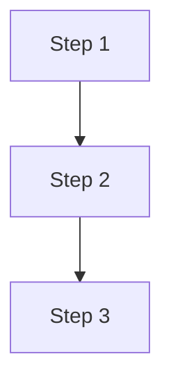
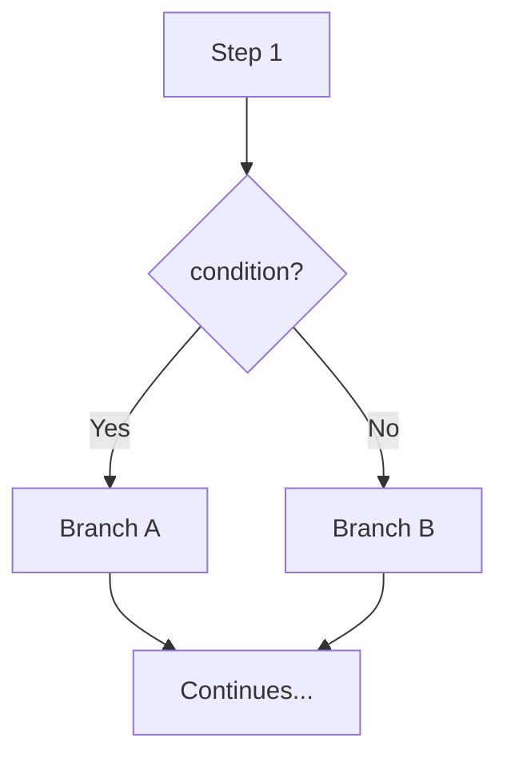
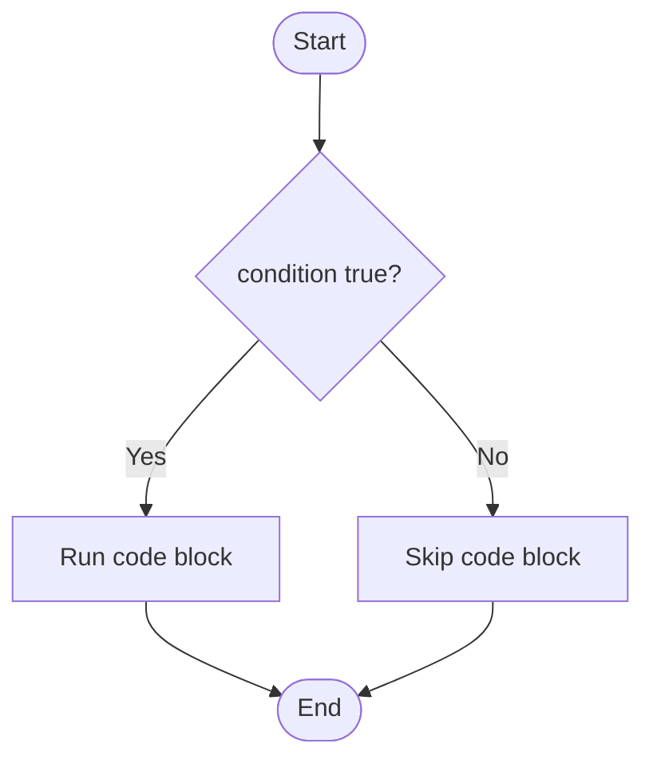
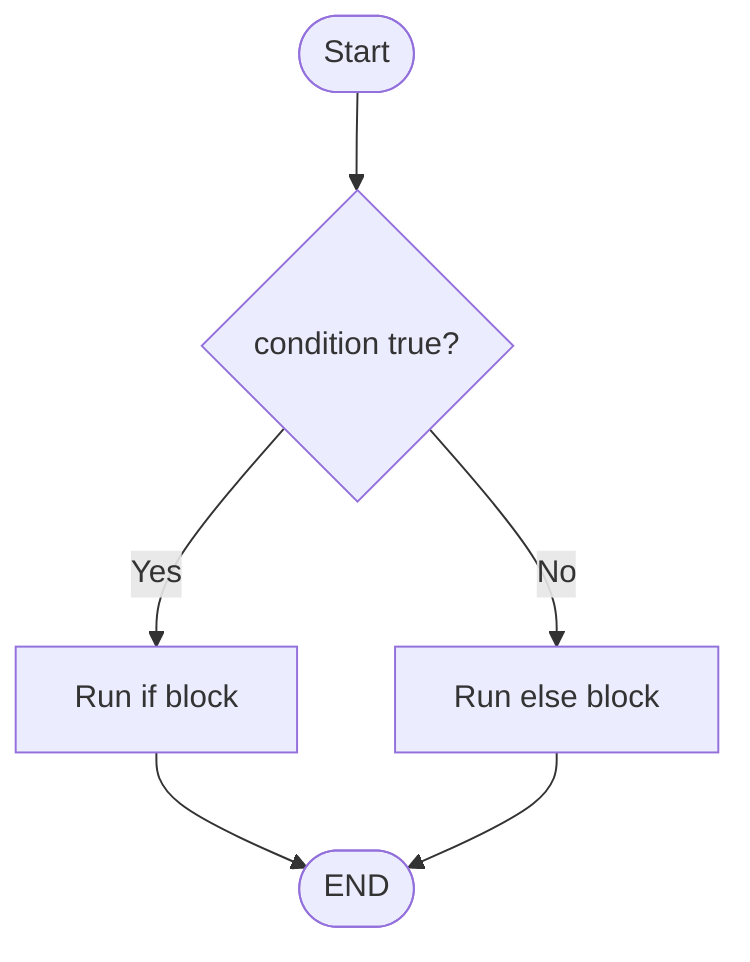
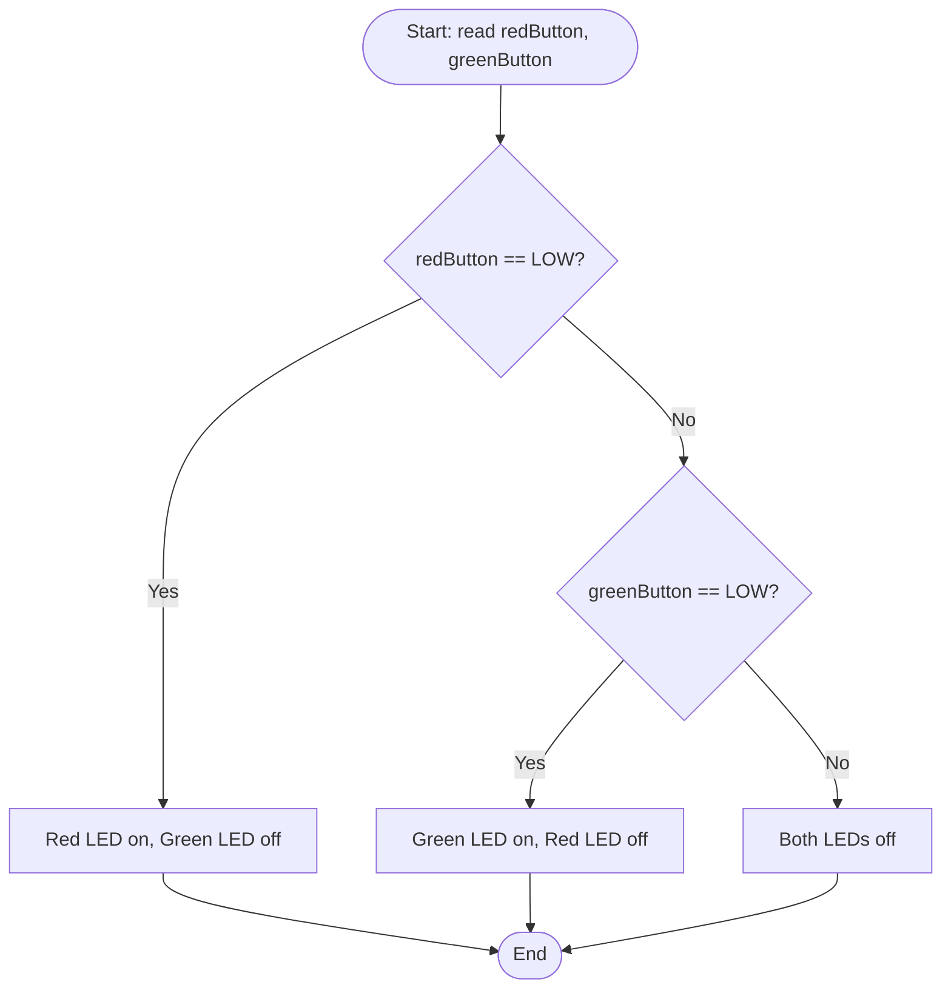
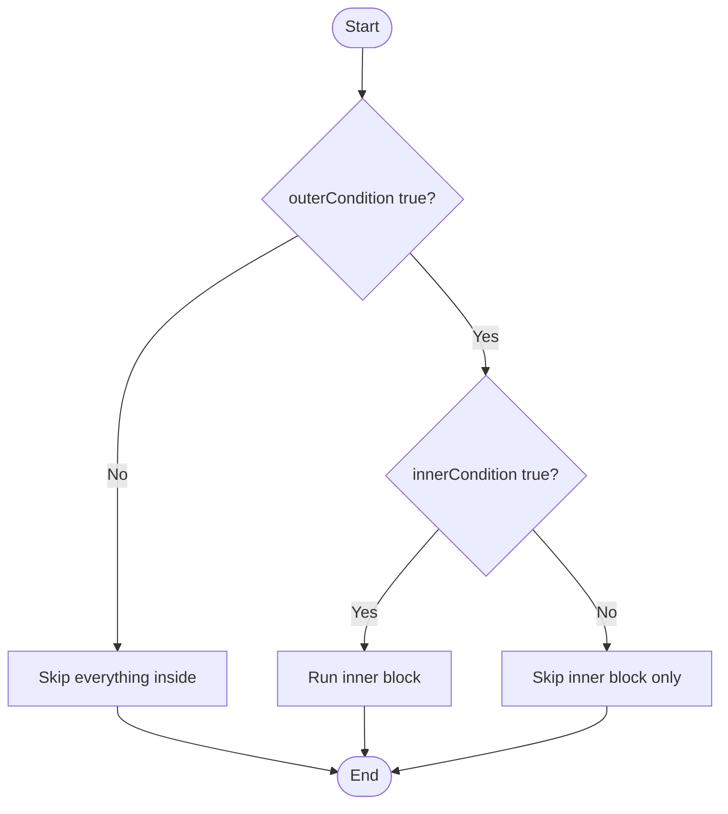

## Week 4: Selection & Conditional Logic

### What is Selection?
**Selection** (also called conditional logic) is one of the three fundamental building blocks of programming, alongside **sequence** (running instructions one after another) and **iteration** (repeating instructions). Selection lets a program choose *which* instructions to run based on a condition, instead of always running the same instructions in the same order.

Without selection, a program is a straight line: step 1, step 2, step 3, done — regardless of input. Selection introduces a branch into that line, so the path taken depends on data the program evaluates while it's running, such as a sensor reading or a button state.

**Sequence (no selection):**


**Example:**
```cpp
void loop() {
  Serial.println("Step 1: Turn LED on");
  digitalWrite(LED_PIN, HIGH);

  Serial.println("Step 2: Wait");
  delay(500);

  Serial.println("Step 3: Turn LED off");
  digitalWrite(LED_PIN, LOW);
}
```
Every step always runs, in the same order, every single time — there's no input that could skip a step or take a different path.

**Selection (branching):**


**Simple example:**
```cpp
void loop() {
  Serial.println("Step 1: Read the button");
  int buttonState = digitalRead(BUTTON_PIN);

  if (buttonState == LOW) {
    Serial.println("Branch A: Turn LED on");
    digitalWrite(LED_PIN, HIGH);
  } else {
    Serial.println("Branch B: Turn LED off");
    digitalWrite(LED_PIN, LOW);
  }

  Serial.println("Continues...");
  delay(200);
}
```
Same shape as the sequence above — but now Step 1 feeds a `condition`, and which branch runs (A or B) depends on `buttonState`. Two runs of this loop can take different paths, which was never possible in the sequence version.

#### Why selection matters
- **It's what makes a device "intelligent."** A microcontroller that only ever runs a fixed sequence can't respond to the world — it does the same thing regardless of what a sensor reports. Selection is the mechanism by which a device *reacts*: "if the button is pressed, turn on the LED; otherwise leave it off."
- **It matches how real-world decisions work.** A buzzer should sound if motion is detected *and* it's after hours; a thermostat should respond differently *depending on* how far the temperature is from the target. Selection lets code express that logic directly.
- **It reduces waste and risk.** A device does only what's appropriate to its current state, instead of running every possible action every time — important for safety-critical logic and for power-constrained IoT devices.
- **It's foundational for everything after it.** Loops (iteration) often contain selection inside them — "keep checking, and *if* the button is pressed, do X." You can't build non-trivial device behaviour without it.


### Comparison operators
Before writing your first `if`, it helps to know how conditions are written. `==` (equal to), `!=` (not equal to), `<`, `>`, `<=`, `>=` compare two values and produce a boolean result (`true` or `false`). This is what goes inside the `( )` of an `if` statement.

| Operator | Meaning | Example |
|---|---|---|
| `==` | equal to | `buttonState == HIGH` |
| `!=` | not equal to | `buttonState != HIGH` |
| `<` | less than | `temperature < 10` |
| `>` | greater than | `temperature > 30` |
| `<=` | less than or equal to | `count <= 5` |
| `>=` | greater than or equal to | `count >= 5` |

> **Watch out:** `==` compares two values; `=` assigns a value. Writing `if (buttonState = HIGH)` by mistake is a common beginner bug.

## 1. The `if` statement
It checks one condition — if that condition is `true`, the code inside the `{ }` runs. If it's `false`, the code is skipped entirely and the program carries on after it. There is no "else" — nothing happens on false.

**Syntax:**
```cpp
if (condition) {
  // runs only if condition is true
}
```



**Simple example:**
```cpp
const int BUTTON_PIN = 4;
const int LED_PIN = 2;

void setup() {
  Serial.begin(115200);

  pinMode(BUTTON_PIN, INPUT_PULLUP);
  pinMode(LED_PIN, OUTPUT);
}

void loop() {
  int buttonState = digitalRead(BUTTON_PIN);

  if (buttonState == LOW) {
    digitalWrite(LED_PIN, HIGH);
    Serial.println("Button pressed");
  } 

  delay(1000); // Simple button debounce
}
```

## 2. `if / else`
Adds a second block that runs when the condition is `false`. Now the program always does *something* one path or the other, never both, never neither.

**Syntax:**
```cpp
if (condition) {
  // runs if condition is true
} else {
  // runs if condition is false
}
```



**Simple example:**
```cpp
const int BUTTON_PIN = 4;
const int LED_PIN = 2;

void setup() {
  Serial.begin(115200);

  pinMode(BUTTON_PIN, INPUT_PULLUP);
  pinMode(LED_PIN, OUTPUT);
}

void loop() {
  int buttonState = digitalRead(BUTTON_PIN);

  if (buttonState == LOW) {
    digitalWrite(LED_PIN, HIGH);
    Serial.println("LED is ON");
  } else {
    digitalWrite(LED_PIN, LOW);
    Serial.println("LED is OFF");
  }

  delay(500); 
}
```
> Open Wokwi simulation and write the example code  : https://wokwi.com/projects/471650376634155009


## 3. `if / else if / else`
Used when there are more than two possible outcomes. Conditions are checked **in order, top to bottom**. As soon as one is `true`, its block runs and the rest are skipped — even if a later condition would also have matched. `else` at the end is optional and catches anything not matched above it.

**Syntax:**
```cpp
if (condition1) {
  // runs if condition1 is true
} else if (condition2) {
  // runs if condition1 is false AND condition2 is true
} else {
  // runs if neither condition1 nor condition2 is true
}
```



**Simple example:**
```cpp
const int redButtonPin = 4;
const int greenButtonPin = 5;
const int redLED = 6;
const int greenLED = 13;

void setup() {
  Serial.begin(115200);

  // Connect each button between its GPIO pin and GND.
  pinMode(redButtonPin, INPUT_PULLUP);
  pinMode(greenButtonPin, INPUT_PULLUP);

  pinMode(redLED, OUTPUT);
  pinMode(greenLED, OUTPUT);

  digitalWrite(redLED, LOW);
  digitalWrite(greenLED, LOW);
}

void loop() {
  int redButton = digitalRead(redButtonPin);
  int greenButton = digitalRead(greenButtonPin);

  if (redButton == LOW) {
    // Red button pressed
    digitalWrite(redLED, HIGH);
    digitalWrite(greenLED, LOW);
    Serial.println("Red button pressed");
  }
  else if (greenButton == LOW) {
    // Green button pressed
    digitalWrite(redLED, LOW);
    digitalWrite(greenLED, HIGH);
    Serial.println("Green button pressed");
  }
  else {
    // No button pressed
    digitalWrite(redLED, LOW);
    digitalWrite(greenLED, LOW);
    Serial.println("No button pressed - LEDs are off");
  }

  delay(500);
}
```
> Open Wokwi simulation and write the example code  : https://wokwi.com/projects/471650992631711745

## 4. Nested `if` statements
An `if` statement can contain another `if` statement inside its block — this is called **nesting**. It's useful when a decision only makes sense after an earlier decision has already been made: first check the outer condition, and only if that's true, go on to check something else. The inner `if` is completely skipped whenever the outer condition is `false`.

**Syntax:**
```cpp
if (outerCondition) {
  // runs if outerCondition is true

  if (innerCondition) {
    // runs only if BOTH outerCondition AND innerCondition are true
  }
}
```



**Example Code:**
```cpp
const int ARM_BUTTON_PIN = 4;
const int PIR_PIN = 5;
const int BUZZER_PIN = 7;

bool systemArmed = false;
int lastButtonState = HIGH;

void startSiren() {
  static int frequency = 600;
  static int direction = 20;

  tone(BUZZER_PIN, frequency);
  frequency += direction;

  if (frequency >= 1600) {
    direction = -20;
  }
  else if (frequency <= 600) {
    direction = 20;
  }
}

void stopSiren() {
  noTone(BUZZER_PIN);
}

void setup() {
  Serial.begin(115200);

  pinMode(ARM_BUTTON_PIN, INPUT_PULLUP);
  pinMode(PIR_PIN, INPUT);
  pinMode(BUZZER_PIN, OUTPUT);

  stopSiren();
  Serial.println("System disarmed");
}

void loop() {
  int buttonState = digitalRead(ARM_BUTTON_PIN);

  // Toggle the alarm system when the button is pressed.
  if (buttonState == LOW && lastButtonState == HIGH) {
    delay(30); // Button debounce

    if (digitalRead(ARM_BUTTON_PIN) == LOW) {
      systemArmed = !systemArmed;

      if (systemArmed) {
        Serial.println("System armed");
      }
      else {
        stopSiren();
        Serial.println("System disarmed");
      }
    }
  }

  lastButtonState = buttonState;

  if (systemArmed) {
    int motionDetected = digitalRead(PIR_PIN);

    if (motionDetected == HIGH) {
      startSiren();
    }
    else {
      stopSiren();
    }
  }
  else {
    stopSiren();
  }

  delay(100);
}
```
> Open Wokwi simulation and write the example code  :  https://wokwi.com/projects/471661119539001345
>
**Code walkthrough:**

| Step | Code | What it does |
|---|---|---|
| 1 | `int buttonState = digitalRead(ARM_BUTTON_PIN);` | Reads the button fresh at the top of every `loop()`. |
| 2 | `if (buttonState == LOW && lastButtonState == HIGH)` | Outer `if` — only fires on the *edge* of a press (pressed now, not pressed last time round). Stops the toggle firing repeatedly while the button is held down. |
| 3 | `delay(30); // Debounce` | Waits out any electrical bounce before trusting the press. |
| 4 | `if (digitalRead(ARM_BUTTON_PIN) == LOW)` | Re-reads the pin to confirm it's genuinely still `LOW` after the debounce delay. |
| 5 | `systemArmed = !systemArmed;` | Flips the armed state once the press is confirmed. |
| 6 | `if (systemArmed) { ... } else { ... }` (inner) | Nested decision that only runs once a real press has been confirmed — picks which message to print. |
| 7 | `lastButtonState = buttonState;` | Runs unconditionally, outside every `if` — must update every loop so the edge check in step 2 is correct next time round. |
| 8 | `if (systemArmed) { ... } else { ... }` (outer) | Separate decision from the button logic above — runs every loop regardless of whether the button was just pressed, and only reads the PIR sensor when `systemArmed` is `true`. |
| 9 | `if (motionDetected == HIGH)` (inner) | Nested for the same reason as step 6 — no point checking motion when the system isn't armed. |

> **Nested `if` vs `&&`:** `if (systemArmed && motionDetected == HIGH)` would give the same result here, since both conditions must be true. Nesting becomes more useful than a single combined condition once the outer and inner branches need *different* `else` behaviour, or the inner check depends on something (like a second sensor read) that should only happen once the outer condition has already passed.

### Order matters
Because `else if` conditions are checked in sequence and the first match wins, the order you write conditions in can change behaviour. A common bug is writing a broad condition before a narrower one, so the narrower one is never reached — a good habit is to check the most specific condition first.

### Vocabulary

| Term | Definition |
|---|---|
| Selection | Also called conditional logic; one of the three fundamental building blocks of programming that lets a program choose which instructions to run based on a condition. |
| Sequence | Running instructions one after another, in a fixed order, regardless of input. |
| Iteration | Repeating a set of instructions, often containing selection inside them. |
| Condition | An expression that evaluates to `true` or `false`, used to decide which branch of code runs. |
| Comparison operator | A symbol (`==`, `!=`, `<`, `>`, `<=`, `>=`) that compares two values and produces a boolean result. |
| Boolean | A data type with only two possible values: `true` or `false`. |
| `if` statement | Checks one condition; if `true`, runs the code inside its block, otherwise skips it entirely. |
| `if / else` | An `if` statement with a second block that runs when the condition is `false`, so exactly one of the two paths always runs. |
| `else if` | An additional condition checked only if the preceding condition(s) were `false`; allows more than two possible outcomes. |
| Boolean logic | The combination of multiple conditions using `&&` (AND), `||` (OR), and `!` (NOT). |
| `&&` (AND) | A boolean operator that is `true` only when both combined conditions are `true`. |
| `\|\|` (OR) | A boolean operator that is `true` when at least one of the combined conditions is `true`. |
| `!` (NOT) | A boolean operator that inverts a condition's value. |
| Nesting | Placing an `if` statement inside the block of another `if` statement, so the inner condition is only checked when the outer condition is `true`. |
| Debounce | A short delay added after detecting a button press to avoid reacting to electrical bounce/noise as multiple presses. |
| Edge (of a press) | The moment a button's state changes from not-pressed to pressed, as opposed to it remaining held down. |
