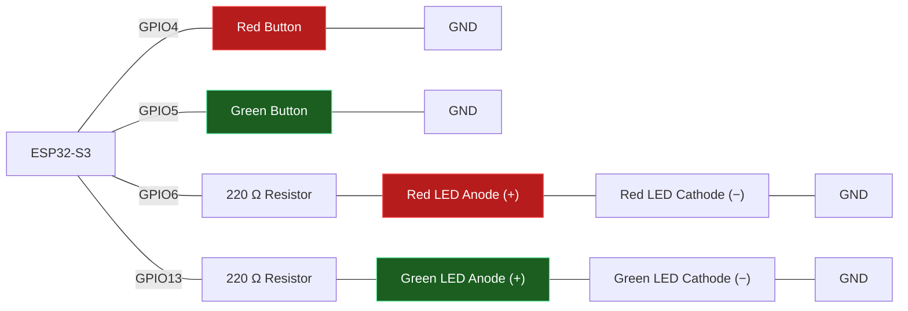

# Task — Reading Inputs and Selection (Week 3)

Build a two-button LED control system that reads digital inputs and uses `if / else if / else` to decide what to do.

**Scenario:** 

A small control panel has a red button and a green button. Pressing the red button should light the red LED only; pressing the green button should light the green LED only; if neither is pressed, both LEDs stay off.

**Components required:**
- ESP32-S3 development board
- 2 × push buttons
- 2 × LEDs (red, green)
- 2 × 220 Ω resistors
- Jumper wires

>
> **Wiring:**
>



**Requirements:**
- Configure both buttons as `INPUT_PULLUP` and both LEDs as `OUTPUT`.
- Read both buttons every loop with `digitalRead()`.
- Use `if / else if / else` so exactly one outcome happens per loop: red pressed → red LED on, green off; green pressed → green LED on, red off; neither pressed → both off.
- Print which branch ran to the Serial Monitor.
- Add a short `delay()` after each reading to debounce the buttons.

>
> Wokwi Link : https://wokwi.com/projects/472054525585822721
>
> 
### Questions

- Why does `INPUT_PULLUP` make "pressed" read `LOW` instead of `HIGH`?
  ```


  ```

- What would go wrong if you checked the two buttons using two separate `if` statements instead of one `if / else if`?
  ```


  ```

- Why does adding `delay(50)` after reading a button count as debouncing?

  ```


  ```

- In `if / else if / else`, if both buttons happened to read `LOW` at the same instant, which branch would run, and why?
  ```


  ```

### Spot-the-Bug Worksheet


**Round 1:**

```cpp
void loop() {
  int buttonState = digitalRead(BUTTON_PIN);

  if (buttonState = LOW) {
    digitalWrite(LED_PIN, HIGH);
  }
}
```

<details><summary>Answer</summary><code>=</code> is assignment, not comparison — this sets <code>buttonState</code> to <code>LOW</code> (always true) instead of checking it. It should be <code>if (buttonState == LOW)</code>.</details>

**Round 2:**

```cpp
void setup() {
  pinMode(BUTTON_PIN, INPUT);
  pinMode(LED_PIN, OUTPUT);
}

void loop() {
  if (digitalRead(BUTTON_PIN) == LOW) {
    digitalWrite(LED_PIN, HIGH);
  }
}
```
<details><summary>Answer</summary><code>BUTTON_PIN</code> is set to plain <code>INPUT</code> instead of <code>INPUT_PULLUP</code> — with nothing holding the pin HIGH when released, it floats and gives unreliable readings instead of reliably reading LOW only when pressed.</details>

**Round 3:**

```cpp
void loop() {
  int redButton = digitalRead(redButtonPin);
  int greenButton = digitalRead(greenButtonPin);

  if (redButton == LOW) {
    digitalWrite(redLED, HIGH);
  }
  if (greenButton == LOW) {
    digitalWrite(greenLED, HIGH);
  }
}
```
<details><summary>Answer</summary>Neither LED is ever turned back <code>LOW</code> when its button is released — there's no <code>else</code> branch, so once a button is pressed its LED stays on forever.</details>

**Round 4:**
```cpp
void loop() {
  int motionDetected = digitalRead(PIR_PIN);
  bool afterHours = true;

  if (motionDetected == HIGH || afterHours) {
    digitalWrite(BUZZER_PIN, HIGH);
  } else {
    digitalWrite(BUZZER_PIN, LOW);
  }
}
```
<details><summary>Answer</summary>Using <code>||</code> (OR) means the buzzer sounds if <em>either</em> condition is true — since <code>afterHours</code> is always <code>true</code> here, the buzzer fires constantly regardless of motion. The scenario calls for both conditions together, so it should be <code>&&</code> (AND).</details>

**Round 5:**
```cpp
void loop() {
  int temperature = analogRead(TEMP_PIN);

  if (temperature > 0) {
    Serial.println("Cold");
  } else if (temperature > 20) {
    Serial.println("Warm");
  } else if (temperature > 35) {
    Serial.println("Hot");
  }
}
```
<details><summary>Answer</summary>The conditions are ordered broadest-first — <code>temperature > 0</code> matches almost every reading, so the <code>"Warm"</code> and <code>"Hot"</code> branches can never be reached. The most specific/narrow condition should be checked first.</details>

**Round 6:**
```cpp
void loop() {
  int potValue = analogRead(potPin);
  int brightness = map(potValue, 0, 4095, 0, 255);
  digitalWrite(ledPin, brightness);
}
```
<details><summary>Answer</summary><code>digitalWrite()</code> only accepts <code>HIGH</code> or <code>LOW</code> — a variable brightness value needs <code>analogWrite(ledPin, brightness)</code> to produce PWM output.</details>


