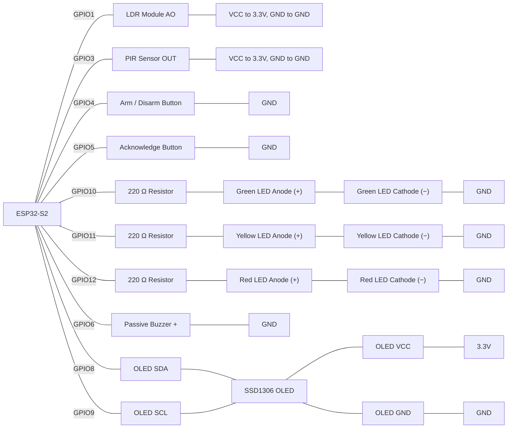

#  Museum Display Case Night Guard

## Scenario
A regional museum keeps a fragile manuscript in a sealed, dark display case overnight. Two sensors watch it:

- An LDR (light sensor) sits *inside* the case. While the case is sealed it reads dark. Lifting the lid or shining a torch in makes the reading jump.
- A PIR motion sensor on the gallery floor detects anyone approaching the case.

Either sensor alone is usually harmless: a cleaner walks past (motion only), or a security light flickers on (light only). The suspicious pattern is a sequence: someone approaches the case, *and then* light floods in. So the guard doesn't alarm on any single reading. It correlates the two sensors. A light spike shortly after motion counts as interference with the case, and either event alone is only a caution.

The guard shows its state on three traffic-light LEDs (green for SECURE, yellow for WARNING, red for ALARM). A passive buzzer plays a different pattern for each serious level. A small OLED screen at the guard desk mirrors the armed state, the alert level, a live brightness bar and the newest log entry. A WARNING clears itself after a quiet spell. An ALARM latches and stays on until a staff member presses the Acknowledge button. An Arm/Disarm button lets staff walk around the gallery during opening hours without setting anything off, and every event is still logged.

This one build uses every major foundation concept, and its core mechanic differs from the earlier practice runs:

| Concept | Where it shows up in this build |
|---|---|
| Variables, `setup()`/`loop()`, digital output | Pin configuration, three LEDs, buzzer |
| Functions, parameters | Every distinct behaviour is its own named function, and one shared button function takes its state by reference |
| Reading inputs, selection (`if`/`else`) | Button/PIR reads, analog LDR read, correlation and escalation decisions |
| Combining multiple sensors, non-blocking `millis()` timing | The whole program runs without a single `delay()` in `loop()`; timed decay, repeating beeps, and an OLED that redraws on change or on a heartbeat |
| Arrays, loops, 2-D arrays, sorting | The event log; a windowed scan that finds the newest matching event; a min/max/average and index-of-peak scan; a 2-D LED pattern table |
| Structs, key-value lookup tables, insertion sort | `GuardEvent` log kept sorted on insert; two lookup tables, `Setting` (by name) and `LevelInfo` (by level number) |

## Components Required
- ESP32-S2 development board
- LDR (photoresistor) module with analog output: Wokwi's *Photoresistor Sensor* (uses its **AO** pin)
- PIR sensor (motion in front of the case)
- 2× push button (`INPUT_PULLUP`): Arm/Disarm button and Acknowledge button
- 3× LED (green, yellow, red) and 3× 220 Ω resistor for the status lights
- Passive buzzer for the alert tones
- SSD1306 OLED display (128×64, I²C) for the status screen
- Jumper wires, breadboard

> **Wiring:**




## Functional Requirements

1. **Log.** Store events in `events[MAX_EVENTS]` using a `GuardEvent` struct (`sensor`, `value`, `unit`, `timestamp`, `armed`). `log_event()` keeps the log sorted by timestamp with an insertion step. When the log is full, drop the oldest record. Log `"light"`, `"motion"`, `"arm"` and `"ack"` events, with `armed` set to the guard's state at that moment.

2. **Inputs.**
   - `read_brightness()` returns 0-100, rising with light. Log it every 1000 ms.
   - Log one `"motion"` event per PIR rising edge.
   - One debounced (40 ms) function, `button_pressed(ButtonState &button)`, serves both buttons.
   - The Arm button toggles `armed`, logs `"arm"` and resets to SECURE.

3. **Lookup tables.** Each returns a sentinel if the key isn't found, and callers check it.
   - `get_setting(String key)`: `"light_limit"` = 60, `"link_window"` = 8000 ms, `"decay_time"` = 10000 ms. Sentinel `-1.0`.
   - `get_level_name(int level)`: SECURE, WARNING, ALARM. Sentinel `"Unknown Level"`.

4. **Correlation and escalation** (only while armed).
   - `find_recent_event(sensor, windowMs)` scans the log once and returns the index of the newest matching record logged while armed within the window, or `-1`.
   - `escalate(newLevel)` only ever raises the level. Repeating the current level restarts the quiet timer.
   - Motion raises WARNING. A light reading rising above `light_limit` raises ALARM if motion was found within `link_window`, otherwise WARNING. Print which case it was (for ALARM, include the ms since the motion).

5. **Outputs.**
   - Light one LED per level from a 2-D `ledPattern` table, with no `if`/`else` chain.
   - WARNING clears itself after `decay_time` with no new escalation. ALARM stays until Acknowledge, which logs `"ack"` and silences the buzzer.
   - Buzzer: one 200 ms, 1000 Hz beep when the level rises to WARNING. In ALARM, a 200 ms, 2000 Hz beep every 500 ms.

6. **Statistics.** `compute_stats()` gives brightness min, max, average and the brightest reading's index from `"light"` records, plus the motion count. Recompute after every log, and avoid dividing by zero.

7. **Serial report** every 2000 ms: armed state, level name, brightness stats, motion count and the newest 5 records.

8. **OLED** (SSD1306, `Wire.begin(8, 9)`, address `0x3C`). Show the armed state, the level name (inverse video in ALARM), brightness as a number and a bar with a `light_limit` marker, and the newest record (`Last: none` if the log is empty). Redraw on change or every 2000 ms, ending with `display.display()`. If the OLED is missing, the guard keeps running.

9. **No `delay()` in `loop()`.**

## Suggested Test 
Test each requirement on its own as you build it, then run this whole table before you call the project finished. In Wokwi, trigger motion with the PIR's simulate-motion control and change brightness with the LDR module's lux slider. Start every scenario from SECURE with the lux slider set dark. In every scenario the OLED should show the same alert level as the LEDs, the brightness bar should follow the lux slider, and in T4 the level name should appear in inverse video until you press Acknowledge.

| # | Do this | Expect |
|---|---|---|
| T1 | Disarmed. Trigger motion, then raise the light. | Stays green and silent. The `"motion"` and `"light"` records still appear in the report. |
| T2 | Arm, then trigger motion once and do nothing else. | Yellow and one short beep. About 10 s later it returns to green by itself. |
| T3 | Armed. Raise the light with no recent motion. | Yellow and an "unexplained light" message. Clears by itself after about 10 s of quiet. |
| T4 | Armed. Trigger motion, wait a couple of seconds, then raise the light. | Red, repeating beeps, and a message giving the ms gap. Stays red until acknowledged. Press Acknowledge: green and silent immediately. |
| T5 | Armed. Raise the light first, then trigger motion. | Yellow only (no correlation in this order). |
| T6 | Armed. Trigger motion, wait more than 8 s, then raise the light. | Yellow, not red, because the motion is outside the link window. |
| T7 | Disarmed. Trigger motion, then arm, then raise the light. | Yellow, not red, because motion logged while disarmed must not count. Arming also resets the level to green. |

## Submission Requirements
- A working Wokwi link with your circuit built and your code loaded and running.
- Your main source file (`.ino` if using the Arduino IDE, or `src/main.cpp` + `platformio.ini` if using PlatformIO).
- Brief written answers to the Reflection Questions below (a few sentences each is enough).

>[!NOTE]
> Wokwi link: https://wokwi.com/projects/476038822892508161

## Self-Assessment Checklist
- [ ] `GuardEvent` struct groups `sensor`, `value`, `unit`, `timestamp`, `armed`; the log is one array of these, not separate arrays per sensor
- [ ] `log_event()` keeps the array sorted by timestamp via insertion (bubbling only the new record), not a full re-sort
- [ ] A full log discards the oldest record by shifting left, so logging never stops
- [ ] `read_brightness()` returns 0-100 rising with light (verified against your own LDR's raw readings), and the LDR is sampled every 1000 ms without `delay()`
- [ ] PIR is edge-detected and logged once per movement, not on every pass while held
- [ ] Both buttons use the same `button_pressed(ButtonState &button)` function, taking its state by reference
- [ ] `get_setting()` and `get_level_name()` both return a checked sentinel for an unrecognised key, and every caller that acts on a result checks it
- [ ] `find_recent_event()` re-scans the log for matching, armed, in-window records and returns the newest index or `-1`, and the `-1` is checked before the index is used
- [ ] Light breach fires on the rising edge only, and only while armed; correlated → ALARM, uncorrelated → WARNING
- [ ] `escalate()` can only raise the level; nothing lowers it except WARNING decay, Acknowledge, and Arm/Disarm
- [ ] Exactly one LED is lit per level, driven by the 2-D `ledPattern[][]` table with no `if`/`else` chain on the level
- [ ] WARNING decays after quiet, ALARM latches until Acknowledge, and the buzzer stops immediately on Acknowledge
- [ ] `compute_stats()` uses only `"light"` records for brightness and only `"motion"` records for the count, and guards against dividing by zero
- [ ] `report()` prints the newest 5 records from the end of the log, on a `millis()` heartbeat
- [ ] The OLED shows the armed state, the level name (via `get_level_name()`, inverse video in ALARM), brightness as a number and a `map()`-scaled bar with a `light_limit` marker, and the newest log record read from the end of the log
- [ ] The OLED redraws on change or at least every 2000 ms (not every pass), ends each redraw with `display.display()`, and a failed `display.begin()` doesn't stop the rest of the guard
- [ ] No `delay()` appears anywhere inside `loop()` or any function it calls
- [ ] Code is broken into named functions, with no single giant `loop()` doing everything inline

## Reflection Questions
Answer these in your own words. They're the kind of question the real Assessment 1 may ask you to justify verbally or in writing:

1. Every `GuardEvent` stores the `armed` flag as it was *when the event happened*, instead of `find_recent_event()` checking the current global `armed`. Describe a sequence of events (using the Arm button) where checking only the current flag would give a wrong answer.
   ```


   ```

2. Why does this guard correlate motion and light instead of raising an alarm the moment either sensor fires on its own? Describe two realistic false alarms that a single-sensor rule would produce in a real gallery.
   ```


   ```

3. `find_recent_event()` returns an index, or `-1` if nothing matched, rather than just `true`/`false`. What does the caller do with the index in this build, and what would happen if the caller used `events[-1]` without checking?
   ```


   ```

4. WARNING decays on its own but ALARM only clears when a person presses Acknowledge. What could go wrong in a real museum if ALARM also decayed after 10 seconds?
   ```


   ```

5. `button_pressed()` takes its `ButtonState` **by reference**. What would go wrong, for both the debounce and the press detection, if it took the struct by value instead?
   ```


   ```

6. Because timestamps come from `millis()`, new records nearly always arrive already in order, so the insertion-sort loop rarely swaps anything. Give two places in this build that would silently break if the log were *not* sorted, which is why the sort step is still worth keeping.
   ```


   ```

7. The OLED redraws only when its content changes or every 2000 ms, instead of on every pass of `loop()`. What goes wrong with a redraw every pass, and what does the heartbeat protect you from when the screen content hasn't changed? Also explain why a missing OLED must not stop the guard from raising an ALARM.
   ```


   ```

8. If you were given extra time to extend this station, what would you add, and which earlier topic would it draw on?
   ```


   ```

