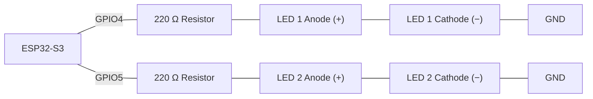
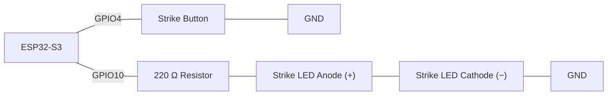
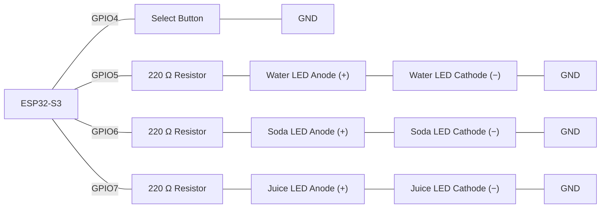
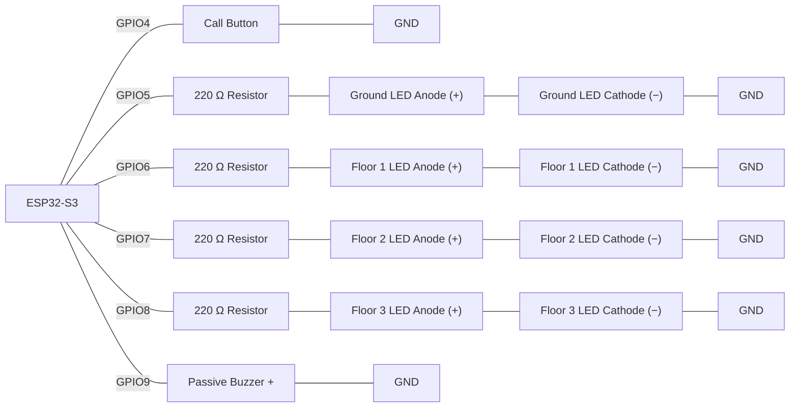
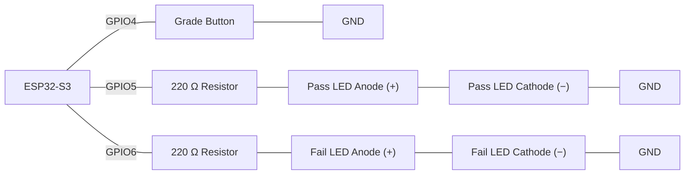
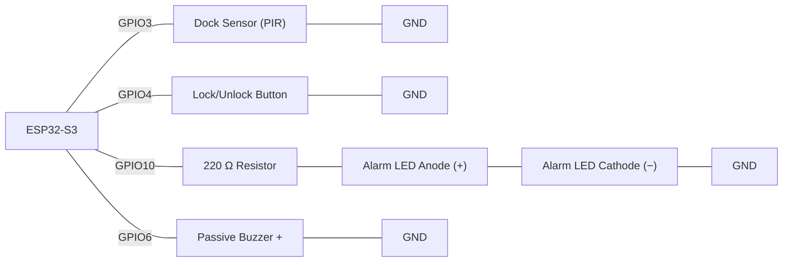
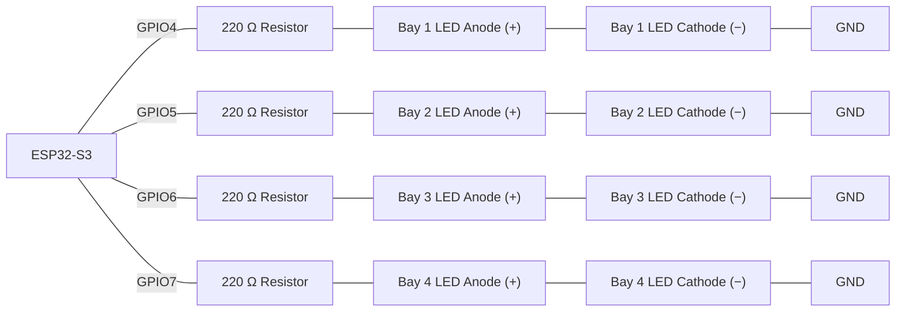
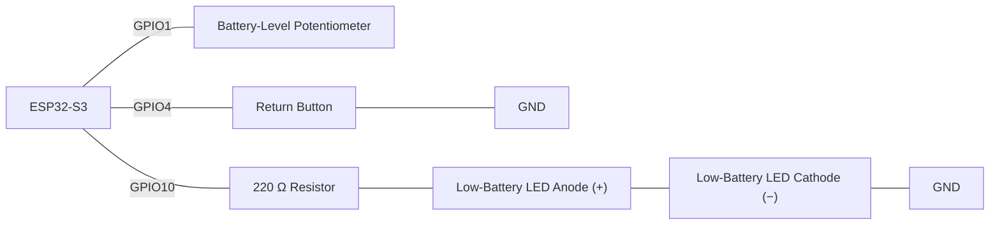
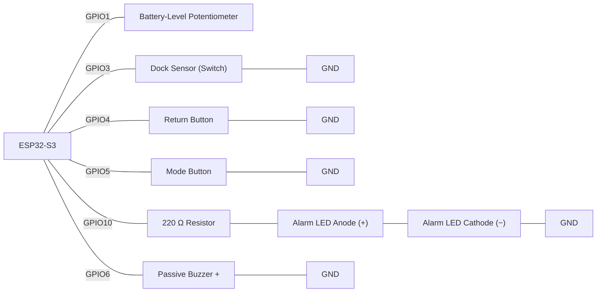

# Revision Activity

## Task 1 - Parameterised Blink Function (Week 1-2 Recap: Variables & Functions)

**Scenario:**

A community noticeboard needs two indicator LEDs to flash different alert patterns, an urgent pattern and a routine pattern — without duplicating the same blink code twice. Write one reusable function that both patterns call with different values.

**Components:**

- ESP32-S3 development board
- 2x LED
- 2x 220 Ω resistor
- Jumper wires

> **Wiring:**



Write `void blink_led(int pin, int times, int onTime)` that flashes the given pin `times` times, each on for `onTime` ms and off for the same duration. In `setup()`, declare `int urgentPin = 4;` and `int routinePin = 5;` as variables (not magic numbers used directly), configure both as `OUTPUT`, then call `blink_led()` twice with different `times`/`onTime` arguments so the urgent LED visibly blinks faster than the routine one.

>[!NOTE]
> Wokwi link: https://wokwi.com/projects/474460961380768769

**Finished Task: 1** https://wokwi.com/projects/474836391266400257

**Check yourself:**
- [ ] `blink_led()` takes `pin`, `times`, and `onTime` as parameters — none of the three is hard-coded inside the function
- [ ] Pin numbers are stored in named variables, not written as bare numbers at the call site
- [ ] Called at least twice with different parameter values, producing two visibly different patterns
- [ ] Both pins are configured `OUTPUT` in `setup()` before either call

**Expected outcome:** Two LEDs blink independently — the "urgent" LED flashes noticeably faster than the "routine" LED — both driven by the same `blink_led()` function called with different arguments.

---

## Task 2 - Debounced Toggle Button (Week 3 Recap: Reading Inputs & Selection)

**Scenario:**

A door-entry system needs to toggle a strike-light on and off with a single push-button press — but a raw digital read of a mechanical button toggles several times per physical press unless it's properly debounced first.

**Components:**

- ESP32-S3 development board
- 1x push button (`INPUT_PULLUP`)
- 1x LED
- 1x 220 Ω resistor
- Jumper wires

> **Wiring:**



Implement settle-time debouncing using `lastButtonReading`, `buttonState`, and `debounceStart` (the same naming used from Week 5 onward), with `DEBOUNCE_TIME = 40`. Only on a validated transition to `LOW` (a genuine fresh press, not held or bouncing), flip a `bool strikeOn` variable and write it to the LED with `if`/`else` selection.

>[!NOTE]
> Wokwi link: https://wokwi.com/projects/474497117436855297

**Finished Task: 2** https://wokwi.com/projects/474838320643817473

**Check yourself:**
- [ ] `lastButtonReading`/`buttonState`/`debounceStart` implement settle-time debouncing before any reading is trusted
- [ ] The LED toggles exactly once per physical press — not multiple times from bounce
- [ ] `INPUT_PULLUP` is used, and the code checks for `LOW` as "pressed"
- [ ] Selection (`if`/`else`) — not a chain of unrelated `if`s — decides the new LED state

**Expected outcome:** Pressing the push button once toggles the strike-light LED cleanly on, then off on the next press — no flickering or multiple toggles from switch bounce.

---

## Task 3 - Vending Machine Drink-Mode Selector (Week 3 Recap: Switch/Case)

**Scenario:**

A campus vending machine cycles through three drink slots — Water, Soda, Juice — each time its Select button is pressed, lighting exactly one slot's indicator LED. With three specific, known values to check a single variable against, `switch`/`case` reads far more clearly here than a chain of `else if`s.

**Components:**

- ESP32-S3 development board
- 1x push button (`INPUT_PULLUP`) — Select button
- 3x LED (Water, Soda, Juice)
- 3x 220 Ω resistor
- Jumper wires

> **Wiring:**



Debounce the Select button using `lastButtonReading`/`buttonState`/`debounceStart` (the same pattern as Task 2, `DEBOUNCE_TIME = 40`). On each validated press, advance `int drinkMode` by one and wrap from `2` back to `0`. Use `switch (drinkMode)` — not a chain of `if`/`else if`s — to light exactly one LED per mode (Water = 0, Soda = 1, Juice = 2), with a `default` case turning every LED off.

>[!NOTE]
> Wokwi link: https://wokwi.com/projects/474470208794608641

**Finished Task: 3** https://wokwi.com/projects/474841333147184129

**Check yourself:**
- [ ] The Select button is debounced with `lastButtonReading`/`buttonState`/`debounceStart` before any press is trusted
- [ ] `drinkMode` advances by exactly one per validated press and wraps from `2` back to `0`
- [ ] `switch (drinkMode)` — not `if`/`else if` — selects the lit LED, and every `case` ends with `break`
- [ ] A `default` case exists and turns every LED off for any unexpected value

**Expected outcome:** Each press of the Select button advances exactly one LED (Water → Soda → Juice → back to Water), with only ever one LED lit at a time.

---

## Task 4 - Elevator Floor Indicator (Week 3 Recap: Switch/Case With Four Cases)

**Scenario:**

A model elevator's control panel needs to show which of four floors — Ground, 1, 2, 3 — it is "at," advancing one floor at a time each time the Call button is pressed and wrapping back to Ground after floor 3. Each floor lights exactly one indicator LED and sounds its own confirmation chime.

**Components:**

- ESP32-S3 development board
- 1x push button (`INPUT_PULLUP`) — Call button
- 4x LED (Ground, Floor 1, Floor 2, Floor 3)
- 4x 220 Ω resistor
- Passive buzzer
- Jumper wires

> **Wiring:**



Debounce the Call button using `lastButtonReading`/`buttonState`/`debounceStart` (the same pattern as Task 2, `DEBOUNCE_TIME = 40`). On each validated press, advance `int currentFloor` by one and wrap from `3` back to `0` — four floors this time, not three, so check your wrap condition matches the new range. Use `switch (currentFloor)` to light exactly one floor LED and sound a short confirmation tone at a different frequency per floor with `tone(buzzerPin, frequency, 150)` — the built-in duration argument stops the tone automatically after 150 ms, so no `millis()` timing is needed here. A `default` case must turn every floor LED off and leave the buzzer silent.

>[!NOTE]
> Wokwi link: https://wokwi.com/projects/474487482790405121

**Finished Task: 4** https://wokwi.com/projects/474842934931389441

**Check yourself:**
- [ ] The Call button is debounced with `lastButtonReading`/`buttonState`/`debounceStart` before any press is trusted
- [ ] `currentFloor` advances by one per validated press and wraps from `3` back to `0` (four floors: 0-3)
- [ ] `switch (currentFloor)` lights exactly one floor LED and sounds a distinct tone per floor, every `case` ending in `break`
- [ ] `default` turns every floor LED off and leaves the buzzer silent

**Expected outcome:** Each press of the Call button moves the lit LED to the next floor (Ground → 1 → 2 → 3 → wraps to Ground), and each press produces a short, distinct-pitched beep per floor.

---

## Task 5 - Grouped Grading Display (Week 3 Recap: Switch/Case With Intentional Fall-Through)

**Scenario:**

A workshop's scoreboard should show only a Pass or Fail light for a trainee's grade, cycled by a debounced Grade button through five letter grades — A, B, C, D, F. Grades A, B, and C should all light the same Pass LED; D and F should both light the same Fail LED. Rather than repeating identical code in three (or two) separate `case` blocks, multiple `case` labels can deliberately share one block by omitting `break` between them — the one situation where falling through is an intentional feature, not the bug it usually is when a `break` goes missing by accident.

**Components:**

- ESP32-S3 development board
- 1x push button (`INPUT_PULLUP`) — Grade button
- 1x LED (green, Pass)
- 1x LED (red, Fail)
- 2x 220 Ω resistor
- Jumper wires

> **Wiring:**



Debounce the Grade button as in Task 2. On each validated press, advance `int gradeIndex` by one and wrap from `4` back to `0` (five grades: A=0, B=1, C=2, D=3, F=4). Write `switch (gradeIndex)` with `case 0:`, `case 1:`, and `case 2:` stacked directly above one shared block that lights the Pass LED and turns off the Fail LED, ending in a single `break` — mark the missing `break`s between the stacked labels with a `// intentional fall-through` comment so a marker (or your future self) can tell it apart from a bug. Do the same for `case 3:`/`case 4:` sharing a block that lights the Fail LED instead, with a `default` case turning both LEDs off.

>[!NOTE]
> Wokwi link: https://wokwi.com/projects/474462085306563585

**Finished Task: 5** https://wokwi.com/projects/474847185761091585

**Check yourself:**
- [ ] The Grade button is debounced before any press is trusted
- [ ] `gradeIndex` cycles through five values (`0`-`4`) and wraps correctly
- [ ] `case 0`, `case 1`, `case 2` share one block (marked `// intentional fall-through`) that lights the Pass LED
- [ ] `case 3`, `case 4` share a separate block that lights the Fail LED; `default` turns both LEDs off
- [ ] The Pass and Fail LEDs are never both lit at the same time

**Expected outcome:** Cycling through grades A→F shows only two possible LED states: the Pass LED lit for A/B/C, the Fail LED lit for D/F — never both lit together.

---

## Task 6 - Locked-Dock Alert: Boolean Logic + Non-blocking Timing (Week 4 Recap)

**Scenario:**

A campus bike-dock alarm should only sound when a bike is removed from its dock **and** the dock has been set to "locked" with a switch — and the alarm must not freeze the rest of the program while it plays, since the dock sensor and switch both need to keep being checked.

**Components:**

- ESP32-S3 development board
- 1x PIR sensor (standing in for the dock's removal sensor)
- 1x push button (`INPUT_PULLUP`) — lock/unlock toggle
- 1x LED
- 1x 220 Ω resistor
- Passive buzzer
- Jumper wires

> **Wiring:**



Use the debounced button pattern from Task 2 to toggle a `bool locked` variable. Edge-detect the dock sensor (`dockNow && !lastDockState`). When `locked && dockNow-on-the-edge`, start a non-blocking 300 ms alarm: LED on and `tone()` sounding, both turned off again once 300 ms have elapsed via `millis()` — no `delay()` anywhere in `loop()`. The lock button must remain readable throughout an active alarm.

>[!NOTE]
> Wokwi link: https://wokwi.com/projects/474488112545664001

**Finished Task: 6** https://wokwi.com/projects/474849085757353985

**Check yourself:**
- [ ] The alarm only triggers when `locked` is `true` **and** a fresh dock-removal edge is detected — a plain `if (dockNow)` alone is not enough
- [ ] The alarm is timed with `millis()`, never `delay()`
- [ ] `tone()`/`noTone()` are used for the buzzer, never `digitalWrite()`
- [ ] The lock/unlock button still responds correctly while an alarm is active

**Expected outcome:** The alarm (LED + buzzer) fires only when the dock is locked **and** the bike is freshly removed, self-stops after 300 ms, and the lock button keeps responding even while the alarm is sounding — no freeze.

---

## Task 7 - Single-Pass Min/Max/Average Scan (Week 5 Recap: Arrays & Loops)

**Scenario:**

A recycling depot wants the minimum, maximum, and average of a burst of bin-fill-level readings, computed in one pass over the array not three separate loops.

**Components:**

- ESP32-S3 development board
- Potentiometer (standing in for a fill-level sensor)
- Jumper wires

> **Wiring:**


Declare `const int NUM_READINGS = 10;` and `int readings[NUM_READINGS];`. In `setup()`, fill the array with one `analogRead()` every 300 ms using a `for` loop. Then, in a **single** separate `for` loop, compute `minVal`, `maxVal` (both initialised from `readings[0]`, never `0`), and a running `sum`. Print all three, with the average computed using floating-point division.

>[!NOTE]
> Wokwi link: https://wokwi.com/projects/473955613809115137

**Finished Task: 7** https://wokwi.com/projects/474850135921266689

**Check yourself:**
- [ ] `minVal`/`maxVal` are initialised from `readings[0]`, not `0`
- [ ] A single `for` loop computes min, max, and sum together
- [ ] The average is computed with floating-point division, not truncated integer division
- [ ] The capture loop and the scan loop are two clearly separate loops, not merged incorrectly

**Expected outcome:** After the 10 readings are captured (with a visible ~300 ms pause between each), the Serial monitor prints correct min, max, and a decimal (non-truncated) average.

---

## Task 8 - Array-Driven Loading-Bay Indicator (Week 5 Recap: Arrays Driving Outputs)

**Scenario:**

A loading dock needs a 4-LED "bay status" chase pattern — but the pin list must live in one array, so adding a fifth bay later means adding one array entry, not writing a fifth hard-coded block.

**Components:**

- ESP32-S3 development board
- 4x LED
- 4x 220 Ω resistor
- Jumper wires

> **Wiring:**



Declare `const int NUM_BAYS = 4;` and `int bayPins[NUM_BAYS] = {4, 5, 6, 7};`. Configure every pin `OUTPUT` in `setup()` with a `for` loop over `bayPins` (no individual `pinMode()` calls). Write `run_chase(int stepDelay)` that lights each bay's LED in turn for `stepDelay` ms using a `for` loop, turning each off before the next lights.

>[!NOTE]
> Wokwi link: https://wokwi.com/projects/473652460611573761

**Finished Task: 8** https://wokwi.com/projects/474851277509402625

**Check yourself:**
- [ ] `bayPins[]` is declared once as an array — no pin number appears hard-coded anywhere else
- [ ] `setup()` configures all four pins with a `for` loop over `bayPins`
- [ ] `run_chase()` takes `stepDelay` as a parameter, so the speed is adjustable by argument, not by editing the function body
- [ ] Each bay's LED turns off again before the next one lights

**Expected outcome:** The 4 LEDs visibly "chase" in sequence, one at a time, at a speed controllable via the `stepDelay` argument — no two LEDs on simultaneously.

---

## Task 9 - Struct Log With Dictionary Battery-Threshold Lookup (Week 6 Recap)

**Scenario:**

A bike-share dock needs every returned bike kept as a timestamped record in sorted order, and a minimum-battery threshold looked up by bike type instead of a hard-coded number.

**Components:**

- ESP32-S3 development board
- Potentiometer (standing in for a battery-level sensor)
- 1x push button (`INPUT_PULLUP`) — Return button
- 1x LED (low-battery indicator)
- 1x 220 Ω resistor
- Jumper wires

> **Wiring:**



Define `struct Checkin { unsigned long timestamp; int batteryLevel; };` and `struct Threshold { String bikeType; int minBattery; };`. On a debounced Return-button press, append a new `Checkin` and run an insertion step that swaps the whole record leftward past any earlier one with a larger timestamp. Define a one-entry `Threshold` table for `"standard"`, and `get_min_battery(String bikeType)` returning a checked `-1` sentinel for an unknown type. Light the low-battery LED whenever the newly logged battery level falls below `get_min_battery("standard")`.

>[!NOTE]
> Wokwi link: https://wokwi.com/projects/474488439674404865

**Finished Task: 9** https://wokwi.com/projects/474854050372942849

**Check yourself:**
- [ ] The Return button is debounced (Task 2's pattern), and each validated press appends exactly one record
- [ ] The insertion step swaps the whole `Checkin` struct, holding the new record in a temporary first
- [ ] `get_min_battery()` returns a sentinel for an unrecognised bike type, and the caller checks it before comparing
- [ ] The low-battery LED lights only when the value genuinely falls below the looked-up threshold

**Expected outcome:** Each Return-button press logs a new check-in that stays sorted by timestamp; the low-battery LED lights only when the potentiometer reading is genuinely below the "standard" threshold, never for unrecognised types.

---

## Task 10 - Capstone: Campus Bike-Share Docking Station

**Scenario:**

Build one docking station that rehearses every concept covered so far at once: a debounced Return button records a struct check-in and checks it against a dictionary battery threshold; a dock sensor's edge, combined with a locked switch, raises the same non-blocking alarm; and a Mode button (also debounced) selects between two pieces of information the Serial monitor prints — nothing may block, and every timed behaviour must use `millis()`.

**Components:**

- ESP32-S3 development board
- Potentiometer (battery-level sensor)
- Switch (dock-removal sensor)
- 2x push button (`INPUT_PULLUP`) — Return button, Mode button
- 1x LED (alarm indicator)
- 1x 220 Ω resistor
- Passive buzzer
- Jumper wires

> **Wiring:**



**Program requirements - this task combines every concept practiced this week:**
1. **Struct log:** `struct Checkin { unsigned long timestamp; int batteryLevel; };` stored in `Checkin checkins[MAX_CHECKINS]` with `checkin_count`, guarded against overflow.
2. **Debounced Return button: ** on a validated press, append a check-in from `analogRead(batteryPin)` (scaled to a 0-100 range) via `log_checkin()`, running the insertion-sort step from Task 9.
3. **Dictionary lookup:** a `Threshold thresholds[]` table for `"standard"`; `get_min_battery("standard")` with a checked sentinel.
4. **Locked-dock alarm:** the Mode button (debounced) toggles `bool locked`. Edge-detect the dock sensor; when `locked` and a fresh removal edge occurs, or a returned bike's battery is below its threshold, trigger the same non-blocking 300 ms LED+buzzer alarm as Task 6.
5. **Single-pass stats:** `compute_stats()` recalculates min, max, and average over `checkins[i].batteryLevel` in one loop after every new check-in.
6. **Serial reporting :** a `report()` function prints either the running battery stats or the locked/unlocked state depending on which the Mode button last selected, called at least every 2000 ms via `millis()` as a heartbeat.
7. Nothing in `loop()` may use `delay()`; both buttons and the dock sensor must remain responsive throughout an active alarm.

>[!NOTE]
> Wokwi link: https://wokwi.com/projects/474488718561188865

**Finished Task: 10** https://wokwi.com/projects/474943395153678337

**Check yourself:**
- [ ] Every check-in is one debounced press → one struct record → one insertion-sort step, guarded against overflowing `MAX_CHECKINS`
- [ ] `get_min_battery()`'s sentinel is checked before any comparison uses it
- [ ] The alarm triggers on **either** a locked removal edge **or** a low-battery return, and is timed with `millis()`, never `delay()`
- [ ] `compute_stats()` runs in a single pass, initialised from `checkins[0].batteryLevel`
- [ ] `report()` is a named function, called on a `millis()` heartbeat, not inline duplicated code
- [ ] Both buttons and the dock sensor stay responsive while an alarm is active

**Expected outcome:** The Return button logs sorted battery check-ins, the Mode button toggles locked/unlocked state and switches what's printed, the alarm fires on either a locked removal edge or a low-battery return without ever blocking, and the Serial monitor prints stats or lock state on a steady ~2 s heartbeat — all inputs remain responsive throughout, even mid-alarm.

---

## Task 11 - Spot-the-Bug Worksheet (Extension)

**Format:** For each round, read the snippet and write down what's wrong **before** revealing the answer.

**Round 1:**
```cpp
void loop() {
  if (digitalRead(returnButtonPin) == LOW) {
    log_checkin(analogRead(batteryPin));
  }
}
```
<details><summary>Answer</summary>There's no debouncing at all — a single physical press's mechanical bounce is read as several rapid `LOW` transitions, so `log_checkin()` is called (and appends a new record) several times for one press, quickly exhausting `MAX_CHECKINS` with near-duplicate entries. A settle-time check (`lastButtonReading`/`debounceStart`) is needed before the call is trusted.</details>

**Round 2:**
```cpp
void loop() {
  bool dockNow = digitalRead(dockPin) == HIGH;
  if (locked && dockNow) {
    digitalWrite(buzzerPin, HIGH);
    delay(300);
    digitalWrite(buzzerPin, LOW);
  }
  bool modePressed = digitalRead(modeButtonPin) == LOW;   // never actually read in time
}
```
<details><summary>Answer</summary>The `delay(300)` blocks the entire `loop()` for 300 ms every time the dock trips while locked, during which the Mode button (and anything else) cannot be read — its `digitalRead()` only ever runs *after* the delay, so a press during the alarm is missed entirely. This needs the non-blocking `millis()` pattern instead.</details>

**Round 3:**
```cpp
const int NUM_READINGS = 10;
int readings[NUM_READINGS];

for (int i = 0; i <= NUM_READINGS; i++) {
  readings[i] = analogRead(potPin);
  delay(300);
}
```
<details><summary>Answer</summary>The loop condition is `i <= NUM_READINGS`, which allows `i` to reach `NUM_READINGS` itself — one past the array's valid indices (`0` to `NUM_READINGS - 1`) — writing out of bounds. It should be `i < NUM_READINGS`.</details>

**Round 4:**
```cpp
int minVal = 0, maxVal = 0;
for (int i = 0; i < NUM_READINGS; i++) {
  if (readings[i] < minVal) minVal = readings[i];
  if (readings[i] > maxVal) maxVal = readings[i];
}
```
<details><summary>Answer</summary>`minVal`/`maxVal` are initialised to `0` instead of `readings[0]`. If every reading happens to be above `0`, `minVal` incorrectly stays `0` forever (since no reading is ever smaller); if every reading is negative, `maxVal` incorrectly stays `0`. Both must be initialised from `readings[0]` before the scan.</details>

**Round 5:**
```cpp
struct Checkin {
  unsigned long timestamp;
  int batteryLevel;
}

Checkin checkins[MAX_CHECKINS];
```
<details><summary>Answer</summary>The struct definition is missing its trailing semicolon after the closing brace. `struct Checkin { ... };` needs a `;` immediately after `}` — without it, the compiler fails trying to parse `Checkin checkins[MAX_CHECKINS];` as part of the same declaration.</details>

**Round 6:**
```cpp
int get_min_battery(String bikeType) {
  for (int i = 0; i < NUM_THRESHOLDS; i++) {
    if (thresholds[i].bikeType == bikeType) return thresholds[i].minBattery;
  }
  return -1;
}

void loop() {
  int minBattery = get_min_battery("e-bike");   // not in the table
  if (analogRead(batteryPin) < minBattery) {
    digitalWrite(alertPin, HIGH);
  }
}
```
<details><summary>Answer</summary>`get_min_battery()` correctly returns the `-1` sentinel for an unrecognised bike type, but the caller never checks for it — `analogRead(batteryPin) < -1` is false for essentially every possible reading (so here the alert would silently never fire), and the reverse mistake (`>` instead of `<`) would make it fire constantly. Either way, the caller must check `if (minBattery >= 0 && ...)` before trusting the comparison.</details>

**Round 7:**
```cpp
bool locked = true;
bool dockNow = digitalRead(dockPin) == HIGH;

if (locked || dockNow) {
  start_alert();
}
```
<details><summary>Answer</summary>`||` (OR) is used where `&&` (AND) was intended. As written, the alarm fires whenever the dock is locked **or** a removal is sensed — meaning it fires continuously the whole time the dock is locked, even with no removal at all, since `locked` alone already satisfies the condition. It should be `if (locked && dockNow)` so both conditions are required.</details>

**Round 8:**
```cpp
switch (drinkMode) {
  case 0:
    digitalWrite(waterLed, HIGH);
  case 1:
    digitalWrite(sodaLed, HIGH);
    break;
  case 2:
    digitalWrite(juiceLed, HIGH);
    break;
}
```
<details><summary>Answer</summary>`case 0` is missing its `break`. When `drinkMode == 0`, execution turns on `waterLed` and then "falls through" into `case 1`, also turning on `sodaLed` — two LEDs light up for mode 0 instead of one. Every `case` needs its own `break` unless falling through is a deliberate, commented choice.</details>

**Round 9:**
```cpp
switch (currentFloor) {
  case 0:
    digitalWrite(groundLed, HIGH);
    digitalWrite(floor1Led, LOW);
    digitalWrite(floor2Led, LOW);
    digitalWrite(floor3Led, LOW);
    break;
  // cases 1-2 omitted — each correctly turns off every other floor LED
  case 3:
    digitalWrite(groundLed, LOW);
    digitalWrite(floor1Led, LOW);
    digitalWrite(floor2Led, LOW);
    digitalWrite(floor3Led, HIGH);
    break;
  default:
    digitalWrite(groundLed, LOW);
    digitalWrite(floor1Led, LOW);
    digitalWrite(floor2Led, LOW);
    // floor3Led is never turned off here
    break;
}
```
<details><summary>Answer</summary>The `default` case turns off `groundLed`, `floor1Led`, and `floor2Led`, but forgets `floor3Led`. If `currentFloor` is ever an unexpected value (e.g. left uninitialised, or corrupted), `default` runs but `floor3Led` keeps whatever state it was last in instead of being reset — the safety net silently has a hole in it. Every output the `switch` controls must be explicitly reset in `default`, not just most of them.</details>

---

## Questions

Answer these in your own words before moving on:

1. When you read a new requirement you haven't seen phrased before, how do you decide which concept it's asking for? Give a concrete example of a phrase that would tip you off.
   ```
   A way of understanding code from an English explanation is basically to translate the human language into code. For example, "The system must continue responding to the buttons while the alarm is active" shows that we have to use millis() so we do not let the program stop for one part of the code.

   ```

2. Why does combining several inputs and outputs in one program make `delay()` a bug, when the exact same `delay()` was harmless in an earlier, single-component sketch?
   ```
   Because delay() is normally used in simple projects because it doesn't matter whether it affects the other parts of the code, since a simple program doesn't have a lot of code running at the same time. While a complex project should use millis() so that when trying to time one part of the code, the whole program doesn't stop.

   ```

3. What do a missing debounce check, a missing array-bounds guard, and an unchecked sentinel value have in common as a class of bug?
   ```
   The common connection between them is that all of them are missing validation checks to make sure no bugs or unwanted data are returned, or to prevent the program from doing something incorrectly.

   ```

4. Why does an array of structs remove an entire bug class that two parallel arrays are prone to?
   ```
   An array struct is more flexible because you can use multiple types like int, string and float, and it also connects related data together so they belong to one item or thing.

   ```

5. In Task 10, why must `compute_stats()` be called again after every new check-in, rather than once in `setup()`?
   ``` 
   Because compute_stats() calculates the average, max, and min, it needs to be called after every new check-in because there can be up to 10 readings, and each new reading can change the average, max, and min results.

   ```

6. Which concept do you feel least confident about, and what would you build to practice it specifically?
   ```
   There are 3 concepts that seem a bit weird logically. Even though I understand them, they are still hard to remember how to write. The first is arrays, the second is struct, and the third is millis(). I am more confident with millis() than arrays and structs, so I would build a small project that uses arrays and structs to practise them.

   ```
