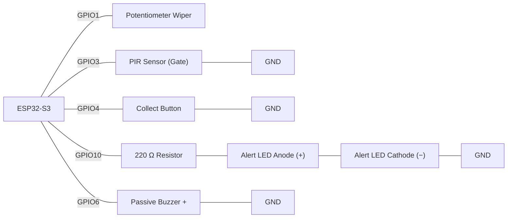

# Task - Revision 

Build a non-blocking recycling-depot bin-fill monitor that combines every concept covered so far: a debounced button logs a collection as a sorted struct record, a PIR sensor watches the depot gate for after-hours motion, and a dictionary-style lookup checks the collected fill-level against a per-bin-type capacity before raising an alert.

**Scenario:**

A recycling depot tracks bin collections at a drop-off point. A potentiometer simulates a fill-level sensor reading a bin's contents as it's tipped for collection. Pressing the Collect button logs a struct record (a timestamp and the fill level) and looks up the bin type's configured maximum capacity by name if the collected fill level exceeds it (the bin overflowed before collection), an alert fires. The PIR sensor separately watches the depot gate for any motion that happens **without** a collection being logged, on the assumption someone is dumping waste after hours. Nothing may block: the Collect button and the PIR must both stay responsive at all times.

**Expected Outcome:**

- A short, debounced press of the Collect button logs exactly one `Collection` record (timestamp + current potentiometer reading), inserted into `collections[]` at the correct sorted position — holding the button, bouncing contacts, or pressing repeatedly must never log more than one record per genuine press.
- If the logged fill level is within `get_capacity("general")`'s limit, nothing further happens — no LED, no buzzer.
- If the logged fill level exceeds the configured capacity, the alert LED and buzzer both fire together for exactly 300 ms and then stop on their own, without freezing button or PIR reads during that window.
- Motion at the PIR gate within 2000 ms of a logged collection is treated as expected activity around a collection and does **not** trigger anything.
- Motion at the PIR gate with no collection logged in the preceding 2000 ms triggers the same 300 ms LED + buzzer alert, flagging it as unregistered dumping.
- Throughout all of the above — including while an alert is actively sounding — the Collect button keeps registering new presses and the PIR keeps registering new motion edges; nothing in `loop()` ever stalls waiting on a `delay()`.
- (Extension) Cycling `binTypeMode` changes which bin type's capacity a collection is checked against, `print_log()` on a long-press dumps every stored record in timestamp order, and the same run also prints the min/max/average fill level across all logged collections.

**Components required:**
- ESP32-S3 development board
- 1 × potentiometer (simulated fill-level reading)
- 1 × PIR sensor (depot gate motion)
- 1 × push button (`INPUT_PULLUP`) — Collect button
- 1 × LED (alert indicator)
- 1 × 220 Ω resistor
- Passive buzzer
- Jumper wires, breadboard

>
> **Wiring:**
>



**Requirements:**
- Define `struct Collection { unsigned long timestamp; int fillLevel; };` and declare `const int MAX_COLLECTIONS = 15;`, `Collection collections[MAX_COLLECTIONS];`, and `int collection_count`.
- Debounce the Collect button using `lastButtonReading`/`buttonState`/`debounceStart` (`DEBOUNCE_TIME = 40`). Only on a validated fresh press, call `log_collection()`: read the potentiometer as the fill level, append a `Collection` record, guarded against exceeding `MAX_COLLECTIONS`, then run an insertion step that swaps the whole record leftward past any earlier one with a **larger** timestamp — the log must stay sorted by timestamp after every insert, not re-sorted from scratch.
- Define `struct BinCapacity { String binType; int maxFill; };` and a small table (at least one entry, `{"general", <a chosen capacity>}`). Write `int get_capacity(String binType)` that linearly searches the table and returns the matching `maxFill`, or `-1` if the bin type isn't found.
- Immediately after logging a collection, look up `get_capacity("general")` — check the sentinel first — and if the logged fill level exceeds it, trigger a non-blocking 300 ms LED + buzzer alert (`millis()`-timed, no `delay()`).
- Edge-detect the PIR (track `lastMotionState`). Track a `bool collectionJustLogged` flag that is set `true` for 2000 ms after any validated Collect press and `false` otherwise. If a fresh PIR motion edge occurs while `collectionJustLogged` is `false`, trigger the same non-blocking alert (unregistered dumping).
- Do not use `delay()` anywhere in `loop()` — the Collect button and PIR must both be read every single pass, including while an alert is active.

**Extension (optional):**
- Add a second `BinCapacity` entry (e.g. `"recyclable"`) and an `int binTypeMode` cycled by a second, debounced button. Use `switch (binTypeMode)` — not `if`/`else if` — to pick which bin type's name is passed into `get_capacity()`, with a `default` case falling back to `"general"`.
- Write `void print_log()` that prints every stored collection's `timestamp` and `fillLevel` in order, triggered by a long-press (held > 1000 ms) of the Collect button, distinguished from a normal short press.
- Compute a single-pass minimum, maximum, and average fill level over `collections[]` (Week 5's scan pattern) every time `print_log()` runs, in addition to the raw list.

>[!NOTE]
> Wokwi Link : https://wokwi.com/projects/474638564592105473
> 
### Questions

- Why does `log_collection()` need to hold the newly-built `Collection` record in a temporary variable before the insertion loop, rather than writing straight into `collections[collection_count]` and shifting other records around it?
  ```


  ```

- What would happen to the alert logic if `get_capacity()`'s sentinel return value were used directly in the fill-level comparison without first checking whether it was `-1`?
  ```


  ```

- Why does the PIR-triggered "unregistered dumping" alert need the `collectionJustLogged` flag, rather than just checking `if (motionDetected)` on its own?
  ```


  ```

- The Collect button uses settle-time debouncing before a press is trusted. What would go wrong with the collection log if that debounce were removed?
  ```


  ```

- Why does `log_collection()` need to check `collection_count` against `MAX_COLLECTIONS` before writing, rather than trusting the array is always big enough?
  ```


  ```

- Identify every place in this program where `millis()`-based timing is used instead of `delay()`, and explain what would break in each case if `delay()` were used instead.
  ```


  ```

### Spot-the-Bug Worksheet

**Format:** For each round, read the snippet and write down what's wrong **before** revealing the answer.

**Round 1:**
```cpp
void loop() {
  if (digitalRead(collectButtonPin) == LOW) {
    log_collection();
  }
}
```
<details><summary>Answer</summary>There's no debouncing — a single physical press's mechanical bounce is read as several rapid `LOW` transitions, so `log_collection()` is called (and appends a new record) several times for one press, quickly exhausting `MAX_COLLECTIONS` with near-duplicate entries. A settle-time debounce check must gate the call.</details>

**Round 2:**
```cpp
struct Collection {
  unsigned long timestamp;
  int fillLevel;
};

void log_collection(int fillLevel) {
  collections[collection_count] = {millis(), fillLevel};
  collection_count++;

  int i = collection_count - 1;
  while (i > 0 && collections[i - 1].timestamp > collections[i].timestamp) {
    collections[i] = collections[i - 1];
    i--;
  }
}
```
<details><summary>Answer</summary>There's no check against `MAX_COLLECTIONS` before writing to `collections[collection_count]`. Once `collection_count` reaches the array's capacity, this writes past the end of the array. A guard such as `if (collection_count >= MAX_COLLECTIONS) return;` is needed at the top of the function.</details>

**Round 3:**
```cpp
int get_capacity(String binType) {
  for (int i = 0; i <= NUM_BIN_TYPES; i++) {
    if (capacities[i].binType == binType) return capacities[i].maxFill;
  }
  return -1;
}
```
<details><summary>Answer</summary>The loop condition should be `i < NUM_BIN_TYPES`, not `i <= NUM_BIN_TYPES`. As written, the loop also checks `capacities[NUM_BIN_TYPES]` — one slot past the end of the array — which is out of bounds.</details>

**Round 4:**
```cpp
void loop() {
  bool motionNow = digitalRead(pirPin) == HIGH;

  if (motionNow) {
    start_alert();
  }
}
```
<details><summary>Answer</summary>There's no edge detection — `start_alert()` is called on *every single pass* of `loop()` for as long as motion stays detected, retriggering the alert continuously rather than once per genuine movement event. It needs to compare against a stored `lastMotionState` and only trigger on the rising edge.</details>

**Round 5:**
```cpp
struct BinCapacity {
  String binType;
  int maxFill;
}

BinCapacity capacities[NUM_BIN_TYPES];
```
<details><summary>Answer</summary>The struct definition is missing its trailing semicolon after the closing brace. `struct BinCapacity { ... };` needs a `;` immediately after `}` — without it, the compiler fails trying to parse `BinCapacity capacities[NUM_BIN_TYPES];` as part of the same declaration.</details>

**Round 6:**
```cpp
int capacity = get_capacity("general");
if (fillLevel > capacity) {
  start_alert();
}
```
<details><summary>Answer</summary>The sentinel returned by `get_capacity()` (`-1` when "general" isn't found) is never checked before being used in the comparison. If the bin type name is misspelled or missing from the table, `capacity` is `-1`, and `fillLevel > -1` is true for essentially any real reading — the alert fires constantly for a bin type that was never configured, instead of reporting a clear "no capacity configured" condition. The caller must check `if (capacity >= 0 && fillLevel > capacity)`.</details>

**Round 7:**
```cpp
void update_alert() {
  if (alertActive && millis() - alertStart >= ALERT_DURATION) {
    digitalWrite(alertLedPin, LOW);
    noTone(buzzerPin);
    alertActive = false;
  }
}

void loop() {
  bool reading = digitalRead(collectButtonPin);
  if (reading == LOW) {
    log_collection(analogRead(fillPin));
    delay(200);
  }
  update_alert();
}
```
<details><summary>Answer</summary>The `delay(200)` after a collection is logged blocks the entire `loop()` for 200 ms, during which `update_alert()` isn't called and the PIR isn't read — an active alert's timing is delayed, and any motion during that window is missed entirely. All timing, including any pause after logging, must use `millis()` comparisons instead of `delay()`.</details>

**Round 8:**
```cpp
switch (binTypeMode) {
  case 0:
    capacityLimit = get_capacity("general");
  case 1:
    capacityLimit = get_capacity("recyclable");
    break;
}
```
<details><summary>Answer</summary>`case 0` is missing its `break`. When `binTypeMode == 0`, execution sets `capacityLimit` from `"general"` and then "falls through" into `case 1`, immediately overwriting it with `"recyclable"`'s capacity instead — every collection is silently checked against the wrong bin type's limit whenever mode 0 is selected. Every `case` needs its own `break` unless falling through is a deliberate, commented choice.</details>

**Round 9:**
```cpp
switch (binTypeMode) {
  case 0:
    capacityLimit = get_capacity("general");
    break;
  case 1:
    capacityLimit = get_capacity("recyclable");
    break;
}
```
<details><summary>Answer</summary>There's no `default` case. If `binTypeMode` were ever something other than `0` or `1` (e.g. left uninitialised, or a third mode is added to the cycling logic later without updating this `switch`), `capacityLimit` simply keeps whatever value it held from the last valid mode instead of being reset to a known state — the bug is silent because nothing crashes, it just silently checks the wrong (stale) limit. Every `switch` should include a `default` case, even if it just leaves a clearly-flagged safe value.</details>
