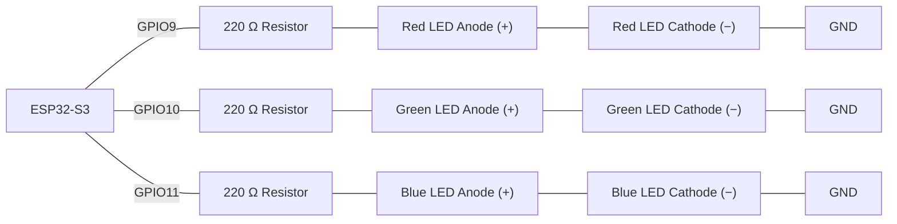
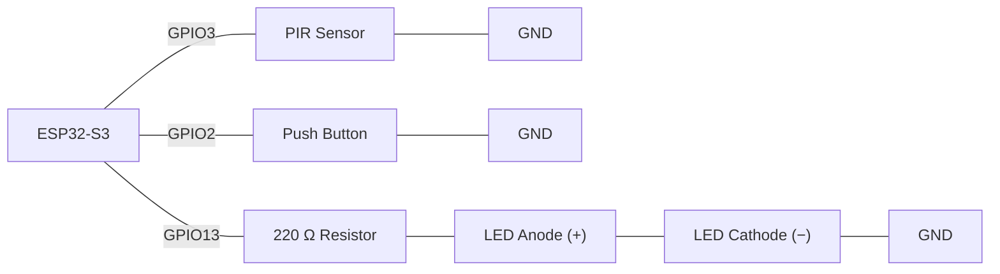
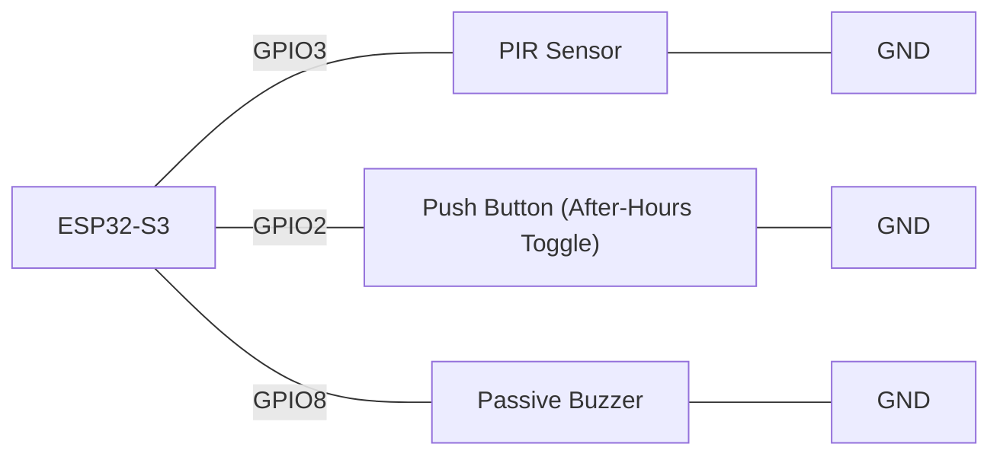
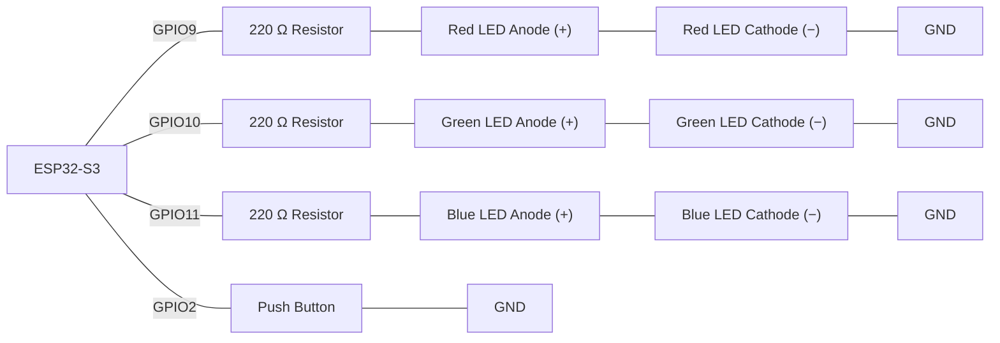
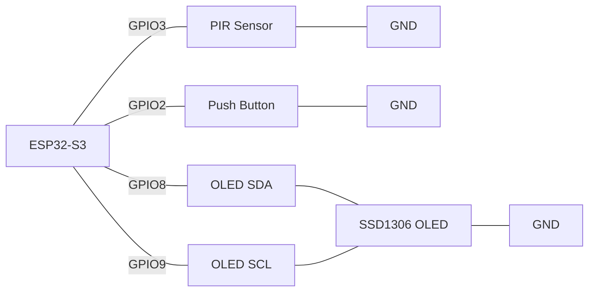
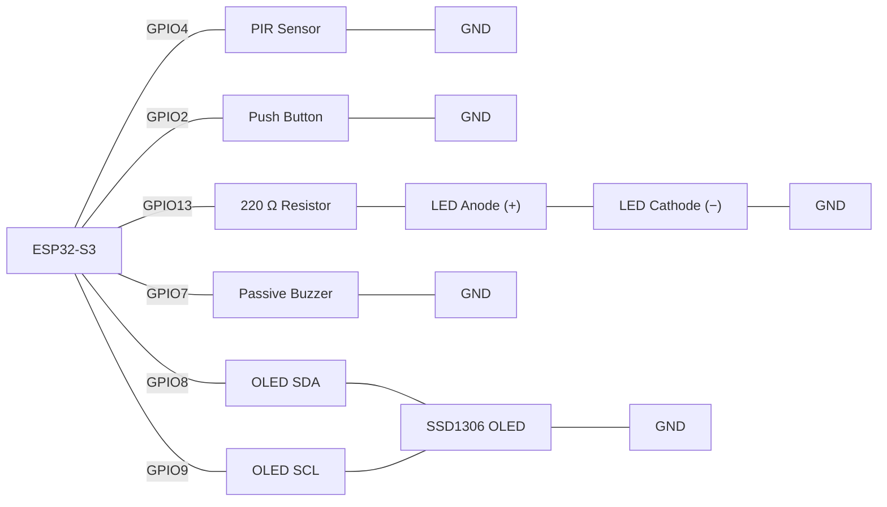

# Activity 4 - Combining Multiple Sensors (Week 4)

## Task 1 - Blink Function With Parameters

**Scenario:**

A workshop indicator panel needs a red, a green, and a blue LED blinking at different speeds depending on the situation, without duplicating the same `digitalWrite`/`delay` code for each one.

**Components:**

- ESP32-S3 development board
- Red LED
- Green LED
- Blue LED
- 3x 220 Ω resistor
- Jumper wires

> **Wiring:**



Write a function `blink_led(int pin, int times, int onTime)` that blinks the LED on `pin` `times` times, staying on and off for `onTime` milliseconds each. Call it from `loop()` three times — once for the red LED, once for the green LED, and once for the blue LED — with a different `onTime` each (e.g. fast, medium, and slow) so you can see the same function producing three different speeds.

>
> Wokwi link: https://wokwi.com/projects/472678434137535489

**Check yourself:**
- [ ] `blink_led()` takes a pin, a count, and a timing parameter — nothing about which LED or its speed is hard-coded inside the function
- [ ] `loop()` only calls `blink_led()`; it contains no raw `digitalWrite`/`delay` of its own
- [ ] The red, green, and blue LEDs are all driven by the same function, and each one visibly blinks at a different speed from the other two

---

## Task 2 - PIR/Button Priority Alert Using Selection

**Scenario:**

A stockroom needs a single LED alert that responds to two inputs — a PIR sensor and a manual button — but motion should always take priority if both happen to trigger in the same instant. The status message must not flood the Serial monitor with a duplicate line on every single pass of `loop()`.

**Components:**

- ESP32-S3 development board
- PIR sensor
- Push button (`INPUT_PULLUP`)
- LED
- 220 Ω resistor
- Jumper wires

> **Wiring:**



Write `read_pir()` and `read_button()` as functions returning `bool`. In `loop()`, use `if` / `else if` / `else` so: motion → LED on, status `"Motion"`; else button pressed → LED on, status `"Button"`; else → LED off, status `"Idle"`. The LED itself must still update immediately on every pass — but use the `millis()` pattern (`unsigned long previousMillis`, a `const long reportInterval` of 500 ms) so the current status is only printed to Serial at most once every `reportInterval`, not on every single pass. Do not use `delay()` anywhere. Confirm which branch wins when you trigger both at once.

>
> Wokwi link: https://wokwi.com/projects/472678982127757313
>

**Check yourself:**
- [ ] `read_pir()` and `read_button()` both return `bool`, not `int`
- [ ] Triggering both inputs at the same time always shows `"Motion"`, never `"Button"`
- [ ] The LED turns off only when neither input is active, and updates immediately every pass
- [ ] The status is only printed to Serial at most once every `reportInterval` (500 ms), using `millis()` — not on every pass, and not via `delay()`

---

## Task 3 - Boolean AND — After-Hours Motion Alarm

**Scenario:**

A warehouse buzzer should only sound when motion is detected **and** it's after hours — motion during the day (staff walking around) should be ignored. There's no clock module, so staff flip a physical mode switch at the start and end of their shift rather than the code being reprogrammed every time. The buzzer must give a single 1000 ms pulse each time the alarm condition newly triggers, not blare continuously for as long as motion is present.

**Components:**

- ESP32-S3 development board
- PIR sensor
- Push button (`INPUT_PULLUP`) — after-hours toggle
- Passive buzzer
- Jumper wires

> **Wiring:**



Declare `bool afterHours` near the top of the program, starting at `false`. Rather than hard-coding it, let the push button toggle it: track a `bool lastButtonState`, and each time the raw button reading changes from not-pressed to pressed (a rising edge), flip `afterHours = !afterHours`. Use `&&` so the alarm condition is only true when **both** motion is detected **and** `afterHours` is `true`. This is a **passive** buzzer, so `digitalWrite()` alone won't produce a tone — use `tone(buzzerPin, buzzerFrequency)` to start it and `noTone(buzzerPin)` to stop it. Track the buzzer with a `bool buzzerActive` and an `unsigned long buzzerStartTime`: when the alarm condition first becomes true and the buzzer isn't already active, call `tone(buzzerPin, buzzerFrequency)`, set `buzzerActive = true`, and record `buzzerStartTime = millis()`. On every pass of `loop()`, if the buzzer is active and `millis() - buzzerStartTime >= 1000`, call `noTone(buzzerPin)` and set `buzzerActive = false`. Do not use `delay()` anywhere.

>
> Wokwi link: https://wokwi.com/projects/472681863784370177
>

**Check yourself:**
- [ ] Pressing the button toggles `afterHours` between `true` and `false` — one flip per press, not repeatedly while held
- [ ] The buzzer stays silent with motion present but `afterHours = false`
- [ ] The buzzer is started with `tone(buzzerPin, buzzerFrequency)` and stopped with `noTone(buzzerPin)` — not `digitalWrite()`
- [ ] The buzzer fires a single 1000 ms pulse when both conditions become true, using `millis()` — not `delay()`
- [ ] `buzzerStartTime` is recorded the moment the buzzer turns on, and is declared `unsigned long`
- [ ] The buzzer doesn't start a new pulse on top of one that's already running

---

## Task 4 - Boolean OR — Dual-Input Alert

**Scenario:**

The same warehouse now wants the alert LED to light from **either** the PIR sensor **or** a manual test button, so staff can trigger a test without waiting for motion. The test button is a cheap mechanical switch prone to contact bounce, so each physical press must be debounced in software using `millis()` rather than counted multiple times.

**Components:**

- ESP32-S3 development board
- PIR sensor
- Push button (`INPUT_PULLUP`)
- LED
- 220 Ω resistor
- Jumper wires

> **Wiring:**


Read the raw button pin into a `bool rawButtonPressed` at the top of `loop()`. Debounce it with the `millis()` pattern: keep an `unsigned long lastDebounceTime` and a `const long debounceDelay` of 300 ms; only accept `rawButtonPressed` as a real `buttonPressed` reading if at least `debounceDelay` has passed since the last time the raw reading changed (updating `lastDebounceTime` whenever it does). Read the PIR into `bool motionDetected` as normal — it doesn't need debouncing. Use `if (motionDetected || debouncedButtonPressed)` to turn the LED on, and `else` to turn it off. Do not use `delay()` anywhere.

>
> Wokwi link: https://wokwi.com/projects/472682245567918081
>

**Check yourself:**
- [ ] The LED turns on from the PIR alone, the debounced button alone, or both together
- [ ] The LED turns off only when neither input is active
- [ ] The button reading is debounced using `millis()` (`lastDebounceTime` as `unsigned long`, `debounceDelay` of 300 ms), not `delay()`
- [ ] Both sensor readings are stored in named `bool` variables before the `if`, not called twice inside it

---

## Task 5 - Non-blocking Test-Blink Timer

**Scenario:**

Workshop staff want to press a button to trigger a 5-second self-test on all three LEDs from Task 1's panel: while the test runs, the red, green, and blue LEDs flash together to catch the eye, then stop automatically once the 5 seconds are up. The button must still be read every single pass — even mid-test — so a fresh press restarts the test from zero, and nothing may block.

**Components:**

- ESP32-S3 development board
- Red LED
- Green LED
- Blue LED
- 3x 220 Ω resistor
- Push button (`INPUT_PULLUP`)
- Jumper wires

> **Wiring:**



This needs **two independent `millis()` timers running at once**, not just one: an `unsigned long testStartTime` bounding the whole test against a `const long testDuration` of 5000 ms, and a separate `unsigned long previousBlinkMillis` toggling all three LEDs together against a `const long blinkInterval` of 250 ms — only while the test is running. Track `bool testRunning` and `bool lastButtonState` for edge detection. On every pass of `loop()`: check the raw button state, and on a rising edge (a fresh press, not held), set `testRunning = true` and `testStartTime = millis()` — this restarts the 5-second window even if a test is already in progress. Whenever `testRunning` is `true`, toggle the same on/off state onto all three LED pins together on the `blinkInterval` timer (e.g. loop over an array of the three pins so there's no repeated `digitalWrite` code); once `millis() - testStartTime >= testDuration`, turn all three LEDs off and set `testRunning = false`. Do not use `delay()` anywhere.

>
> Wokwi link: https://wokwi.com/projects/472683682988874753
>

**Check yourself:**
- [ ] A fresh button press (edge detected, not held) starts a 5-second test; holding the button doesn't repeatedly restart it
- [ ] Pressing the button again mid-test restarts the 5-second window from zero
- [ ] All three LEDs flash together in sync on the shared `blinkInterval` timer, independent from the `testDuration` timer bounding the whole test
- [ ] The test stops automatically once `testDuration` has elapsed, turning all three LEDs off and clearing `testRunning`- [ ] `loop()` contains no `delay()` calls anywhere, and all `millis()`-based timing variables are `unsigned long`

---

## Task 6 - Non-blocking Status Display (OLED)

**Scenario:**

The stockroom alert from Task 2 needs an at-a-glance status screen instead of only a Serial log — an SSD1306 OLED should show `"System OK"`, `"ALERT: Motion"`, or `"ALERT: Button"` depending on what's happening, and it must update immediately without ever using `delay()`. Staff also want a "heartbeat" redraw at least every 2 seconds even while the status stays the same, so a frozen screen is easy to tell apart from a genuinely unchanged status.

**Components:**

- ESP32-S3 development board
- PIR sensor
- Push button (`INPUT_PULLUP`)
- SSD1306 OLED display (128×64, I²C)
- Jumper wires

> **Wiring:**



Set up the display as in the Week 2 resource notes: `#include <Adafruit_GFX.h>` and `#include <Adafruit_SSD1306.h>`, then `Wire.begin(8, 9)` and `display.begin(SSD1306_SWITCHCAPVCC, 0x3C)` inside `setup()`. Write `update_display(String status)`, calling `display.clearDisplay()` → `display.setCursor(0, 0)` → `display.println(status)` → `display.display()`, in that order. In `loop()`, work out the current status string from `read_pir()`/`read_button()`, track the previous status in a variable to compare against, and track an `unsigned long lastRefresh` with a `const long heartbeatInterval` of 2000 ms. Call `update_display()` — and update `lastRefresh = millis()` — whenever either the status has changed **or** `millis() - lastRefresh >= heartbeatInterval` has elapsed, whichever comes first. Do not use `delay()` anywhere.

>
> Wokwi link: https://wokwi.com/projects/472684464516881409
>

**Check yourself:**
- [ ] `update_display()` ends with `display.display()`, or nothing appears on screen
- [ ] The OLED text changes correctly between all three states: OK, motion alert, button alert
- [ ] The screen redraws immediately when the status changes, and also at least once every `heartbeatInterval` (2000 ms) even while it stays the same, using `millis()` — not on every single pass of `loop()`, and not via `delay()`

---

## Task 7  Non-blocking Warehouse Alarm Station

**Scenario:**

A warehouse needs a combined alert station: a PIR sensor detects unauthorised motion, and a manual button lets staff trigger a test alert. Either input should sound the buzzer, light a warning LED, and show the alert on an OLED status screen — but nothing may block, since the PIR sensor and button both need to keep being read while the buzzer is sounding.

**Components:**

- ESP32-S3 development board
- PIR sensor
- Push button (`INPUT_PULLUP`)
- LED
- Passive buzzer
- SSD1306 OLED display (128×64, I²C)
- 220 Ω resistor
- Jumper wires

> **Wiring:**



**Program requirements — this task combines every concept from this week:**
1. **Functions:** write `read_pir()`, `read_button()`, `set_led()`, `start_buzzer()`, `update_buzzer()`, `update_display()`, and `log_event()`. `loop()` should only call these.
2. **Selection:** use `if` / `else` in `loop()` to decide whether the alert is active.
3. **Boolean logic:** combine the two inputs with `||` so either one triggers the alert.
4. **Non-blocking timing:** this is a **passive** buzzer, so `start_buzzer(int duration)` starts it with `tone(buzzerPin, buzzerFrequency)` (not `digitalWrite()`) and records `millis()`; `update_buzzer()` — called every pass of `loop()` — calls `noTone(buzzerPin)` to turn it off once `duration` has elapsed. No `delay()` anywhere in `loop()`.
5. **Display:** `update_display()` shows the current status and is only called when that status changes or the heartbeat interval elapses (as in Task 6).
6. Log a message via `log_event()` each time the alert starts, stating which sensor caused it, using the same status text passed to `update_display()`.

>
> Wokwi link: https://wokwi.com/projects/472684827957585921
>

**Check yourself:**
- [ ] Every sensor read and output action lives inside its own function
- [ ] The PIR sensor and button are both still readable every loop while the buzzer is sounding
- [ ] All `millis()`-based timing variables are `unsigned long`
- [ ] The alert triggers from either input using `||`, and the log message correctly names which one fired
- [ ] The OLED status redraws when it actually changes, and at least every heartbeat interval otherwise

---

## Task 8 - Spot-the-Bug Worksheet (Extension)

**Format:** For each round, read the snippet and write down what's wrong **before** revealing the answer.

**Round 1:**
```cpp
void loop() {
  bool motionDetected = read_pir();
  bool buttonPressed = read_button();

  if (motionDetected) {
    set_led(true);
  } else if (motionDetected || buttonPressed) {
    set_led(true);
  } else {
    set_led(false);
  }
}
```
<details><summary>Answer</summary>The second branch can never be reached in the way intended — once <code>motionDetected</code> is false (the only way to reach the <code>else if</code>), <code>motionDetected || buttonPressed</code> just collapses to checking <code>buttonPressed</code> alone. The condition should simply be <code>buttonPressed</code>.</details>

**Round 2:**
```cpp
void start_buzzer(int duration) {
  tone(buzzerPin, buzzerFrequency);
  buzzerActive = true;
  buzzerDuration = duration;
}

void update_buzzer() {
  if (buzzerActive && millis() - buzzerStartTime >= buzzerDuration) {
    noTone(buzzerPin);
    buzzerActive = false;
  }
}
```
<details><summary>Answer</summary><code>start_buzzer()</code> never records <code>buzzerStartTime = millis();</code> — without it, <code>buzzerStartTime</code> stays at its old value (or 0), so <code>update_buzzer()</code>'s timing check is meaningless.</details>

**Round 3:**
```cpp
void loop() {
  unsigned long currentMillis = millis();
  unsigned long previousMillis = 0;
  const long interval = 500;

  if (currentMillis - previousMillis >= interval) {
    previousMillis = currentMillis;
    blink_led();
  }
}
```
<details><summary>Answer</summary><code>previousMillis</code> is declared (and reset to <code>0</code>) <strong>inside</strong> <code>loop()</code>, so it loses its value the instant the function returns. Every single pass, <code>currentMillis - previousMillis</code> is computed against a fresh <code>0</code>, which is always <code>&gt;= interval</code> — so <code>blink_led()</code> fires on every pass instead of once every 500 ms. <code>previousMillis</code> needs to keep its value between calls, either by declaring it <code>static</code> inside <code>loop()</code> or as a variable outside <code>loop()</code> entirely.</details>

**Round 4:**
```cpp
bool read_pir() {
  if (digitalRead(pirPin) == HIGH) {
    return true;
  }
}

void loop() {
  if (read_pir()) {
    start_buzzer(500);
  }
}
```
<details><summary>Answer</summary>There's no <code>return false;</code> for the case where the PIR sensor reads <code>LOW</code> — a function declared to return <code>bool</code> that doesn't return on every path gives an unreliable result when no motion is detected.</details>

**Round 5:**
```cpp
void loop() {
  bool motionDetected = read_pir();
  bool afterHours = true;

  if (motionDetected | afterHours) {
    start_buzzer(500);
  }
}
```
<details><summary>Answer</summary><code>|</code> is the bitwise OR operator, not the logical OR. It happens to evaluate correctly here because both sides are already <code>bool</code>, but it's the wrong tool and can silently misbehave with non-boolean values — it should be <code>||</code>.</details>

**Round 6:**
```cpp
#include <Adafruit_GFX.h>
#include <Adafruit_SSD1306.h>

Adafruit_SSD1306 display(128, 64, &Wire);

void setup() {
  Wire.begin(8, 9);
  Serial.begin(115200);
}

void update_display(String status) {
  display.clearDisplay();
  display.setCursor(0, 0);
  display.println(status);
  display.display();
}
```
<details><summary>Answer</summary><code>setup()</code> never calls <code>display.begin(SSD1306_SWITCHCAPVCC, 0x3C)</code> — without initialising the SSD1306 driver chip first, the display object isn't ready to receive commands, so <code>update_display()</code> will have no visible effect (or the sketch may hang/crash on some boards).</details>


---

## Questions

Answer these in your own words before moving on:

1. Why does splitting sensor reads and actions into functions (`read_pir()`, `start_buzzer()`, etc.) make a multi-sensor program easier to extend later?
   ```


   ```

2. In Task 2, what would happen if `else if (buttonPressed)` were changed to a separate `if (buttonPressed)` instead? Would the priority behaviour still hold?
   ```


   ```

3. Why does `&&` (Task 3) only need one side to be false to stop the alert, while `||` (Task 4) needs both sides to be false?
   ```


   ```

4. In Task 3/7, what specifically would break if `start_buzzer()`/`update_buzzer()` were replaced with a single call to `activate_buzzer()` that used `delay(duration)` instead?
   ```


   ```

5. Why must every variable that stores a `millis()` timestamp be declared `unsigned long`, and what could go wrong if one were declared as a signed `int` instead?
   ```


   ```

6. In Task 6/7, why does `update_display()` need a "previous status" variable to compare against, when `update_buzzer()` doesn't need anything similar?
   ```


   ```
