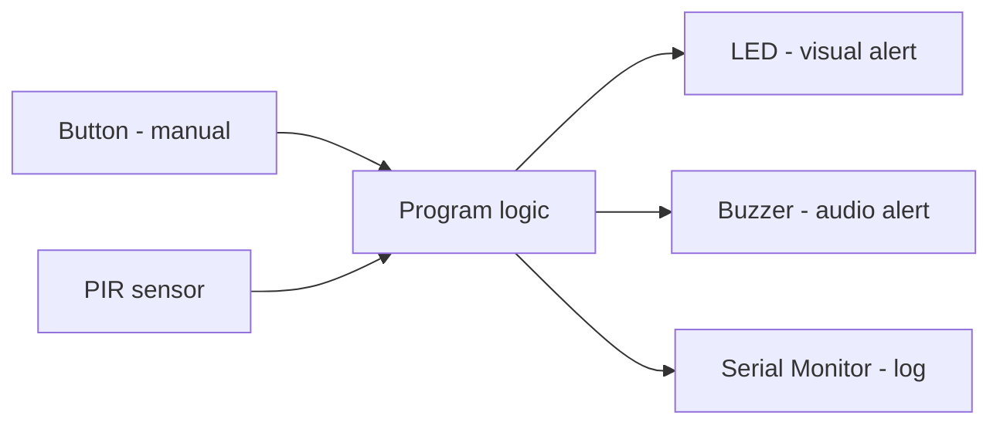
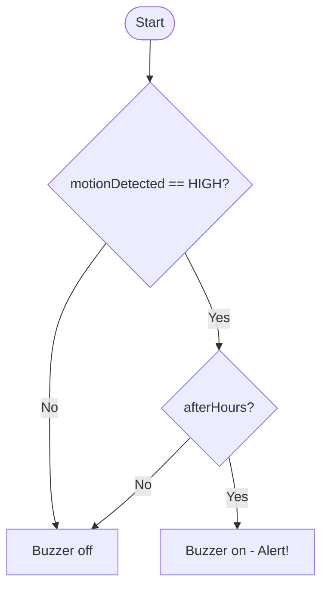

# Week 4 — Combining Multiple Sensors

## From Single Components to a System
In previous weeks, you programmed one component at a time. Real IoT devices combine multiple inputs and outputs into a single coordinated program.

**Example — Smart Security Node:**


This node combines two inputs a manual **Button** and a **PIR motion sensor**  into one program's logic, which then drives three outputs at once: an **LED** for a visual alert, a **Buzzer** for an audio alert, and the **Serial Monitor** to log what happened. It's the running example for this week: instead of reading one sensor and driving one output, the program must decide how multiple inputs combine before triggering multiple outputs together.

### Boolean Logic
`&&` (AND), `||` (OR) and `!` (NOT) combine multiple conditions into one. `if (motionDetected && afterHours)` only triggers when *both* conditions are true; `if (buttonPressed || timeoutReached)` triggers when *either* is true. Understanding how these combine and how `!` inverts a condition  is essential once your decisions depend on more than one input.

| Operator | Definition | When to use it |
|---|---|---|
| `&&` (AND) | `true` only if **both** conditions on either side are `true` | When an action should only happen once **every** required condition is met at the same time — e.g. alert only if motion is detected **and** it's after hours |
| <code>&#124;&#124;</code> (OR) | `true` if **at least one** of the conditions on either side is `true` | When an action should happen if **any one** of several inputs triggers it — e.g. alert if the PIR **or** the button fires |
| `!` (NOT) | Flips a `true`/`false` value to its opposite | When you want to check the **absence** of a condition, or a sensor's logic is inverted — e.g. `if (!buttonPressed)` to check the button is *not* pressed |

**Truth table:**

| A | B | `A && B` | <code>A &#124;&#124; B</code> | `!A` |
|---|---|---|---|---|
| `false` | `false` | `false` | `false` | `true` |
| `false` | `true` | `false` | `true` | `true` |
| `true` | `false` | `false` | `true` | `false` |
| `true` | `true` | `true` | `true` | `false` |

**Syntax:**
```cpp
if (condition1 && condition2) {
  // runs only if BOTH condition1 and condition2 are true
}
```



**Simple example:**
```cpp
const int PIR_PIN = 3;          
const int BUZZER_PIN = 8;       
const int BUZZER_FREQUENCY = 2000;

bool afterHours = true;    // set elsewhere in the program, 
void setup() {
  Serial.begin(115200);

  pinMode(PIR_PIN, INPUT);
  pinMode(BUZZER_PIN, OUTPUT);
}

void loop() {
  int motionDetected = digitalRead(PIR_PIN);

  if (motionDetected == HIGH && afterHours) {
    tone(BUZZER_PIN, BUZZER_FREQUENCY);
    Serial.println("Alert! Motion detected after hours");
  } else {
    noTone(BUZZER_PIN);
  }

  delay(200);
}
```


> This example stores the raw `digitalRead()` result as `int` and compares it with `== HIGH`, since that's what `digitalRead()` returns directly. Later examples wrap the sensor read in a function like `read_pir()` that returns `bool` instead  that's a design choice for readability, not a different underlying mechanism: `HIGH` is `1` and `LOW` is `0`, so `motionDetected == HIGH` and a `bool` returned as `true` mean the same thing.


## Structuring a Multi-Component Program
When combining multiple components, follow this structure:

1. **Declare all pin variables at the top** — one per component, clearly named.
2. **Write one function per component action** — e.g., `read_pir()`, `trigger_alert()`.
3. **Keep `loop()` clean** — it should read like a list of actions, not contain raw code.
4. **Use comments to label sections** — group variable declarations, function definitions, and the main logic.

### `constexpr` and Right-Sized Types: `uint8_t` vs `int`

Pin numbers never change while the program is running, and an ESP32 pin number never goes above a few dozen nowhere near the range `int` provides. Two keywords let a declaration say that precisely.

### What is `uint8_t`?

`uint8_t` is an unsigned 8-bit integer type, range `0`–`255`. It matches the actual size of a pin number and uses a quarter of the memory of a 32-bit `int`.

### What is `constexpr`?

`constexpr` is a C++ keyword that tells the compiler a value must be known and fixed at compile time, not computed while the program runs.

**Key points:**
- Once declared `constexpr`, the value can never be reassigned — the compiler enforces this as a hard error, not just a convention.
- Because the compiler knows the value up front, it can substitute it directly wherever it's used (no memory lookup at runtime), and it can also use it in contexts that require compile-time constants, like array sizes.
- It's stronger than plain `const`. `const` only promises "won't change after initialization" — the initial value itself could still come from something computed at runtime (e.g., a function call). `constexpr` requires the value to be a literal or something fully resolvable at compile time.

**Example:**
```cpp
constexpr uint8_t pirPin = 3;   // fixed, compile-time constant — valid
const uint8_t sensorValue = analogRead(A0);  // valid — but NOT constexpr-eligible, since it's only known at runtime
```

| | `int pirPin = 3;` | `constexpr uint8_t pirPin = 3;` |
|---|---|---|
| Size | 32-bit | 8-bit |
| Range | −2,147,483,648 to 2,147,483,647 | 0 to 255 |
| Can be reassigned later? | Yes | No — compile error if you try |
| Value fixed at compile time? | Not guaranteed | Guaranteed |
| Matches what a pin number needs? | Far more range than needed | Exact fit |

```cpp
constexpr uint8_t pirPin    = 3;
constexpr uint8_t buttonPin = 2;
constexpr uint8_t ledPin    = 13;
constexpr uint8_t buzzerPin = 8;
```

> The "Simple example" above uses plain `const int` pins for simplicity while introducing boolean logic, before this convention has been taught. From here on, every example on this page uses `constexpr uint8_t` for pin declarations, and this week's task requires it too — use the form above in your own code.

### Program Layout Template
```cpp
// === Pin Declarations ===
constexpr uint8_t pirPin    = 3;
constexpr uint8_t buttonPin = 2;
constexpr uint8_t ledPin    = 13;
constexpr uint8_t buzzerPin = 8;

// === Functions ===

bool read_pir() { ... }
bool read_button() { ... }
void turn_led_on() { ... }
void turn_led_off() { ... }
void activate_buzzer(int ms) { ... }
void log_event(String msg) { ... }

// === Setup and Loop ===

void setup() { ... }

void loop() { ... }
```

### Reading Multiple Inputs in One Loop
You can read multiple sensors in a single `loop()` cycle and combine their logic:

```cpp
bool motionDetected = read_pir();
bool buttonPressed  = read_button();

if (motionDetected || buttonPressed) {
  turn_led_on();
  activate_buzzer(300);
}
```

> `||` means **OR** — the alert fires if **either** condition is true.

### Non-blocking Timing: `millis()` vs `delay()`
Once a program reads more than one sensor, `delay()` becomes a problem: while the program is paused inside a `delay()`, it cannot read the PIR sensor, check the button, or do anything else. A long `delay()` in `activate_buzzer()` means the button and PIR are effectively "deaf" for that whole time.

### What is `millis()`?

`millis()` returns the number of milliseconds that have passed since the board started running the current program, as an `unsigned long`. It doesn't pause anything it's just a running clock you can read at any point in `loop()`. By comparing the current value of `millis()` to a value you saved earlier, you can tell "has enough time passed yet?" without ever blocking the rest of the code.

### What does `unsigned` mean?

`unsigned` is a modifier on an integer type that means the variable can only hold values ≥ 0 — no negatives. A signed type normally spends one bit marking positive vs. negative; `unsigned` gives that bit to magnitude instead, so giving up the negative range doubles the maximum positive value the variable can store.

| Type | Size on ESP32 | Range |
|---|---|---|
| `int` (signed) | 32-bit | −2,147,483,648 to 2,147,483,647 |
| `unsigned int` | 32-bit | 0 to 4,294,967,295 |
| `long` (signed) | 32-bit | −2,147,483,648 to 2,147,483,647 |
| `unsigned long` | 32-bit | 0 to 4,294,967,295 |

> On the ESP32, `int` and `long` are both 32-bit and have identical ranges. This differs from AVR boards like the Arduino Uno, where `int` is only 16-bit — always check your board if a variable's range matters.

Time since the board started can never be negative, so `millis()` returns `unsigned long` to get the full 0 to 4,294,967,295 range — about 49.7 days — before it wraps back to 0, instead of running out at half that if it were signed.

This also matters for the timing pattern below: `if (currentMillis - previousMillis >= interval)` stays correct even at the moment `millis()` wraps around, because both variables are `unsigned long` and unsigned subtraction wraps using the same modular arithmetic as `millis()` itself. If either variable were a signed type, that subtraction could go negative right at the wraparound and break the comparison — which is why `previousMillis` should always be declared `unsigned long` to match what `millis()` returns.

### `delay()` vs `millis()`
| | `delay(ms)` | `millis()` |
|---|---|---|
| Behaviour | **Blocks** — pauses the entire program for `ms` milliseconds | **Non-blocking** — returns immediately; you check the elapsed time yourself |
| Other sensors during the wait | Cannot be read | Still read every loop, as normal |
| Multiple timers at once | Not possible (`delay()` only pauses everything) | Possible (each timer keeps its own "last run" variable) |
| Typical use | Very short, simple programs with one thing happening at a time | Any program combining multiple sensors/outputs — including this week's programs |

### How to Use `millis()` — the Standard Pattern
```cpp
unsigned long previousMillis = 0;   // remembers when the action last ran
const long interval = 1000;         // how often to repeat, in ms (1000 ms = 1 s)

void loop() {
  unsigned long currentMillis = millis();

  if (currentMillis - previousMillis >= interval) {
    previousMillis = currentMillis;  // reset the timer
    // ...do the timed action here...
  }

  // everything else in loop() keeps running immediately, every pass,
  // instead of being frozen while this timer waits
}
```
Subtracting `previousMillis` from `currentMillis` (rather than comparing to a fixed target) is what makes this safe even when `millis()` eventually overflows and wraps back to 0 after about 49 days.

#### Example 1 — Blink an LED Without Blocking Anything Else
```cpp
constexpr uint8_t ledPin = 13;
unsigned long previousMillis = 0;
const long interval = 500;   // toggle every 500 ms
bool ledState = false;

void setup() {
  pinMode(ledPin, OUTPUT);
}

void loop() {
  unsigned long currentMillis = millis();

  if (currentMillis - previousMillis >= interval) {
    previousMillis = currentMillis;
    ledState = !ledState;
    digitalWrite(ledPin, ledState);
  }

  // a button or sensor read placed here would still run every loop,
  // unlike if this blink used delay(500) instead
}
```

#### Example 2 — Applying It to This Lesson's Buzzer
The `start_buzzer()` function used in the Smart Alert System below blocks with `delay(duration)`, which freezes `loop()` and stops the PIR and button from being checked while the buzzer sounds. A `millis()`-based version keeps the buzzer timed without blocking. This is a **passive** buzzer, so it's started with `tone(buzzerPin, buzzerFrequency)` and stopped with `noTone(buzzerPin)` — `digitalWrite()` alone wouldn't produce a tone:
```cpp
constexpr int buzzerFrequency = 2000;
bool buzzerActive = false;
unsigned long buzzerStartTime = 0;
int buzzerDuration = 0;

void start_buzzer(int duration) {
  tone(buzzerPin, buzzerFrequency);
  buzzerActive = true;
  buzzerStartTime = millis();
  buzzerDuration = duration;
}

void update_buzzer() {
  if (buzzerActive && millis() - buzzerStartTime >= buzzerDuration) {
    noTone(buzzerPin);
    buzzerActive = false;
  }
}
```
`start_buzzer()` turns the buzzer on and records when it should stop; `update_buzzer()` is called on every pass of `loop()` and only turns it off once enough time has passed — the PIR and button keep being read the whole time the buzzer is sounding.

#### Example 3 — Combining Functions, Selection, Boolean Logic and `millis()`
This example brings everything from this page together into one non-blocking version of the Stage 3 alert system: one **function** per component action, **selection** (`if` / `else if` / `else`) to decide which action runs, **boolean logic** (`&&`, `||`) to combine multiple sensor readings, and **`millis()`** so the buzzer timing never blocks the PIR or button from being read.
```cpp
// === Pin Declarations ===
constexpr uint8_t pirPin    = 3;
constexpr uint8_t buttonPin = 2;
constexpr uint8_t ledPin    = 13;
constexpr uint8_t buzzerPin = 8;
constexpr int buzzerFrequency = 2000;

// === State for non-blocking buzzer ===
bool buzzerActive = false;
unsigned long buzzerStartTime = 0;
int buzzerDuration = 0;

// === Functions ===

bool read_pir() {
  return digitalRead(pirPin) == HIGH;
}

bool read_button() {
  return digitalRead(buttonPin) == LOW;   // LOW = pressed (INPUT_PULLUP)
}

void set_led(bool on) {
  digitalWrite(ledPin, on ? HIGH : LOW);
}

void start_buzzer(int duration) {
  tone(buzzerPin, buzzerFrequency);   // passive buzzer — needs a driven frequency
  buzzerActive = true;
  buzzerStartTime = millis();
  buzzerDuration = duration;
}

void update_buzzer() {
  // selection + boolean AND: only stop the buzzer once it's running AND its time is up
  if (buzzerActive && millis() - buzzerStartTime >= buzzerDuration) {
    noTone(buzzerPin);
    buzzerActive = false;
  }
}

void log_event(String message) {
  Serial.print("[LOG] ");
  Serial.println(message);
}

// === Setup and Loop ===

void setup() {
  pinMode(pirPin,    INPUT);
  pinMode(buttonPin, INPUT_PULLUP);
  pinMode(ledPin,    OUTPUT);
  pinMode(buzzerPin, OUTPUT);
  Serial.begin(9600);
  log_event("System initialised. Monitoring started.");
}

void loop() {
  bool motionDetected = read_pir();
  bool buttonPressed  = read_button();

  // selection with boolean OR: either input can trigger the same alert
  if (motionDetected || buttonPressed) {
    set_led(true);
    if (!buzzerActive) {                  // don't restart a buzz that's already running
      start_buzzer(motionDetected ? 500 : 200);
      log_event(motionDetected ? "Motion detected." : "Manual button triggered.");
    }
  } else {
    set_led(false);
  }

  update_buzzer();   // checked every loop, never blocks PIR/button reads above
}
```


---

### Smart Alert System

> **Note:** This example uses the simpler, blocking `activate_buzzer()` with `delay()` so the core structure (functions, selection, boolean logic) is easier to follow on a first pass. Example 3 above shows the same system rebuilt with `start_buzzer()` / `update_buzzer()` and `millis()` so nothing blocks — converting this demo to that non-blocking version is good follow-up practice.

### Circuit Setup
**Components required:**
- ESP32-S3 development board
- 1 × PIR sensor (GPIO3)
- 1 × push button (GPIO2, `INPUT_PULLUP`)
- 1 × red LED (GPIO13)
- 1 × passive buzzer (GPIO8)
- 220 Ω resistor for LED
- Jumper wires, breadboard

### Code — Combined PIR and Button Alert System
```cpp
// === Pin Declarations ===
constexpr uint8_t pirPin    = 3;
constexpr uint8_t buttonPin = 2;
constexpr uint8_t ledPin    = 13;
constexpr uint8_t buzzerPin = 8;
constexpr int buzzerFrequency = 2000;

// === Functions ===

bool read_pir() {
  return digitalRead(pirPin) == HIGH;
}

bool read_button() {
  return digitalRead(buttonPin) == LOW;   // LOW = pressed (INPUT_PULLUP)
}

void turn_led_on() {
  digitalWrite(ledPin, HIGH);
}

void turn_led_off() {
  digitalWrite(ledPin, LOW);
}

void activate_buzzer(int duration) {
  tone(buzzerPin, buzzerFrequency);   // passive buzzer — needs a driven frequency
  delay(duration);
  noTone(buzzerPin);
}

void log_event(String message) {
  Serial.print("[LOG] ");
  Serial.println(message);
}

// === Setup and Loop ===

void setup() {
  pinMode(pirPin,    INPUT);
  pinMode(buttonPin, INPUT_PULLUP);
  pinMode(ledPin,    OUTPUT);
  pinMode(buzzerPin, OUTPUT);
  Serial.begin(9600);
  log_event("System initialised. Monitoring started.");
}

void loop() {
  bool motionDetected = read_pir();
  bool buttonPressed  = read_button();

  if (motionDetected) {
    turn_led_on();
    activate_buzzer(500);
    log_event("Motion detected.");
  } else if (buttonPressed) {
    turn_led_on();
    activate_buzzer(200);
    log_event("Manual button triggered.");
  } else {
    turn_led_off();
  }

  delay(100);
}
```

### Code Walkthrough
| Section | What it does |
|---------|-------------|
| Pin declarations | Clear, named variables for every component |
| `read_pir()` | Returns `true` if the PIR reads HIGH |
| `read_button()` | Returns `true` if the button is pressed (LOW with pull-up) |
| `log_event()` | Prefixes every log message with `[LOG]` for easy reading |
| `loop()` | Reads both inputs and decides which response to trigger |

**Notice:** `loop()` is only 10 lines and reads clearly like a specification: "if motion → alert; else if button → alert; else → off."

---


## Vocabulary
| Term | Definition |
|------|-----------|
| Integrated program | A program that combines multiple components working together |
| `bool` | Boolean data type — stores `true` or `false` |
| Function | A named, reusable block of code that performs one task, e.g. `read_pir()` |
| Selection | Code that chooses between different actions based on a condition, e.g. `if` / `else if` / `else` |
| <code>&#124;&#124;</code> (OR) | Logical operator — condition is true if either side is true |
| `&&` (AND) | Logical operator — condition is true only if both sides are true |
| Bitwise operator | Operators such as `&`, <code>&#124;</code>, `^` that act on the individual bits of a value, not on it as a whole `true`/`false` |
| `else if` | Checks a second condition only if the first was false |
| Modular design | Organising code into functions, each responsible for one task |
| Event logging | Printing timestamped or labelled messages to track what the program is doing |
| `millis()` | Returns the number of milliseconds since the board started running the program; used to time actions without blocking |
| `delay()` | Pauses (blocks) the entire program for a set number of milliseconds |
| `unsigned` | Type modifier meaning a variable can only hold values ≥ 0; in exchange it doubles the maximum positive value it can store, e.g. `unsigned long` |
| `uint8_t` | An unsigned 8-bit integer type, range `0`–`255`; right-sized for values like pin numbers |
| `constexpr` | Tells the compiler a value is fixed and known at compile time; stronger than `const`, which only blocks reassignment |
| Blocking | Code that pauses the whole program, preventing anything else from running until it finishes (e.g. `delay()`) |
| Non-blocking | Code that lets `loop()` keep running immediately while still tracking timing, typically using `millis()` |
