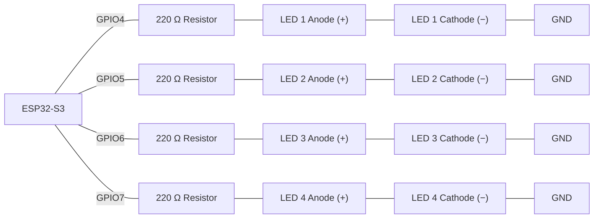
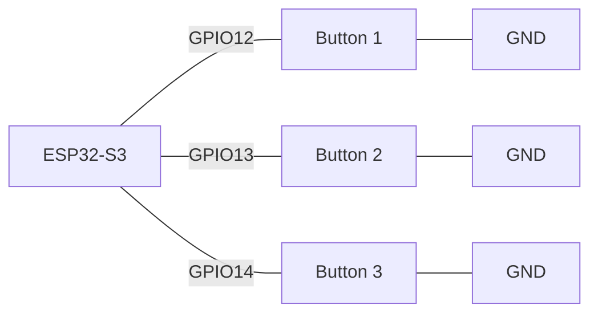
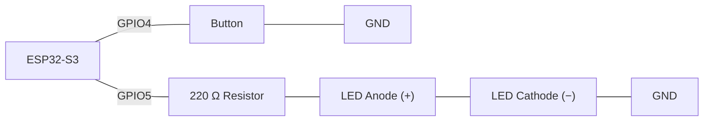
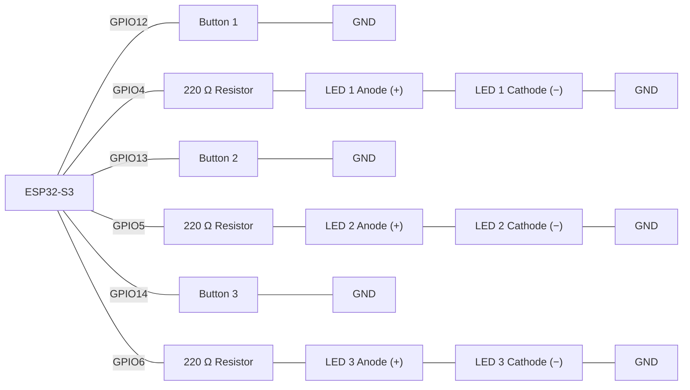
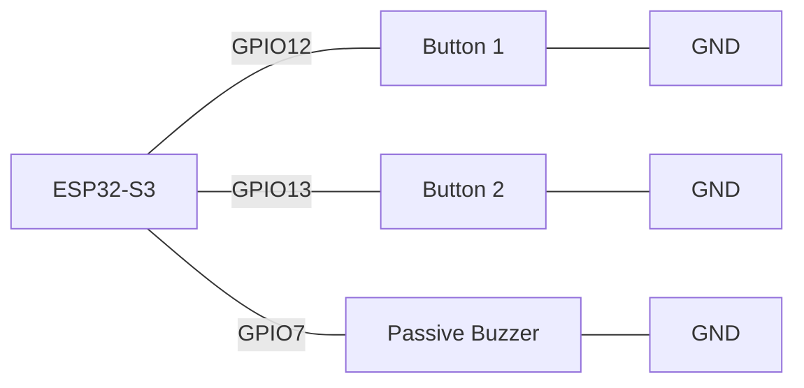

# Activity 5 - Lists, Arrays & Loops 

## Task 1 - LED Chaser Using an Array and a For Loop

**Scenario:**

A control panel needs a 4-LED "chaser" light — a sweeping indicator like a loading bar — driven entirely by an array of pin numbers and a `for` loop, so adding a fifth LED later means changing the array, not rewriting the sequence logic.

**Components:**

- ESP32-S3 development board
- 4x LED
- 4x 220 Ω resistor
- Jumper wires

> **Wiring:**



Declare `const int ledPins[4] = {4, 5, 6, 7};` and `const unsigned long STEP_INTERVAL = 150;`. Track `int currentIndex = 0`, `int direction = 1`, and `unsigned long previousStepMillis = 0`. Write `led_chaser()` so that every `STEP_INTERVAL` ms — checked with `millis()`, never `delay()` — it turns off the LED at `currentIndex`, then, if `currentIndex + direction` would fall outside the array (below `0` or above `3`), flips `direction` between `1` and `-1` before advancing `currentIndex` by `direction` and turning that LED on. This makes the chaser sweep to one end of the array, reverse, sweep back to the other end, and keep bouncing back and forth continuously rather than restarting from index 0 every cycle. Call `led_chaser()` from `loop()` every pass — the `millis()` check inside it decides when a step actually happens. `setup()` must still use a `for` loop over `ledPins` to configure every pin as `OUTPUT` — no pin number should appear hard-coded anywhere outside the array.

>
> Wokwi link: https://wokwi.com/projects/473652460611573761

**Finished Task 1:** https://wokwi.com/projects/473678077319933953

**Check yourself:**
- [ ] No `delay()` anywhere; stepping is timed with `millis()` and `STEP_INTERVAL`
- [ ] Exactly one LED is lit at any moment
- [ ] Reaching either end of `ledPins[]` reverses `direction`, so the chaser bounces back and forth instead of restarting from index 0
- [ ] No pin number is hard-coded anywhere outside `ledPins[]`


## Task 2 - Burst-Sampling a Button Panel

**Scenario:**

A workshop wants to quickly test a panel of 3 buttons at once. For each button in turn, the board should read it 10 times in rapid succession and print the whole burst — a first, brute-force look at how "noisy" each switch's signal actually is before worrying about doing anything smarter with it.

**Components:**

- ESP32-S3 development board
- 3x push button (`INPUT_PULLUP`)
- Jumper wires

> **Wiring:**



Declare `const int buttonPins[3] = {12, 13, 14};` and `const int MAX_READINGS = 10;`, with a reusable `int readings[MAX_READINGS];` and `int reading_count`. Write `capture_all_buttons()` with an **outer** `for` loop that walks each button in `buttonPins[]`, and an **inner** `for` loop that bursts-samples the current button 10 times (5 ms apart), resetting `reading_count` to 0 at the start of every button and storing each sample at `readings[reading_count]` before incrementing it. After each button's inner loop finishes, print all `reading_count` captured samples for that button, labelled with its pin number. Call `capture_all_buttons()` from `loop()`, with a 2-second gap between full sweeps.

>
> Wokwi link: https://wokwi.com/projects/473651805811447809


**Finished Task 2:** https://wokwi.com/projects/473679926210290689

## Task 3 - Debouncing a Single Button, Properly

**Scenario:**

A single button controls one LED, but a plain `digitalRead()` check makes the LED flicker unpredictably the instant the button is pressed or released — the mechanical contacts are bouncing. Fix it using the "wait for the reading to settle" technique, not by taking a burst of samples.

**Components:**

- ESP32-S3 development board
- 1x push button (`INPUT_PULLUP`)
- 1x LED
- 1x 220 Ω resistor
- Jumper wires

> **Wiring:**



Track three pieces of state: `int lastButtonReading` (the raw `digitalRead()` from the previous pass), `unsigned long debounceStart` (when that raw reading last changed), and `int buttonState` (the debounced, trusted state). On every pass of `loop()`: read the pin: if the raw reading differs from `lastButtonReading`, record `millis()` into `debounceStart`. Separately, if `millis() - debounceStart` has exceeded `DEBOUNCE_TIME` (50 ms) **and** the raw reading differs from `buttonState`, update `buttonState` and toggle the LED only on that transition. Update `lastButtonReading` at the end of every pass. No `delay()` anywhere.

>
> Wokwi link: https://wokwi.com/projects/473653428507075585

**Finished Task 3:** https://wokwi.com/projects/473678077319933953

**Check yourself:**
- [ ] `debounceStart` is reset every time the *raw* reading changes, not every pass
- [ ] The LED only toggles once the reading has stayed stable for `DEBOUNCE_TIME`, and only on a genuine change of `buttonState`
- [ ] `millis()` is used for all timing; there is no `delay()` anywhere in `loop()`
- [ ] Pressing and releasing the button quickly toggles the LED cleanly once per press, with no flicker

---

## Task 4 - Parallel Arrays: Debounced Button/LED Pairs, Non-Blocking Cycles

**Scenario:**

Extend Task 3's debounce technique across 3 independent button/LED pairs at once, and wrap the whole check in a repeating, non-blocking test cycle — so one button bouncing never delays reading the other two, and nothing in the program ever blocks.

**Components:**

- ESP32-S3 development board
- 3x push button (`INPUT_PULLUP`)
- 3x LED
- 3x 220 Ω resistor
- Jumper wires

> **Wiring:**



Declare parallel arrays `const int buttonPins[3] = {12, 13, 14};` and `const int ledPins[3] = {4, 5, 6};` — index `i` pairs one button with one LED. Give each pair its own debounce state using per-index arrays: `int lastButtonReading[3]`, `unsigned long debounceStart[3]`, and `bool buttonState[3]`, following exactly the same per-button logic as Task 3 but inside a `for` loop over all 3 pairs. Whenever a pair's debounced state changes to pressed, drive its matching LED on (and off on release). Wrap the whole check in a `millis()`-gated timer (`CYCLE_INTERVAL = 1000`) so a full pass over all 3 pairs happens once a second, not every single loop iteration — but keep the debounce timing itself checked every pass, independent of the cycle gate.

>
> Wokwi link: https://wokwi.com/projects/473326289925248001

**Finished Task 4:** https://wokwi.com/projects/473767422639042561

**Check yourself:**
- [ ] `buttonPins[]` and `ledPins[]` are parallel arrays — index `i` always refers to the same pair in both
- [ ] Each pair has its own debounce state (`lastButtonReading[i]`, `debounceStart[i]`, `buttonState[i]`), not one shared set of variables
- [ ] Debouncing one pair never delays or blocks debouncing the others
- [ ] No `delay()` anywhere; the cycle gate uses `millis()` and `CYCLE_INTERVAL`

---

## Task 5 - Arrays: A Two-Song Melody Selector

**Scenario:**

Build a simple 2-button music box: pressing Button 1 or Button 2 plays a different short tune on a buzzer, note by note, without blocking the rest of the program. Each song's notes and their durations live in a 2-D array, one row per song.

**Components:**

- ESP32-S3 development board
- 2x push button (`INPUT_PULLUP`)
- 1x passive buzzer
- Jumper wires

> **Wiring:**



Declare `const int NUM_SONGS = 2;` and `const int NUM_NOTES = 8;`, then `int melodies[NUM_SONGS][NUM_NOTES]` and `int noteDurations[NUM_SONGS][NUM_NOTES]` holding two short 8-note tunes of your choosing (use named note constants like `NOTE_C4 = 262`, not raw frequency numbers). Track `int currentSong`, `int currentNote`, `bool songPlaying`, and `unsigned long noteStartTime`. On a plain `digitalRead()` press of either button (debouncing isn't the focus here — that's Task 6), start that song: set `currentSong`, reset `currentNote` to 0, and call `tone()` for the first note. In `loop()`, use `millis()` to check whether the current note's duration has elapsed; if so, move to `melodies[currentSong][currentNote]` for the next note (`currentNote++`), or stop the buzzer once `currentNote` reaches `NUM_NOTES`. No `delay()` — the buttons must stay readable while a song plays.

>
> Wokwi link: https://wokwi.com/projects/473653874488503297

**Finished Task 5:** https://wokwi.com/projects/473768802056637441

**Check yourself:**
- [ ] `melodies[][]` and `noteDurations[][]` are indexed consistently as `[song][note]` everywhere
- [ ] The correct song's row is selected by `currentSong`, and playback advances through `currentNote` from 0 up to (not including) `NUM_NOTES`
- [ ] Note timing uses `millis()`, not `delay()` — both buttons are still readable while a song plays
- [ ] Pressing the other button mid-song correctly switches to the new song

---

## Task 6 - Combine: Debounced Two-Song Melody Selector

**Scenario:**

Task 5's plain button reads occasionally restart a song twice from one press, or miss a press entirely — switch bounce again. Fix it by adding Task 3's proper debounce technique, now as per-button arrays sized for the 2 buttons (as in Task 4), so a song only ever starts on a genuine, settled press.

**Components:** Same as Task 5.

> **Wiring:**


Add `int lastButtonReading[2]`, `unsigned long debounceStart[2]`, and `int buttonState[2]` — one entry per button. Replace Task 5's plain `digitalRead()` checks with the settle-based debounce logic from Task 3/4, applied in a `for` loop over both buttons. Only call `startSong(button)` when a button's debounced state has just transitioned to pressed — never on a raw, unsettled reading.

>
> Wokwi link: https://wokwi.com/projects/473653874488503297

**Finished Task 6:** https://wokwi.com/projects/473770471542904833

**Check yourself:**
- [ ] Debounce state (`lastButtonReading[]`, `debounceStart[]`, `buttonState[]`) is a separate array entry per button, not shared
- [ ] `startSong()` is only called on a debounced press-edge, never on every raw `LOW` reading
- [ ] The melody playback logic from Task 5 (note timing via `millis()`) is unchanged
- [ ] Rapidly pressing a button doesn't restart or glitch the song mid-press

---


## Task 7 - Spot-the-Bug Worksheet (Extension)

**Round 1:**
```cpp
const int MAX_READINGS = 10;
int readings[MAX_READINGS];

void capture_burst() {
  for (int i = 0; i < MAX_READINGS; i++) {
    readings[i] = digitalRead(buttonPin);
    delay(5);
  }
}

**Fixed**

```
<details><summary>Answer</summary>The condition should be <code>i &lt; MAX_READINGS</code>, not <code>i &lt;= MAX_READINGS</code>. As written, the loop runs 11 times against a 10-element array, so <code>readings[10]</code> writes one slot past the end of the array — undefined behaviour that can silently corrupt nearby memory.</details>

**Round 2:**
```cpp
int reading_count = 0;
int readings[10];

void capture_burst() {
  for (int i = 0; i < 10; i++) {
    readings[reading_count] = digitalRead(buttonPin);
    reading_count++;
    delay(5);
  }
}

**Fixed**

```
<details><summary>Answer</summary><code>reading_count</code> is never incremented inside the loop — every iteration overwrites index 0 instead of filling the array. It needs <code>reading_count++;</code> after each sample is stored.</details>

**Round 3:**
```cpp
int lastButtonReading = HIGH;
unsigned long debounceStart = 0;

void loop() {
  int reading = digitalRead(buttonPin);

    if (reading != lastButtonReading) {
    debounceStart = millis();
  }

  if (millis() - debounceStart >= 50 && reading != buttonState) {
    buttonState = reading;
  }
  lastButtonReading = reading;
}

**Fixed**

```
<details><summary>Answer</summary><code>debounceStart</code> is reset to <code>millis()</code> on <em>every</em> pass, not only when the raw reading actually changes — so <code>millis() - debounceStart</code> is always close to 0 and the 50 ms settle check can never pass. It should only update <code>debounceStart</code> inside an <code>if (reading != lastButtonReading)</code> check.</details>

**Round 4:**
```cpp
const int buttonPins[3] = {12, 13, 14};
const int ledPins[3] = {4, 5, 6};

void update_pairs() {
  for (int i = 0; i < 3; i++) {
    bool pressed = digitalRead(buttonPins[i]) == LOW;
    digitalWrite(ledPins[i], pressed);
  }
}

**Fixed**

```
<details><summary>Answer</summary><code>ledPins[0]</code> is hard-coded inside the loop instead of using the loop's own index <code>i</code>. As written, every button's state overwrites the same LED (LED 1), and LEDs 2 and 3 never respond to their matching buttons. It should be <code>digitalWrite(ledPins[i], pressed);</code>.</details>

**Round 5:**
```cpp
const int NUM_SONGS = 2;
const int NUM_NOTES = 8;
int melodies[NUM_SONGS][NUM_NOTES];

void set_note(int note, int song, int frequency) {
  melodies[song][note] = frequency;
}

**Fixed**

```
<details><summary>Answer</summary><code>melodies</code> was declared <code>[NUM_SONGS][NUM_NOTES]</code> — song first, note second — but <code>set_note()</code> writes <code>melodies[note][song]</code>, the axes reversed. Since <code>NUM_SONGS</code> is only 2, any <code>note</code> value of 2 or higher used as the first index writes out of bounds. It needs to match the declared order: <code>melodies[song][note] = frequency;</code>.</details>

**Round 6:**
```cpp
const int NUM_BUTTONS = 4;
unsigned long debounceStart[NUM_BUTTONS];
int buttonState[NUM_BUTTONS];

void setup() {
  for (int i = 0; i < NUM_BUTTONS; i++) {
    pinMode(buttonPins[i], INPUT_PULLUP);
  }
}

**Fixed**

```
<details><summary>Answer</summary><code>debounceStart[]</code> should be <code>unsigned long</code>, not <code>int</code> — it's meant to hold the return value of <code>millis()</code>, which is an <code>unsigned long</code> that overflows a plain <code>int</code> after about 24 days of uptime (and can already exceed <code>int</code>'s range much sooner). Comparisons like <code>millis() - debounceStart[i]</code> will silently misbehave once that happens.</details>

**Round 7:**
```cpp
void update_cycle() {
  unsigned long currentMillis = millis();

  if (currentMillis - previousCycleMillis >= CYCLE_INTERVAL) {
    previousCycleMillis = currentMillis;

    for (int i = 0; i < NUM_PAIRS; i++) {
      buttonStates[i] = digitalRead(buttonPins[i]) == LOW;
      digitalWrite(ledPins[i], buttonStates[i]);
    }
  }
}

**Fixed**

```
<details><summary>Answer</summary><code>previousCycleMillis</code> is never updated inside the <code>if</code> block. Once the interval first elapses, <code>currentMillis - previousCycleMillis</code> keeps growing and stays past <code>CYCLE_INTERVAL</code> forever, so the block runs on <em>every single pass</em> from then on instead of once per interval. It needs <code>previousCycleMillis = currentMillis;</code> inside the <code>if</code>.</details>

---

## Questions

Answer these in your own words before moving on:

1. Why does a `for` loop over a collection need `i < count` rather than `i <= count`, when `count` is the number of items currently stored (not the array's declared capacity)?
   ```
   We use i < count because the indexes go from 0 to count - 1. Using i <= count would go one index too far.

   ```

2. Why must `buttonPins[]` and `ledPins[]` (or any pair of parallel arrays) always be read and written at the same index, rather than one array's index ever drifting from the other's?
   ```
    They should use the same index so the items match. for example, buttonPins[0] should match with ledPins[0]. If the indexes are different, such as buttonPins[1] and ledPins[0], the wrong button would control the wrong LED.

   ```

3. Task 2 debounces by burst-sampling; Task 3 onward debounces by waiting for the reading to settle. What's the practical downside of the burst-sampling approach that the settle-based one avoids?
   ```
   Burst-sampling uses delay(), which blocks the program while it takes the readings. The settle-based approach uses millis() instead, so the program can keep doing other things while waiting for the button to settle.

   ```

4. In a 2-D array like `melodies[NUM_SONGS][NUM_NOTES]`, why does the order of the two indices matter, even though `melodies[song][note]` and `melodies[note][song]` would allocate the same total amount of memory?
   ```
   Because the songs always come first and the notes come second. If you switch them, the program will think that the songs are the notes and the notes are the songs, even though the memory is still the same.

   ```

5. Why does giving each button its own entry in a debounce array (rather than one shared set of debounce variables) matter once there's more than one button to read?
   ```
   Giving each button its own debounce variables is important because they are separate buttons and can change at different times. If they shared the same debounce variables, one button's reading could interfere with the other button's debounce timing.

   ```

6. Why is an array's size fixed at declaration in C++, and what problem does keeping a separate counter like `reading_count` (distinct from the array's declared capacity) solve?
   ```
   The counter keeps track of how many items are currently stored in the array. It helps the program know how much of the array is being used and prevents it from going past the array's maximum size.

   ```
