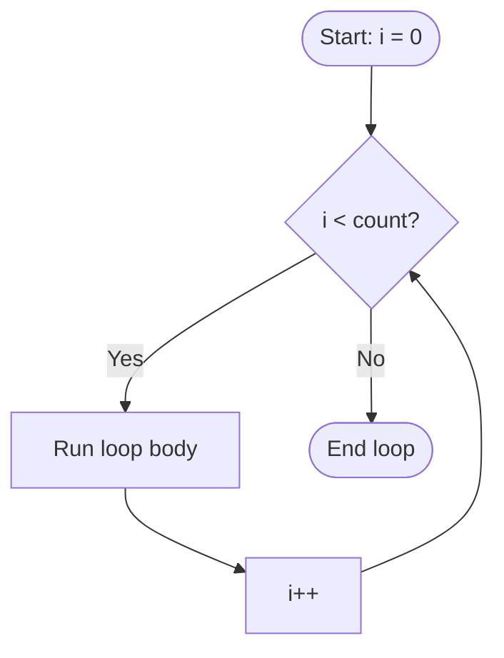
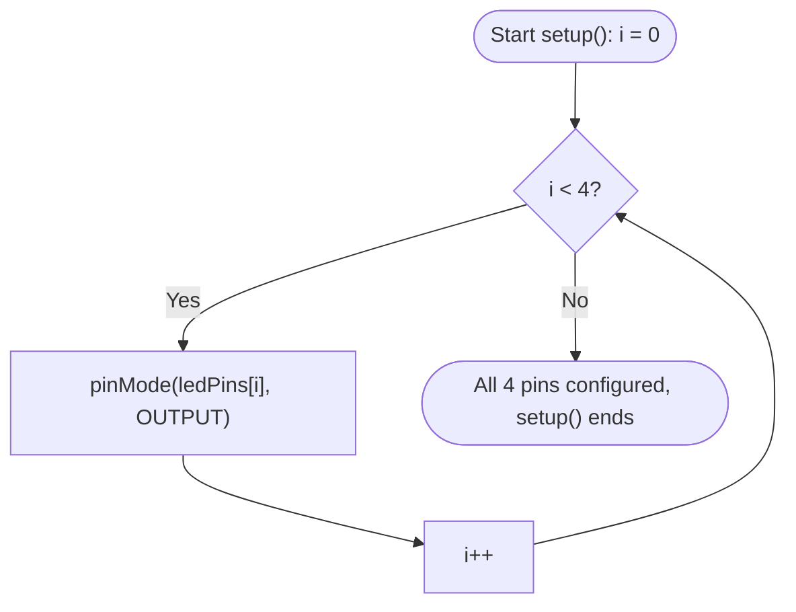
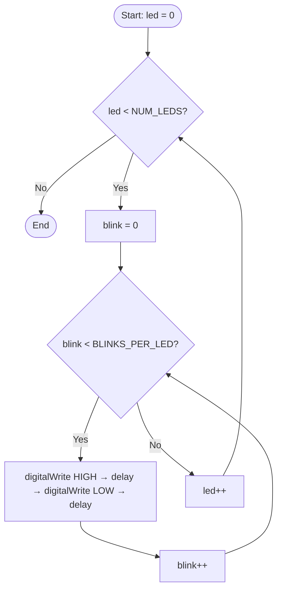

# Week 5: Lists, Arrays & Loops

## Introduction
Storing and processing collections of readings is central to data handling. Until now, your programs have reacted to a single reading at a time read a sensor, decide, act, forget it, repeat. This week introduces **arrays** to hold multiple readings or device states under one name, and `for` **loops** to repeat actions across them without writing the same line over and over. Together they're the pattern behind LED sequences, button panels, and anything that needs to remember more than "just now".


### Arrays - Storing Many Values Under One Name

An array is a fixed-size, ordered collection that holds many values under a single variable name  `int readings[10];` instead of ten separate variables (`reading0`, `reading1`, ... `reading9`). You access an item by its **index**, a position number starting at `0`: `readings[0]` is the first item, `readings[9]` is the last of a 10-element array. Trying to access `readings[10]` reads or writes memory outside the array  C++ does not stop you, so an off-by-one index is a real bug, not just a warning.

**Syntax:**
```cpp
type arrayName[size];                    // declares space for `size` elements, values uninitialised
type arrayName[size] = {val0, val1, ...}; // declares AND initialises in one line
arrayName[index] = value;                // write to one element (index from 0 to size - 1)
value = arrayName[index];                // read one element
```

**Example:**
```cpp
int readings[5];        // 5 ints, uninitialised — declares the space, doesn't set values
readings[0] = 512;      // first element
readings[4] = 300;      // last element (index = size - 1)

int ledPins[4] = {4, 5, 6, 7};   // declared AND initialised in one line
```

#### How it works
An array is a single, contiguous block of memory enough space for every element, laid out back to back. The array's name is really just the address of its first element; `readings[i]` is computed as "start address + `i` × (size of one element)" to jump straight to that slot, which is why indexing is fast regardless of how large the array is, and why the compiler needs to know each element's fixed size up front.

#### Fixed size, unlike a Python list
Unlike a Python list, a C++ array's size is fixed the moment it's declared you decide the capacity once, and it can never grow or shrink afterward. This suits a microcontroller's limited, predictable memory: the compiler reserves exactly that much RAM and no more, with no hidden resizing that could silently exhaust memory at runtime. The practical consequence is that your code almost always needs **two** things together: the array itself (the fixed capacity), and a separate counter often called something like `reading_count` that tracks how many of those slots are actually in use right now. `readings[10]` can hold up to 10 values; `reading_count` might be `3` if only three have been logged so far. Looping or printing should always be bounded by the count of items actually stored, not the array's full declared capacity.

#### Right-sizing pin arrays with `constexpr uint8_t`
As introduced in the previuos Week , pin numbers are known at compile time and never change, so an array of pins should use the same `constexpr uint8_t` convention as a single pin declaration:
```cpp
constexpr uint8_t ledPins[4] = {4, 5, 6, 7};
```
This reserves exactly 4 bytes instead of the 16 bytes a plain `int ledPins[4]` would use, and the compiler enforces that none of those pin numbers can be reassigned later.

#### 2-D Arrays — Two Dimensions Under One Name
A 2-D array is an array of arrays  it organises data along two dimensions and is addressed with two indices instead of one: `arrayName[row][col]`.

**Syntax:**
```cpp
type arrayName[rows][cols];                  // declares a rows × cols grid, uninitialised
type arrayName[rows][cols] = {{...}, {...}};  // declares AND initialises, one row per {}
arrayName[row][col] = value;                  // write to one cell
value = arrayName[row][col];                  // read one cell
```

**Example — 4 songs, 16 notes each:**
```cpp
constexpr int NUM_SONGS = 4;
constexpr int NUM_NOTES = 16;
int melodies[NUM_SONGS][NUM_NOTES];

melodies[0][0] = 262;               // song 0 (row), note 0 (column)
int firstNoteOfSong2 = melodies[2][0];
```
The first index selects which song (the row); the second selects which note within that song (the column). Example 3 below uses exactly this shape  `melodies[currentSong][currentNote]`  to look up one note at a time as a song plays.

---

### For Loops — Repeating Without Repeating Yourself

A `for` loop repeats a block of code once per item in a collection, without you writing out each repetition by hand. It has three parts, separated by semicolons:

**Syntax:**
```cpp
for (initialisation; condition; increment) {
  // runs once per pass, while condition stays true
}
```

**Example:**
```cpp
for (int i = 0; i < count; i++) {
  // runs once per value of i, from 0 up to (but not including) count
}
```



| Part | Example | Meaning |
|---|---|---|
| Initialisation | `int i = 0` | Runs once, before the loop starts declares the loop counter |
| Condition | `i < count` | Checked before *every* pass; the loop keeps running while this is `true` |
| Increment | `i++` | Runs after every pass, before the condition is checked again |

This is how you drive an LED sequence loop over an array of pin numbers instead of writing a separate `digitalWrite()`/`delay()` block for every LED and how you process every stored sensor reading without knowing in advance exactly how many there will be, up to the array's fixed capacity.

```cpp
constexpr uint8_t ledPins[4] = {4, 5, 6, 7};

void setup() {
  for (int i = 0; i < 4; i++) {
    pinMode(ledPins[i], OUTPUT);   // configures all 4 pins with one loop, not four pinMode() calls
  }
}
```



#### Looping over what's stored, not what's possible
When a loop walks an array that's only partially filled like the `readings`/`reading_count` pair described above the condition must be `i < reading_count`, never `i < MAX_READINGS`. Looping to the array's full capacity instead of the count actually stored either prints garbage leftover values from unused slots, or (worse) reads memory the array never had valid data in to begin with.

#### Nested for loops
A loop can contain another loop. The inner loop runs to completion for every single pass of the outer loop.

**Syntax:**
```cpp
for (initOuter; condOuter; incOuter) {     // outer loop
  for (initInner; condInner; incInner) {   // inner loop — runs to completion every outer pass
    // innermost code runs once per (outer pass × inner pass) combination
  }
}
```

**Example — blink each LED a fixed number of times before moving to the next:**
```cpp
constexpr uint8_t ledPins[3] = {9, 10, 11};
constexpr int NUM_LEDS = 3;
constexpr int BLINKS_PER_LED = 3;

for (int led = 0; led < NUM_LEDS; led++) {              // outer: walk each LED
  for (int blink = 0; blink < BLINKS_PER_LED; blink++) { // inner: blink that LED 3 times
    digitalWrite(ledPins[led], HIGH);
    delay(150);
    digitalWrite(ledPins[led], LOW);
    delay(150);
  }
}
```
For every single pass of the outer loop (one LED selected), the inner loop runs all the way through (3 full blinks) before the outer loop advances to the next LED — 3 LEDs × 3 blinks = 9 total blink cycles, not 3.



#### Real-world use in industry
Cycling through every channel on a PLC's I/O table once per control scan, walking a sensor array during each polling cycle in a monitoring system, and refreshing every pixel or LED in a display buffer are all instances of the same pattern: one block of logic, repeated across a collection, instead of duplicated by hand for every item.

---

### Debouncing — Filtering Out Switch Noise
A mechanical button doesn't switch cleanly between LOW and HIGH the instant it's pressed  the metal contacts physically bounce for a few milliseconds, so a single `digitalRead()` taken right at that moment can catch a brief, spurious flicker instead of the real, settled state. Filtering that noise out is called **debouncing**, and the examples below use two different approaches to it:

- **Burst-sample and inspect** (Example 2): read the pin several times in quick succession and look at all the samples together, rather than trusting any single read.
- **Wait for the reading to settle** (Example 3): note *when* the raw reading last changed, and only treat it as a real press once it's stayed the same for a minimum stretch of time (e.g. 50ms)  a small per-button timer, not a burst of samples.

Example 3's version is the one you'd actually want beyond a quick demo: it costs nothing while a button is idle, and  by giving each button its own timer in an array  it debounces several buttons independently, so waiting on one button never delays reading the others.

---

## Code Examples

### Example 1 — LED Sequence Driven by an Array and a For Loop
```cpp
constexpr uint8_t ledPins[3] = {9, 10, 11};
constexpr int NUM_LEDS = 3;

void led_chaser() {
  for (int i = 0; i < NUM_LEDS; i++) {
    digitalWrite(ledPins[i], HIGH);
    delay(150);
    digitalWrite(ledPins[i], LOW);
  }
}

void setup() {
  for (int i = 0; i < NUM_LEDS; i++) {
    pinMode(ledPins[i], OUTPUT);
  }
}

void loop() {
  led_chaser();   // one function call sweeps across all 4 LEDs, in array order
}
```

**Code Walkthrough**
| Section | What it does |
|---|---|
| `ledPins[3]` / `NUM_LEDS` | Stores the 3 LED pin numbers under one array name, and how many there are |
| `led_chaser()` | Loops through `ledPins[]`, turning each LED on then off before moving to the next |
| `setup()` | Loops through `ledPins[]` once to configure every pin as `OUTPUT` |
| `loop()` | Calls `led_chaser()` on every pass, sweeping across all 3 LEDs each time |
>
> Wokwi Link: https://wokwi.com/projects/473317425753399297
>

### Example 2 — Burst-Capture Readings Into an Array
```cpp
constexpr uint8_t buttonPins[3] = {12, 13, 14}; // Store the GPIO pin numbers for the three buttons
constexpr int NUM_BUTTONS = 3; // Total number of buttons
constexpr int MAX_READINGS = 10; // Number of readings taken from each button

int readings[MAX_READINGS]; // Stores ten readings for one button at a time
int reading_count = 0; // Tracks how many readings have been stored

void setup() {
  
  Serial.begin(115200);

  // Configure all button pins using the internal pull-up resistors
  for (int b = 0; b < NUM_BUTTONS; b++) {
    pinMode(buttonPins[b], INPUT_PULLUP);
  }
}

// Read each button ten times
void capture_all_buttons() {

  // Outer loop moves through each button
  for (int b = 0; b < NUM_BUTTONS; b++) {
    reading_count = 0;

    // Inner loop reads the current button ten times
    for (int i = 0; i < MAX_READINGS; i++) {
      // LOW means pressed; HIGH means released
      readings[reading_count] = digitalRead(buttonPins[b]);

      reading_count++;
      delay(5);
    }

    // Display which button was tested
    Serial.print("Button ");
    Serial.print(b + 1);
    Serial.print(" on GPIO ");
    Serial.print(buttonPins[b]);
    Serial.print(": ");

    // Print all readings for the current button
    for (int i = 0; i < reading_count; i++) {
      Serial.print(readings[i]);
      Serial.print(" ");
    }

    Serial.println();
  }
}

void loop() {
  // Capture readings from all three buttons
  capture_all_buttons();

  // Wait before capturing the next group of readings
  delay(2000);
}
```
Sampling a button 10 times in quick succession like this  rather than trusting a single `digitalRead()`  is the basis of debouncing a noisy mechanical switch. `reading_count` tracks how many of the 10 reserved slots are actually filled for the *current* button  printing loops on it, not on `MAX_READINGS`, so nothing reads uninitialised memory. The outer loop over `buttonPins[]` repeats that whole burst-and-print process for every button in the array.

**Code Walkthrough**
| Section | What it does |
|---|---|
| `buttonPins[3]` / `NUM_BUTTONS` | The array of button pins to test (GPIO 12, 13, 14), and how many there are |
| `readings[]` / `reading_count` | A reusable burst buffer and its "slots filled" counter, reset for every button |
| `setup()` | Configures every pin in `buttonPins[]` as `INPUT_PULLUP` |
| Outer `b` loop | Walks each button in `buttonPins[]` in turn |
| Inner `i` loop (capture) | Burst-samples the current button 10 times, 5ms apart |
| Print header | Labels the output with the button's number and its actual GPIO pin, e.g. "Button 1 on GPIO 12" |
| Inner `i` loop (print) | Prints only the `reading_count` samples actually captured for that button |
| `loop()` | Calls `capture_all_buttons()` to test all three buttons, then waits 2 seconds before repeating |
>
> Wokwi Link: https://wokwi.com/projects/473321382592612353
>

### Example 3 — Multi-Song Melody Box (Debounced Buttons, RGB Feedback, Non-Blocking Timing)
```cpp
// -------------------- PIN CONFIGURATION --------------------

// Four melody-selection buttons
const int buttonPins[4] = {11, 12, 13, 14};

// RGB pins: Red, Green, Blue
const int rgbPins[3] = {9, 10, 3};

// Passive buzzer pin
const int BUZZER_PIN = 7;

const int NUM_SONGS = 4;
const int NUM_NOTES = 16;
const int NUM_RGB_PINS = 3;
const int NUM_BUTTONS = 4;   // happens to equal NUM_SONGS (one button per song), but counts a different thing


// -------------------- MUSICAL NOTES --------------------

const int REST    = 0;
const int NOTE_C4 = 262;
const int NOTE_D4 = 294;
const int NOTE_E4 = 330;
const int NOTE_F4 = 349;
const int NOTE_G4 = 392;
const int NOTE_A4 = 440;
const int NOTE_B4 = 494;
const int NOTE_C5 = 523;


// -------------------- SONG NAMES --------------------

const char* songNames[NUM_SONGS] = {
  "Twinkle Twinkle",
  "Ode to Joy",
  "Mary Had a Little Lamb",
  "Row Row Row Your Boat"
};


// -------------------- MELODY ARRAY --------------------

int melodies[NUM_SONGS][NUM_NOTES] = {

  // Button 1: Twinkle Twinkle
  {
    NOTE_C4, NOTE_C4, NOTE_G4, NOTE_G4,
    NOTE_A4, NOTE_A4, NOTE_G4, REST,
    NOTE_F4, NOTE_F4, NOTE_E4, NOTE_E4,
    NOTE_D4, NOTE_D4, NOTE_C4, REST
  },

  // Button 2: Ode to Joy
  {
    NOTE_E4, NOTE_E4, NOTE_F4, NOTE_G4,
    NOTE_G4, NOTE_F4, NOTE_E4, NOTE_D4,
    NOTE_C4, NOTE_C4, NOTE_D4, NOTE_E4,
    NOTE_E4, NOTE_D4, NOTE_D4, REST
  },

  // Button 3: Mary Had a Little Lamb
  {
    NOTE_E4, NOTE_D4, NOTE_C4, NOTE_D4,
    NOTE_E4, NOTE_E4, NOTE_E4, REST,
    NOTE_D4, NOTE_D4, NOTE_D4, REST,
    NOTE_E4, NOTE_G4, NOTE_G4, REST
  },

  // Button 4: Row Row Row Your Boat
  {
    NOTE_C4, NOTE_C4, NOTE_C4, NOTE_D4,
    NOTE_E4, NOTE_E4, NOTE_D4, NOTE_E4,
    NOTE_F4, NOTE_G4, NOTE_C5, NOTE_C5,
    NOTE_G4, NOTE_G4, NOTE_E4, REST
  }
};


// -------------------- NOTE DURATIONS --------------------

// 2 = half note
// 4 = quarter note
// 8 = eighth note
int noteDurations[NUM_SONGS][NUM_NOTES] = {
  {
    4, 4, 4, 4,
    4, 4, 2, 4,
    4, 4, 4, 4,
    4, 4, 2, 4
  },

  {
    4, 4, 4, 4,
    4, 4, 4, 4,
    4, 4, 4, 4,
    4, 4, 2, 4
  },

  {
    4, 4, 4, 4,
    4, 4, 2, 4,
    4, 4, 2, 4,
    4, 4, 2, 4
  },

  {
    4, 4, 2, 4,
    4, 4, 4, 4,
    4, 2, 8, 8,
    8, 8, 8, 4
  }
};


// -------------------- RGB COLOUR ARRAY --------------------

int colours[][3] = {
  {255,   0,   0},  // Red
  {  0, 255,   0},  // Green
  {  0,   0, 255},  // Blue
  {255, 255,   0},  // Yellow
  {255,   0, 255},  // Magenta
  {  0, 255, 255},  // Cyan
  {255, 100,   0},  // Orange
  {255, 255, 255}   // White
};

const int NUM_COLOURS = 8;


// -------------------- BUTTON VARIABLES --------------------

// Current stable state of each button
int buttonState[NUM_BUTTONS] = {
  HIGH, HIGH, HIGH, HIGH
};

// Previous raw reading from each button
int lastButtonReading[NUM_BUTTONS] = {
  HIGH, HIGH, HIGH, HIGH
};

// Separate debounce timer for each button
unsigned long debounceStart[NUM_BUTTONS] = {
  0, 0, 0, 0
};

const unsigned long DEBOUNCE_TIME = 50;


// -------------------- MELODY VARIABLES --------------------

int currentSong = -1;
int currentNote = 0;

bool songPlaying = false;
bool notePlaying = false;
bool gapPlaying = false;

unsigned long noteStartTime = 0;
unsigned long noteLength = 0;

unsigned long gapStartTime = 0;
unsigned long gapLength = 0;


// -------------------- RGB FUNCTIONS --------------------

// Set the RGB LED using an array and a for loop
void setColour(int colourNumber) {
  for (int channel = 0;
       channel < NUM_RGB_PINS;
       channel++) {

    analogWrite(
      rgbPins[channel],
      colours[colourNumber][channel]
    );
  }
}


// Turn off every RGB channel
void turnOffRGB() {
  for (int channel = 0;
       channel < NUM_RGB_PINS;
       channel++) {

    analogWrite(rgbPins[channel], 0);
  }
}


// -------------------- START NOTE --------------------

void startCurrentNote() {
  // Check whether the song has finished
  if (currentNote >= NUM_NOTES) {
    songPlaying = false;
    notePlaying = false;
    gapPlaying = false;

    noTone(BUZZER_PIN);
    turnOffRGB();

    Serial.println("Song finished");
    return;
  }

  // Get the note frequency from the melody array
  int frequency =
      melodies[currentSong][currentNote];

  // Calculate how long the note should play
  noteLength =
      1000 / noteDurations[currentSong][currentNote];

  // Select a colour based on the note position
  int colourNumber =
      currentNote % NUM_COLOURS;

  // Play the sound and show the colour
  if (frequency != REST) {
    tone(BUZZER_PIN, frequency);
    setColour(colourNumber);
  }
  else {
    noTone(BUZZER_PIN);
    turnOffRGB();
  }

  // Record when the note started
  noteStartTime = millis();

  notePlaying = true;
  gapPlaying = false;
}


// -------------------- START SONG --------------------

void startSong(int songNumber) {
  // Stop the previous song
  noTone(BUZZER_PIN);
  turnOffRGB();

  // Select the requested song
  currentSong = songNumber;
  currentNote = 0;
  songPlaying = true;

  Serial.print("Playing: ");
  Serial.println(songNames[currentSong]);

  // Start the first note immediately
  startCurrentNote();
}


// -------------------- UPDATE SONG --------------------

void updateSong() {
  // Exit if no song is playing
  if (!songPlaying) {
    return;
  }

  unsigned long currentMillis = millis();

  // Check whether the current note has finished
  if (notePlaying &&
      currentMillis - noteStartTime >= noteLength) {

    // Stop the buzzer and RGB LED
    noTone(BUZZER_PIN);
    turnOffRGB();

    notePlaying = false;
    gapPlaying = true;

    // Start timing the gap between notes
    gapStartTime = currentMillis;

    // Gap is 30% of the note duration
    gapLength = noteLength * 30 / 100;
  }

  // Check whether the gap has finished
  if (gapPlaying &&
      currentMillis - gapStartTime >= gapLength) {

    gapPlaying = false;

    // Move to the next note
    currentNote++;

    // Start the next note
    startCurrentNote();
  }
}


// -------------------- CHECK BUTTONS --------------------

void checkButtons() {
  unsigned long currentMillis = millis();

  // Check all four buttons
  for (int button = 0;
       button < NUM_BUTTONS;
       button++) {

    int reading =
        digitalRead(buttonPins[button]);

    // Restart the debounce timer when the reading changes
    if (reading != lastButtonReading[button]) {
      debounceStart[button] = currentMillis;
    }

    // Check whether the reading has remained stable
    if (currentMillis - debounceStart[button]
        >= DEBOUNCE_TIME) {

      // Check whether the stable state has changed
      if (reading != buttonState[button]) {
        buttonState[button] = reading;

        // INPUT_PULLUP means LOW is pressed
        if (buttonState[button] == LOW) {
          Serial.print("Button selected: ");
          Serial.println(button + 1);

          // The button index selects the song
          startSong(button);
        }
      }
    }

    // Save the raw button reading
    lastButtonReading[button] = reading;
  }
}


// -------------------- SETUP --------------------

void setup() {
  Serial.begin(115200);

  // Configure all four buttons
  for (int i = 0; i < NUM_BUTTONS; i++) {
    pinMode(buttonPins[i], INPUT_PULLUP);
  }

  // Configure all RGB pins
  for (int i = 0; i < NUM_RGB_PINS; i++) {
    pinMode(rgbPins[i], OUTPUT);
  }

  // Configure the buzzer
  pinMode(BUZZER_PIN, OUTPUT);

  turnOffRGB();
  noTone(BUZZER_PIN);

  Serial.println("Melody player ready");
  Serial.println("Button 1: Twinkle Twinkle");
  Serial.println("Button 2: Ode to Joy");
  Serial.println("Button 3: Mary Had a Little Lamb");
  Serial.println("Button 4: Row Row Row Your Boat");
}


// -------------------- MAIN LOOP --------------------

void loop() {
  // Check the buttons continuously
  checkButtons();

  // Update the melody without stopping the program
  updateSong();
}
```
Four buttons each select a different song; the melody then plays note-by-note using `millis()` instead of `delay()`, so `checkButtons()` keeps responding to presses (including switching songs mid-tune) while a song is playing.

**Code Walkthrough**
| Section | What it does |
|---|---|
| `buttonPins[4]` / `rgbPins[3]` / `BUZZER_PIN` | Named pins for the 4 melody-select buttons, the RGB LED's three channels, and the buzzer |
| `NUM_BUTTONS` vs `NUM_SONGS` | Two separate constants that happen to both be 4  buttons and songs are counted separately even though there's one button per song |
| `melodies[NUM_SONGS][NUM_NOTES]` / `noteDurations[NUM_SONGS][NUM_NOTES]` | 2-D arrays holding each song's 16 note frequencies and note lengths, one row per song |
| `songNames[]` | Array of song title strings, printed when a button selects that song |
| `colours[][3]` | 2-D array of RGB values; a colour is picked from it as each note plays |
| `buttonState[]` / `lastButtonReading[]` / `debounceStart[]` | Per-button arrays giving each of the 4 buttons its own independent debounce timer |
| `setColour()` / `turnOffRGB()` | Loop over `rgbPins[]` to drive the RGB LED from one row of `colours[]` |
| `startSong()` / `startCurrentNote()` | Begin a song, then set up the current note's tone, colour, and duration |
| `updateSong()` | Uses `millis()` to detect when the current note (and the gap after it) has finished, and advances to the next note without blocking |
| `checkButtons()` | Loops over all 4 buttons, debouncing each one independently and calling `startSong()` on a fresh press |
| `setup()` | Loops over `buttonPins[]` and `rgbPins[]` to configure every pin, then configures the buzzer |
| `loop()` | Calls `checkButtons()` and `updateSong()` every pass  no `delay()`, so buttons stay responsive while a song plays |
>
> Wokwi Link: https://wokwi.com/projects/473324549721867265
>


### Example 4 — Multi-Cycle Button-to-LED Test
Every pass of `loop()` calls `test_cycles()`, but it only actually runs a cycle once `CYCLE_INTERVAL` has elapsed since the last one — a `millis()` check gates the work instead of a blocking `delay()`. When a cycle does run, one loop walks every button/LED pair, lighting each LED to match its button, and a second loop prints that cycle's results.
```cpp
constexpr uint8_t buttonPins[3] = {12, 13, 14}; // Store the three button pins
constexpr uint8_t ledPins[3] = {4, 5, 6}; // Store the three matching LED pins
constexpr int NUM_PAIRS = 3; // Number of button and LED pairs

constexpr int NUM_CYCLES = 2; // Number of test cycles
constexpr unsigned long CYCLE_INTERVAL = 1000; // Time between each test cycle

bool buttonStates[NUM_PAIRS];  // Store the state of each button
int currentCycle = 0; // Store the current test cycle

unsigned long previousCycleMillis = 0; // Store when the previous cycle was completed

bool firstCycle = true; // Allow the first cycle to run immediately

 
void setup() {
  // Start the Serial Monitor
  Serial.begin(115200);

  // Configure all button and LED pins
  for (int i = 0; i < NUM_PAIRS; i++) {
    pinMode(buttonPins[i], INPUT_PULLUP);
    pinMode(ledPins[i], OUTPUT);

    // Make sure each LED starts turned off
    digitalWrite(ledPins[i], LOW);
  }
}


void test_cycles() {
  
  unsigned long currentMillis = millis(); // Get the current running time

  // Run immediately the first time, then ever one seconds
  if (firstCycle ||
      currentMillis - previousCycleMillis >= CYCLE_INTERVAL) {

   
    previousCycleMillis = currentMillis;  // Save the time when this cycle started

   
    firstCycle = false;  // The first cycle has now been completed

    // Check every button and control its matching LED
    for (int i = 0; i < NUM_PAIRS; i++) {

      // INPUT_PULLUP means a pressed button reads LOW
      buttonStates[i] = digitalRead(buttonPins[i]) == LOW;

      // Turn on the matching LED when the button is pressed
      digitalWrite(ledPins[i], buttonStates[i]);
    }

    // Print the current cycle number
    Serial.print("Cycle ");
    Serial.print(currentCycle);
    Serial.print(": ");

    // Print the state of every button
    for (int i = 0; i < NUM_PAIRS; i++) {
      Serial.print(buttonStates[i]);
      Serial.print(" ");
    }

    Serial.println();

    // Move to the next cycle
    currentCycle++;

    // Return to cycle 0 after completing all cycles
    if (currentCycle >= NUM_CYCLES) {
      currentCycle = 0;
    }
  }
}


void loop() {
  // This function is checked continuously
  // without stopping the program
  test_cycles();
}
```

**Code Walkthrough**
| Section | What it does |
|---|---|
| `buttonPins[3]` / `ledPins[3]` | Parallel arrays  index `i` pairs one button with one LED |
| `NUM_CYCLES` / `CYCLE_INTERVAL` | How many cycles to run, and how many milliseconds to wait between each one |
| `buttonStates[3]` | Holds each pair's current reading for the running cycle |
| `currentCycle` / `previousCycleMillis` / `firstCycle` | Non-blocking timing state: which cycle is next, when the last one ran, and whether to fire immediately |
| `setup()` | Configures every button as `INPUT_PULLUP`, every LED as `OUTPUT`, and starts each LED off |
| `test_cycles()` timing check | Runs immediately the first time, then only once `CYCLE_INTERVAL` (1s) has passed since the last run  using `millis()`, not `delay()` |
| `for` loop (read/write) | Reads each button and immediately drives its matching LED |
| `for` loop (print) | Prints the cycle number and that cycle's captured button states |
| `currentCycle` wrap-around | Advances the cycle counter, resetting it to 0 once `NUM_CYCLES` is reached |
| `loop()` | Calls `test_cycles()` every pass; the timing check inside means the rest of the program never blocks |
>
> Wokwi Link: https://wokwi.com/projects/473326289925248001
>


## Vocabulary
| Term | Definition |
|---|---|
| Array | A fixed-size, ordered collection of values stored under a single variable name, accessed by index. |
| Index | A position number (starting at `0`) used to access a specific element of an array. |
| Fixed size | An array's capacity is set when it's declared and can never grow or shrink afterward. |
| `reading_count` (or similar) | A separate counter tracking how many of an array's fixed slots currently hold valid data, distinct from the array's declared capacity. |
| `for` loop | A control structure that repeats a block of code, running an initialisation once, checking a condition before every pass, and running an increment after every pass. |
| Loop counter | The variable (commonly `i`) that a `for` loop increments each pass, typically used to index into an array. |
| Nested loop | A loop placed inside another loop; the inner loop runs to completion for every single pass of the outer loop. |
| 2-D array | An array of arrays, indexed with two brackets (e.g. `melodies[song][note]`), used to organise data along two dimensions. |
| Parallel arrays | Two or more arrays where the same index across each array represents fields of the same logical record (e.g. `buttonPins[i]` and `ledPins[i]` describing one button/LED pair). |
| Debounce | Filtering out the brief, spurious HIGH/LOW flickers a mechanical switch produces the instant it's pressed or released, so only the stable, settled state is treated as a real press. |


