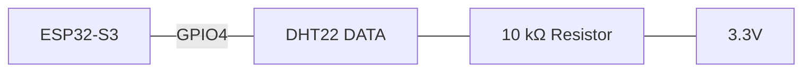
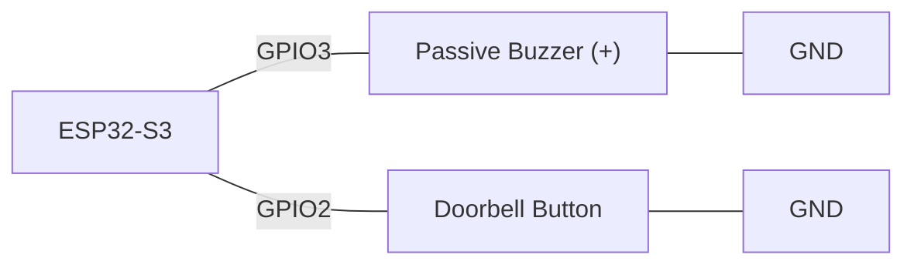
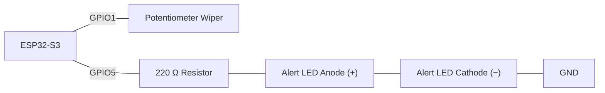
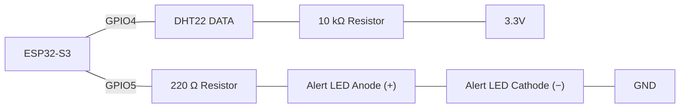

# Week 6: Structured Data (Structs & Dictionaries)

## Introduction
Grouping related values makes data meaningful. A bare number like `23.6` tells you nothing on its own but a record that groups `sensor = "temperature"`, `value = 23.6`, `unit = "C"` and `timestamp = 3` together is self-describing. Last week's parallel arrays (`buttonPins[]`/`ledPins[]`, index `i` always describing one button/LED pair) already hinted at this: two arrays that must always stay in sync are really one record, artificially split apart.  **structs**  user-defined, aggregate data structures to put that record back together, and shows how a small array of key-value structs can stand in for a **dictionary** on a microcontroller, where a real hash map is usually the wrong tool.


## Key Concepts

### Structs - Grouping Related Fields Under One Name

A `struct` groups a fixed set of named fields together as one logical record. Instead of remembering that "index 1 in the array means value," you write `reading.value` and the field name documents itself.

**Syntax:**
```cpp
struct StructName {
  type field1;
  type field2;
  // ...
};                                    // note the trailing semicolon — easy to forget

StructName variableName;              // declare one record, fields uninitialised
StructName variableName = {v1, v2};   // declare AND initialise, in field order
variableName.field1 = value;          // write to one field, using dot notation
value = variableName.field1;          // read one field
```

| Part | Syntax | Meaning |
|---|---|---|
| Definition | `struct StructName { type field1; type field2; };` | Declares a new *type* — a blueprint only, nothing created in memory yet. Fields can each be a different type, unlike an array. |
| Trailing `;` | `};` | Required after the closing brace, because the definition is technically a statement — easy to forget, and forgetting it produces a confusing compiler error on the *next* line, not this one. |
| Declare only | `StructName variableName;` | Creates one actual record in memory; all fields start uninitialised (garbage values), same as `int x;` with no assignment. |
| Declare + initialise | `StructName variableName = {v1, v2};` | Creates and fills a record in one step. Values are matched to fields **by position**, in declaration order — not by name — so listing them out of order silently puts each value in the wrong field. |
| Write a field | `variableName.field1 = value;` | Dot notation — the struct equivalent of `array[i]`, except addressed by field name instead of numeric index. |
| Read a field | `value = variableName.field1;` | Same dot notation, used to read instead of write. |

**Example:**
```cpp
struct Reading {
  String sensor;
  float value;
  String unit;
  unsigned long timestamp;
};

Reading latest = {"temperature", 23.6, "C", 3};
Serial.println(latest.sensor);   // "temperature" — accessed by name, not by index
latest.value = 24.1;             // update just one field
```


#### How it works
Unlike an array, a struct's fields don't have to be the same type  `Reading` mixes `String`, `float`, and `unsigned long` in one record. The compiler lays each field out in memory one after another, and `variableName.field1` is really just "jump to this record's starting address, then the fixed offset where `field1` lives" similarly fast to an array index, but addressed by name instead of position. Because the set of fields and their types is fixed at compile time, a struct's memory footprint is exactly as predictable as a plain array's, which is why it not a general-purpose dictionary is the default choice for structured sensor data on a microcontroller with only a few kilobytes of RAM.

---
**Example**
```cpp
#include <Arduino.h>

// Define a structure named Reading.
// A structure groups related variables into a single record.
struct Reading {
  String sensor;            // Name of the sensor, such as "temperature"
  float value;              // Sensor measurement, such as 23.6
  String unit;              // Measurement unit, such as "C"
  unsigned long timestamp;  // Time when the reading was recorded
};

// Create and initialise a Reading record.
// Values must follow the same order as the fields in the structure.
Reading latest = {"temperature", 23.6, "C", 3};

void setup() {
  // Start Serial communication at 115200 bits per second.
  Serial.begin(115200);

  // Print the original sensor information.
  Serial.print("Sensor: ");
  Serial.println(latest.sensor);  // Access the sensor field using dot notation

  Serial.print("Original value: ");
  Serial.print(latest.value);     // Access and print the value field
  Serial.println(latest.unit);    // Print the measurement unit

  // Update only the value field of the latest record.
  latest.value = 24.1;

  // Print the updated sensor value.
  Serial.print("Updated value: ");
  Serial.print(latest.value);
  Serial.println(latest.unit);

  // Print the time when the reading was recorded.
  Serial.print("Timestamp: ");
  Serial.println(latest.timestamp);
}

void loop() {
  // Nothing is repeated because this example runs only once in setup().
}
```

**Code Walkthrough**
| Section | What it does |
|---|---|
| `struct Reading` | Groups `sensor`, `value`, `unit`, and `timestamp` into one record type. |
| `Reading latest = {...}` | Declares and initialises a single `Reading` record at global scope, values matched to fields by position. |
| `setup()` — first print | Starts Serial at 115200 baud, then prints `latest.sensor` using dot notation. |
| `setup()` — print original value | Prints `latest.value` and `latest.unit` together on one line. |
| `latest.value = 24.1;` | Updates just the `value` field in place — the other three fields are untouched. |
| `setup()` — print updated value | Prints the same `value`/`unit` pair again, now showing the updated reading. |
| `setup()` — print timestamp | Prints `latest.timestamp`, unchanged since it was never reassigned. |
| `loop()` | Empty — this sketch runs once in `setup()` and has nothing to repeat. |

>
> Wokwi link: https://wokwi.com/projects/473995555083265025
>
---

### Structs replace parallel arrays
Week 5's parallel-array pattern (`buttonPins[]` and `ledPins[]`, index `i` always describing one button/LED pair) was really describing one thing: a pairing that must stay in sync. A struct makes that relationship explicit instead of implicit  and removes the entire bug class of "updated one array but forgot the other," because there's only one array now, of one record type.

**Example 1 — Week 5's button/LED pair:**
```cpp
// Before (Week 5): two arrays that must always move together
uint8_t buttonPins[3] = {12, 13, 14};
uint8_t ledPins[3] = {4, 5, 6};   // ledPins[i] is only meaningfully paired with buttonPins[i] by convention

// After (Week 6): one array of one record type
struct ButtonLedPair {
  uint8_t buttonPin;
  uint8_t ledPin;
};

const int NUM_PAIRS = 3;
ButtonLedPair pairs[NUM_PAIRS] = {
  {12, 4},
  {13, 5},
  {14, 6},
};
// pairs[i].buttonPin and pairs[i].ledPin can never fall out of sync — they're one record, not two array slots

void setup() {
  for (int i = 0; i < NUM_PAIRS; i++) {
    pinMode(pairs[i].buttonPin, INPUT_PULLUP);
    pinMode(pairs[i].ledPin, OUTPUT);
  }
}

void loop() {
  for (int i = 0; i < NUM_PAIRS; i++) {
    int pressed = digitalRead(pairs[i].buttonPin) == LOW;   // INPUT_PULLUP: LOW means pressed
    digitalWrite(pairs[i].ledPin, pressed ? HIGH : LOW);    // each LED mirrors its own paired button, by struct — not by index convention
  }
}
```

**Code Walkthrough**
| Section | What it does |
|---|---|
| `struct ButtonLedPair` | Groups one button pin and its paired LED pin into a single record, replacing the two parallel arrays from Week 5. |
| `NUM_PAIRS` / `pairs[]` | An array of three `ButtonLedPair` records, each initialised with a button/LED pin pair. |
| `setup()` | Loops over `pairs[]`, configuring each record's `buttonPin` as `INPUT_PULLUP` and `ledPin` as `OUTPUT`. |
| `loop()` — read | For each pair, reads `pairs[i].buttonPin`; `LOW` means pressed because of `INPUT_PULLUP`. |
| `loop()` — write | Drives `pairs[i].ledPin` `HIGH` when its own paired button is pressed, `LOW` otherwise — always the correct pair, since both pins live in the same record. |

The same idea applies just as well to a sensor log, where a reading has a time *and* a value:

>
> Wokwi link: https://wokwi.com/projects/473326289925248001

**Example 2 — a sensor log:**
```cpp
// Before: two arrays that must always move together
unsigned long timestamps[MAX_READINGS];
int values[MAX_READINGS];

// After (Week 6): one array of one record type
struct Reading {
  unsigned long timestamp;
  int value;
};
Reading readings[MAX_READINGS];
```

**IoT version of Example 2 — a real sensor filling the struct log.** **Components:** ESP32-S3, potentiometer (stands in for an analog sensor).

```cpp
// Structure to bind a timestamp with its corresponding sensor value
struct Reading {
  unsigned long timestamp;
  int value;
};

const int MAX_READINGS = 10;          // Maximum capacity for stored readings
Reading readings[MAX_READINGS];       // Array to store the reading history
int reading_count = 0;                // Current number of valid readings stored

const int sensorPin = 1;              // Analog pin connected to the sensor (e.g., potentiometer)
const unsigned long SAMPLE_INTERVAL = 500; // Time interval between samples in milliseconds (0.5 seconds)
unsigned long previousSampleMillis = 0;    // Timestamp of the last recorded sample

void setup() {
  Serial.begin(115200);                 // Initialize serial communication for debugging
}

void loop() {
  unsigned long currentMillis = millis(); // Track current time without blocking execution
  
  // Check if storage capacity remains and if the sample interval has elapsed
  if (reading_count < MAX_READINGS && currentMillis - previousSampleMillis >= SAMPLE_INTERVAL) {
    previousSampleMillis = currentMillis; // Update the last sample time reference

    // Store timestamp and value together so they never fall out of sync
    readings[reading_count] = {currentMillis, analogRead(sensorPin)};   
    
    // Output the recorded data point to the Serial Monitor
    Serial.println("[" + String(readings[reading_count].timestamp) + "] " + String(readings[reading_count].value));
    
    reading_count++; // Move to the next index in the array
  }
}
```
Every 500ms (checked non-blocking via `millis()`, no `delay()`), one `Reading` is appended to `readings[]` with the sensor value and the moment it was captured, stopping once `MAX_READINGS` slots are full — the same overflow guard used for every fixed-size array in this course. Sorting this log by timestamp as new readings arrive is covered next, in the "Keeping Structured Data Sorted and Searchable" section below.

**Code Walkthrough**
| Section | What it does |
|---|---|
| `struct Reading` | Groups a `timestamp` and a `value` into one record — this version drops `sensor`/`unit` since only one analog sensor is used. |
| `MAX_READINGS` / `readings[]` / `reading_count` | Fixed-capacity array of `Reading` structs plus a counter for how many slots are filled. |
| `sensorPin` | GPIO1 — the potentiometer wiper, standing in for a real analog sensor. |
| `SAMPLE_INTERVAL` / `previousSampleMillis` | Non-blocking timing state — a new sample is only taken once `SAMPLE_INTERVAL` (500ms) has elapsed since the last one. |
| `setup()` | Just starts Serial — no per-pin setup is needed for an analog input. |
| `loop()` — guard | `reading_count < MAX_READINGS && currentMillis - previousSampleMillis >= SAMPLE_INTERVAL` combines the overflow guard and the non-blocking timing check in one condition. |
| `loop()` — sample | `readings[reading_count] = {currentMillis, analogRead(sensorPin)}` writes the timestamp and the sensor reading into one record in a single struct assignment, so they can never fall out of sync. |
| `loop()` — print & advance | Prints the just-stored record, then `reading_count++` moves on to the next free slot. |

>
> Wokwi Link: https://wokwi.com/projects/473955613809115137
>

#### Real-world use in industry
Sensor telemetry packets on an industrial bus (each frame is a fixed-layout record device ID, value, unit, timestamp not four unrelated numbers), configuration records in embedded firmware (a `struct` per device profile), and CAN bus / Modbus message definitions, which are essentially structs with a specified byte layout.

---


### Simulating a Dictionary With a Key-Value Struct Array

A dictionary (or "map") looks up a value by a *name* instead of a numeric index `thresholds["temperature"]` instead of `thresholds[2]`. C++ has no dictionary built into the language the way Python does, and the standard library's `std::map` uses dynamic memory allocation that's usually avoided on a microcontroller for the same predictability reasons a `struct` is preferred over a general dictionary in the first place. The practical stand-in is a small **array of key-value structs**, searched with a plain loop:

**Syntax:**
```cpp
struct KeyValue {
  String key;
  valueType value;
};

KeyValue table[N] = { {"key1", v1}, {"key2", v2}, /* ... */ };

int find_index(String key) {              // linear search — walk the array looking for a match
  for (int i = 0; i < N; i++) {
    if (table[i].key == key) return i;    // found — return its position
  }
  return -1;                              // not found — a sentinel value the caller must check
}
```

**Example:**
```cpp
#include <Arduino.h>

// Define a structure for storing a sensor threshold.
struct Threshold {
  String sensor;  // Sensor name
  float limit;    // Threshold value
};

// Number of threshold records.
const int NUM_THRESHOLDS = 3;

// Create an array containing the sensor thresholds.
Threshold thresholds[NUM_THRESHOLDS] = {
  {"temperature", 28.0},
  {"humidity", 70.0},
  {"light", 800.0}
};

// Search for the threshold belonging to a sensor.
float get_threshold(String sensor) {
  // Check each record in the thresholds array.
  for (int i = 0; i < NUM_THRESHOLDS; i++) {

    // Return the limit if the sensor name matches.
    if (thresholds[i].sensor == sensor) {
      return thresholds[i].limit;
    }
  }

  // Return -1.0 if the sensor was not found.
  return -1.0;
}

void setup() {
  // Start communication with the Serial Monitor.
  Serial.begin(115200);

  // Get the temperature threshold.
  float limit = get_threshold("temperature");

  // Check whether the sensor was found.
  if (limit != -1.0) {
    Serial.print("Temperature threshold: ");
    Serial.println(limit);
  } else {
    Serial.println("Temperature threshold not found.");
  }
}

void loop() {
  // Nothing needs to repeat, but loop() is still required.
}
```

**Code Walkthrough**
| Section | What it does |
|---|---|
| `struct Threshold` | Groups a sensor name (`sensor`, the key) with its numeric `limit` (the value) — one key-value pair. |
| `NUM_THRESHOLDS` / `thresholds[]` | The dictionary itself: a 3-entry array of `Threshold` records for temperature, humidity, and light. |
| `get_threshold()` | Linear search — loops through `thresholds[]` comparing `sensor` against the requested name; returns the matching `limit`, or the sentinel `-1.0` if nothing matches. |
| `setup()` — lookup | Calls `get_threshold("temperature")` to fetch that sensor's limit. |
| `setup()` — sentinel check | `if (limit != -1.0)` checks the sentinel before trusting the result, printing the limit only if a real match was found, otherwise printing a "not found" message. |
| `loop()` | Empty — required by Arduino, but nothing repeats in this demonstration. |

#### Why a sentinel return value matters
`find_index()` and `get_threshold()` above both return a fixed value (`-1`, `-1.0`) when nothing matches. This is the same "did it actually work?" problem the `isnan()` check solved for a failed DHT22 read  the caller must always check the sentinel before using the result, or a "not found" case silently gets treated as a real answer (e.g. a threshold of `-1.0` being read as an actual limit rather than "no such sensor").

#### Linear search vs. a real dictionary
A linear search checks each entry in turn, so looking something up takes longer the more entries there are fine for the handful of sensors or settings a small embedded project needs, but it's the reason a real hash-map-backed dictionary (constant-time lookup regardless of size) is worth the extra memory once a table grows into the hundreds or thousands of entries, which is far more than this course's device-side tables ever hold.

#### Real-world use in industry
A device's small settings/configuration table (name → value pairs read from EEPROM or flash at boot), a lookup table mapping an error code to a human-readable message string, and register-name-to-address tables in driver code for talking to a sensor over I²C/SPI.

---

### Keeping Structured Data Sorted and Searchable

A collection of records is only as useful as your ability to find what you need in it. Keeping the array sorted by a chosen field (e.g. timestamp) **as new records are added**  rather than sorting only when asked makes the structure ready for efficient searching later in this course, once binary search (which requires sorted data) is introduced.

**Example  insertion sort on every new record:**
```cpp
void log_reading(String sensor_name, float value, String unit, unsigned long timestamp) {
  if (reading_count >= MAX_READINGS) return;
  readings[reading_count] = {sensor_name, value, unit, timestamp};
  reading_count++;

  // keep the log ordered by timestamp: bubble the newest entry left until it's in place
  int i = reading_count - 1;
  while (i > 0 && readings[i - 1].timestamp > readings[i].timestamp) {
    Reading temp = readings[i];
    readings[i] = readings[i - 1];
    readings[i - 1] = temp;
    i--;
  }
}
```
This is a form of **insertion sort**: rather than re-sorting the whole array from scratch after every insert, only the one newly-added record needs to move every record already in the array was already in order before this insert, so it's compared against its left neighbour and swapped backward until it finds its correct spot, then the loop stops. Because a struct assignment (`readings[i] = readings[i-1]`) copies every field at once, this works exactly the same way regardless of how many fields the struct has.

**Full example — logging three out-of-order readings:**
```cpp
#include <Arduino.h>

// Define the structure used to store one sensor reading.
struct Reading {
  String sensor;            // Sensor name, such as "temperature"
  float value;              // Measured value
  String unit;              // Measurement unit, such as "C"
  unsigned long timestamp;  // Time when the reading was recorded
};

// Maximum number of readings that can be stored.
const int MAX_READINGS = 10;

// Create an array capable of storing 10 Reading records.
Reading readings[MAX_READINGS];

// Store the current number of readings in the array.
int reading_count = 0;

// Add a new reading and keep the array ordered by timestamp.
void log_reading(
  String sensor_name,
  float value,
  String unit,
  unsigned long timestamp
) {
  // Stop if the array is full.
  if (reading_count >= MAX_READINGS) {
    return;
  }

  // Add the new reading to the next available position.
  readings[reading_count] = {
    sensor_name,
    value,
    unit,
    timestamp
  };

  // Increase the number of stored readings.
  reading_count++;

  // Get the position of the newly added reading.
  int i = reading_count - 1;

  // Move the new reading left until it is in the correct
  // timestamp order, from earliest to latest.
  while (
    i > 0 &&
    readings[i - 1].timestamp > readings[i].timestamp
  ) {
    // Save the current reading temporarily.
    Reading temp = readings[i];

    // Swap the two readings.
    readings[i] = readings[i - 1];
    readings[i - 1] = temp;

    // Check the next position to the left.
    i--;
  }
}

// Print all stored readings.
void print_readings() {
  Serial.println("Stored readings:");

  // Visit every occupied position in the array.
  for (int i = 0; i < reading_count; i++) {
    Serial.print("Sensor: ");
    Serial.print(readings[i].sensor);

    Serial.print(", Value: ");
    Serial.print(readings[i].value);

    Serial.print(" ");
    Serial.print(readings[i].unit);

    Serial.print(", Timestamp: ");
    Serial.println(readings[i].timestamp);
  }
}

void setup() {
  // Start communication with the Serial Monitor.
  Serial.begin(115200);

  // Add readings in an unordered timestamp sequence.
  log_reading("temperature", 23.6, "C", 3000);
  log_reading("humidity", 48.0, "%", 1000);
  log_reading("light", 800.0, "lux", 2000);

  // Print the readings after they have been sorted.
  print_readings();
}

void loop() {
  // Nothing needs to repeat.
}
```
Insertion order is temperature(3000) → humidity(1000) → light(2000), but because `log_reading()` re-sorts after every insert, `print_readings()` outputs them in timestamp order instead: humidity(1000), light(2000), temperature(3000).

**Code Walkthrough**
| Section | What it does |
|---|---|
| `struct Reading` | Groups one reading's `sensor` name, `value`, `unit`, and `timestamp` together as a single record instead of four separate values. |
| `MAX_READINGS` / `readings[]` | Fixed-capacity array of `Reading` structs — the sensor log itself, sized to hold at most 10 entries. |
| `reading_count` | Tracks how many of the 10 slots are currently filled; also doubles as the index of the next free slot. |
| `log_reading()` — overflow guard | `if (reading_count >= MAX_READINGS) return;` stops silently once the array is full, the same fixed-array overflow guard used throughout the course. |
| `log_reading()` — append | `readings[reading_count] = {...}` writes the new record into the next free slot using struct initializer syntax, then `reading_count++` marks that slot as used. |
| `log_reading()` — insertion sort | Starting at `i = reading_count - 1` (the just-inserted record), the `while` loop compares it against its left neighbour's `timestamp`. As long as the neighbour's timestamp is later than the new record's, they swap and `i` moves one step left — bubbling the new reading into its correct chronological position among records that were already sorted. |
| `Reading temp = readings[i]; ...` | A three-line swap using a temporary variable — because it's a struct assignment, all four fields move together in one line each, never risking one field getting out of sync with the rest. |
| `print_readings()` | Loops from `0` to `reading_count` (not `MAX_READINGS` — only visits filled slots) and prints each record's fields via dot notation, one `Reading` per line. |
| `setup()` | Calls `log_reading()` three times with timestamps out of order (3000, 1000, 2000) to demonstrate the sort, then calls `print_readings()` once. |
| `loop()` | Empty — this sketch logs and prints once at startup, nothing needs to repeat. |

#### Real-world use in industry
An event log that must always display in time order as new events arrive (alarms, audit trails), a leaderboard that re-ranks itself after every new score without a full re-sort, and any streaming/incremental data pipeline that must stay ordered without re-processing everything already received.

>
> Wokwi Link : https://wokwi.com/projects/473995555083265025
>
---
## Code Examples
Each example below is a complete, self-contained sketch built around real hardware you can wire up in Wokwi — not just Serial-only demonstrations. Build each circuit separately.

### Example 1 - Struct-Based Sensor Log (DHT22), Kept Sorted on Every Insert

**Components:** ESP32-S3, DHT22 sensor, 10 kΩ resistor.

**Wiring:**


```cpp
#include <DHT.h>              // Adafruit DHT sensor library — reads the DHT22's timed one-wire protocol

#define DHTPIN 4               // DHT22 DATA pin
#define DHTTYPE DHT22          // Sensor model, used by the library to decode its signal correctly
DHT dht(DHTPIN, DHTTYPE);      // Create the DHT sensor object

// One record: everything about a single sensor reading, grouped together
struct Reading {
  String sensor;               // Which sensor/quantity this reading is ("temperature", "humidity", ...)
  float value;                 // The measured value
  String unit;                 // Unit the value is measured in ("C", "%", ...)
  unsigned long timestamp;     // When the reading was captured
};

const int MAX_READINGS = 20;   // Fixed capacity of the log
Reading readings[MAX_READINGS]; // The log itself: an array of structs
int reading_count = 0;          // How many of those slots are currently filled

// Adds one reading to the log, then re-sorts it into timestamp order
void log_reading(String sensor_name, float value, String unit, unsigned long timestamp) {
  if (reading_count >= MAX_READINGS) return;   // overflow guard — same pattern as any fixed array (Week 5)
  readings[reading_count] = {sensor_name, value, unit, timestamp};   // append the new record
  reading_count++;

  // Insertion sort: bubble the newest entry left until it's in its correct timestamp position
  int i = reading_count - 1;
  while (i > 0 && readings[i - 1].timestamp > readings[i].timestamp) {
    Reading temp = readings[i];        // swap the new record...
    readings[i] = readings[i - 1];     // ...with its left neighbour...
    readings[i - 1] = temp;            // ...one step at a time, until it's in place
    i--;
  }
}

// Prints every logged record, in sorted (timestamp) order
void display_readings() {
  for (int i = 0; i < reading_count; i++) {
    Serial.println("[" + String(readings[i].timestamp) + "] " +
                    readings[i].sensor + ": " + String(readings[i].value) + readings[i].unit);
  }
}

void setup() {
  Serial.begin(115200);
  dht.begin();                 // Start the DHT22

  float humidity = dht.readHumidity();       // Real sensor read — humidity in %
  float temperature = dht.readTemperature(); // Real sensor read — temperature in °C
  if (isnan(humidity) || isnan(temperature)) {   // guard exactly as taught in Week 3 — a failed read must never be logged as a real value
    Serial.println("Failed to read from DHT22 sensor!");
    return;
  }

  // timestamps are hardcoded here (not millis()) purely so the sort is visible in the Serial output — see note below
  log_reading("temperature", temperature, "C", 3);
  log_reading("humidity", humidity, "%", 1);
  display_readings();   // prints humidity (t=1) before temperature (t=3), despite insert order
}

void loop() {
  // nothing to repeat — this example logs once at startup and prints the sorted result
}
```
The `value` and `unit` fields here come from a real DHT22 read, but `timestamp` is still passed in as a plain small number (`3`, `1`) purely so the sort order is obvious to read in the Serial output. In a real build, `log_reading()` would typically call `millis()` itself the moment it's invoked, rather than accepting a timestamp from the caller — the parameter version here is just for demonstration; your own struct's field order and how you generate a timestamp are up to you.

**Code Walkthrough**
| Section | What it does |
|---|---|
| `DHTPIN` / `DHTTYPE` / `dht` | Configures the DHT22 library object on GPIO4 |
| `struct Reading` | Groups `sensor`, `value`, `unit` and `timestamp` together as one record |
| `readings[]` / `reading_count` | The struct array acting as the sensor log, and how many slots are filled |
| `log_reading()` | Appends a new record, then bubbles it left (insertion sort) until `readings[]` is back in timestamp order |
| `display_readings()` | Prints every logged record, in sorted order, by walking `readings[]` |
| `setup()` | Reads real temperature/humidity from the DHT22, guards with `isnan()`, then logs and displays two records — using manually-chosen timestamps so the reordering is visible |

>
> Wokwi Link: https://wokwi.com/projects/473956741868447745
>
---
### Example 2 - Array of Structs as a Doorbell Melody

**Components:** ESP32-S3, passive buzzer, push button.

**Wiring:**


```cpp
// One record: everything about a single note, grouped together
struct Note {
  int frequency;   // pitch, in Hz
  int duration;    // how long to hold the note, in ms
};

const int buzzerPin = 3;      // passive buzzer — must use tone()/noTone(), never digitalWrite()
const int buttonPin = 2;      // doorbell button

const int MELODY_LENGTH = 3;
Note melody[MELODY_LENGTH] = {   // the tune: an array of Note structs, not two parallel arrays
  {262, 200},   // C4
  {330, 200},   // E4
  {392, 400},   // G4
};

int lastButtonReading = HIGH;   // previous raw button state, used to detect a fresh press

// Plays every note in melody[], in order
void play_melody() {
  for (int i = 0; i < MELODY_LENGTH; i++) {
    tone(buzzerPin, melody[i].frequency, melody[i].duration);   // frequency and duration read straight off the struct
    delay(melody[i].duration + 50);   // short gap so consecutive notes are distinguishable
  }
  noTone(buzzerPin);   // make sure the buzzer is silent once the tune ends
}

void setup() {
  pinMode(buttonPin, INPUT_PULLUP);   // button reads LOW when pressed, HIGH when released
}

void loop() {
  int buttonReading = digitalRead(buttonPin);
  if (buttonReading == LOW && lastButtonReading == HIGH) {   // chime once per press, not once per pass while held
    play_melody();
  }
  lastButtonReading = buttonReading;   // remember this pass's reading for the next comparison
}
```
Each element of `melody[]` carries both a `frequency` *and* a `duration` together — exactly the case a struct is for, versus two parallel arrays (`frequencies[]`, `durations[]`) that could fall out of sync. As with any passive buzzer, use `tone()`/`noTone()` — never `digitalWrite()`. The button press turns this into a doorbell chime: a genuine, if small, IoT device.

**Code Walkthrough**
| Section | What it does |
|---|---|
| `struct Note` | Groups a note's `frequency` and `duration` together as one record |
| `melody[]` / `MELODY_LENGTH` | The array of notes to play, and how many there are |
| `play_melody()` | Loops through `melody[]`, sounding each note in turn with `tone()`, then `noTone()` once the tune ends |
| `lastButtonReading` | Remembers the previous raw button state so the chime fires once per press, not once per loop pass while held |
| `loop()` | Detects a HIGH-to-LOW transition (a fresh press) on `buttonPin` and calls `play_melody()` |

>
> Wokwi Link: https://wokwi.com/projects/473957449017751553
>

---
### Example 3 - Key-Value Struct Array Simulating a Dictionary

**Components:** ESP32-S3, potentiometer (stands in for a light sensor), LED, 220 Ω resistor.

**Wiring:**


```cpp
// One record: a single sensor name mapped to its limit — the key-value pair a dictionary is built from
struct Threshold {
  String sensor;   // the key — sensor name to look up by
  float limit;     // the value — that sensor's threshold
};

const int NUM_THRESHOLDS = 1;             // how many entries the table holds
Threshold thresholds[NUM_THRESHOLDS] = {  // the dictionary itself: an array of key-value structs
  {"light", 800.0},
};

const int lightPin = 1;    // potentiometer wiper, standing in for a light sensor
const int alertPin = 5;    // LED — lights whenever the reading exceeds its threshold
const unsigned long CHECK_INTERVAL = 500;   // how often to poll the sensor, in ms
unsigned long previousCheckMillis = 0;      // last time the sensor was checked

// Linear search: walks thresholds[] looking for a matching sensor name
float get_threshold(String sensor) {
  for (int i = 0; i < NUM_THRESHOLDS; i++) {
    if (thresholds[i].sensor == sensor) return thresholds[i].limit;   // found — return its limit
  }
  return -1.0;   // sentinel — caller must check before trusting this
}

void setup() {
  Serial.begin(115200);
  pinMode(alertPin, OUTPUT);
}

void loop() {
  unsigned long currentMillis = millis();
  if (currentMillis - previousCheckMillis >= CHECK_INTERVAL) {   // non-blocking timing — no delay()
    previousCheckMillis = currentMillis;

    float lightLevel = map(analogRead(lightPin), 0, 4095, 0, 1000);   // simulate a 0-1000 light sensor
    float limit = get_threshold("light");                            // dictionary lookup by name
    bool exceeded = (limit >= 0 && lightLevel > limit);               // sentinel checked before it's trusted

    digitalWrite(alertPin, exceeded ? HIGH : LOW);   // alert LED reflects the current reading
    if (exceeded) {
      Serial.println("Light threshold exceeded: " + String(lightLevel));
    }
  }
}
```
The dictionary lookup itself — `get_threshold("light")` walking `thresholds[]` with a linear search — is unchanged from the syntax example earlier in this lesson; what's new here is that `lightLevel` comes from a real analog sensor instead of a hardcoded test value, and the sentinel-checked result drives a real LED, not just a `Serial.println()`.

**Code Walkthrough**
| Section | What it does |
|---|---|
| `struct Threshold` / `thresholds[]` | The key-value struct array simulating a dictionary of per-sensor limits |
| `get_threshold()` | Linear-searches `thresholds[]` by sensor name, returning the sentinel `-1.0` if no match is found |
| `lightPin` / `alertPin` | The potentiometer (simulated light sensor) input pin and the alert LED output pin |
| `CHECK_INTERVAL` / `previousCheckMillis` | Non-blocking timing — polls the sensor only every 500ms, without a blocking `delay()` |
| `loop()` | Reads and maps the potentiometer, looks up the `"light"` threshold, and drives the alert LED whenever it's exceeded |

>
> Wokwi Link: https://wokwi.com/projects/473958323838595073
>

---
### Example 4 - Combining the Log and the Dictionary: DHT22 Logging With an Immediate Threshold Alert

**Components:** ESP32-S3, DHT22 sensor, 10 kΩ resistor, LED, 220 Ω resistor.

**Wiring:**


```cpp
#include <DHT.h>              // Adafruit DHT sensor library — reads the DHT22's timed one-wire protocol

#define DHTPIN 4               // DHT22 DATA pin
#define DHTTYPE DHT22          // Sensor model, used by the library to decode its signal correctly
DHT dht(DHTPIN, DHTTYPE);      // Create the DHT sensor object

// One record: a single logged reading — the sorted-log side of this example
struct Reading {
  String sensor;              // Which sensor/quantity this reading is ("temperature", "humidity")
  float value;                // The measured value
  unsigned long timestamp;    // When the reading was captured
};

// One record: a single sensor name mapped to its limit — the dictionary side of this example
struct Threshold {
  String sensor;   // the key — sensor name to look up by
  float limit;     // the value — that sensor's threshold
};

const int MAX_READINGS = 10;     // Fixed capacity of the log
Reading readings[MAX_READINGS];  // The log itself: an array of structs
int reading_count = 0;           // How many of those slots are currently filled

const int NUM_THRESHOLDS = 2;             // how many entries the dictionary holds
Threshold thresholds[NUM_THRESHOLDS] = {  // the dictionary itself: an array of key-value structs
  {"temperature", 28.0},
  {"humidity", 70.0},
};

const int alertPin = 5;                     // LED — lights whenever either reading exceeds its threshold
const unsigned long READ_INTERVAL = 2000;   // DHT22 can only be read reliably about once every 2 seconds
unsigned long previousReadMillis = 0;       // last time the DHT22 was read

// Linear search: walks thresholds[] looking for a matching sensor name
float get_threshold(String sensor) {
  for (int i = 0; i < NUM_THRESHOLDS; i++) {
    if (thresholds[i].sensor == sensor) return thresholds[i].limit;   // found — return its limit
  }
  return -1.0;   // sentinel — caller must check before trusting this
}

// Adds one reading to the sorted log, then checks it against the dictionary
void log_reading(String sensor_name, float value, unsigned long timestamp) {
  if (reading_count >= MAX_READINGS) return;   // overflow guard — same pattern as any fixed array (Week 5)
  readings[reading_count] = {sensor_name, value, timestamp};   // append the new record
  reading_count++;

  // Insertion sort: bubble the newest entry left until it's in its correct timestamp position
  int i = reading_count - 1;
  while (i > 0 && readings[i - 1].timestamp > readings[i].timestamp) {
    Reading temp = readings[i];        // swap the new record...
    readings[i] = readings[i - 1];     // ...with its left neighbour...
    readings[i - 1] = temp;            // ...one step at a time, until it's in place
    i--;
  }

  float limit = get_threshold(sensor_name);          // dictionary lookup by name
  if (limit >= 0 && value > limit) {                  // sentinel checked before it's trusted
    Serial.println(sensor_name + " reading " + String(value) + " exceeds threshold " + String(limit) + "!");
  }
}

void setup() {
  Serial.begin(115200);
  dht.begin();                 // Start the DHT22
  pinMode(alertPin, OUTPUT);
}

void loop() {
  unsigned long currentMillis = millis();
  if (currentMillis - previousReadMillis >= READ_INTERVAL) {   // non-blocking timing — no delay()
    previousReadMillis = currentMillis;

    float humidity = dht.readHumidity();        // Real sensor read — humidity in %
    float temperature = dht.readTemperature();  // Real sensor read — temperature in °C
    if (isnan(humidity) || isnan(temperature)) {   // guard exactly as taught in Week 3
      Serial.println("Failed to read from DHT22 sensor!");
      return;
    }

    log_reading("temperature", temperature, currentMillis);   // logs and threshold-checks temperature
    log_reading("humidity", humidity, currentMillis);         // logs and threshold-checks humidity

    // Combine both exceeded-flags here, rather than inside log_reading(), so the second call
    // (humidity) can't silently overwrite whatever the first call (temperature) just set
    bool alert = (temperature > get_threshold("temperature")) || (humidity > get_threshold("humidity"));
    digitalWrite(alertPin, alert ? HIGH : LOW);
  }
}
```
This is the pattern the rest of the course's builds are graded on: every new value logged into the sorted struct array is immediately checked against a name-keyed threshold table, with the sentinel checked before it's trusted. Nothing here is a new concept — it's the previous three examples (a real sensor feeding a sorted struct log, and a real output driven by a dictionary lookup) used together, exactly as the Hands-On Activity and Cluster Integration Activity below expect. The alert LED is driven once per `loop()` pass from both readings together, rather than inside `log_reading()` itself otherwise the second call (humidity) would silently overwrite whatever the first call (temperature) had just set.

**Code Walkthrough**
| Section | What it does |
|---|---|
| `struct Reading` / `struct Threshold` | The sorted log record and the dictionary record, combined in one sketch |
| `readings[]` / `thresholds[]` | The struct log and the threshold table |
| `get_threshold()` | Linear-search lookup by sensor name, returning the sentinel `-1.0` when nothing matches |
| `log_reading()` | Inserts a new record in sorted order (insertion sort) and prints a Serial alert if it exceeds its threshold |
| `READ_INTERVAL` / `previousReadMillis` | Non-blocking timing — the DHT22 is read no more than once every 2 seconds |
| `loop()` | Reads the DHT22, guards with `isnan()`, logs both readings, then drives the alert LED from both readings' exceeded-flags combined |

>
> Wokwi Link: https://wokwi.com/projects/473959438435232769
>

---
---

# Vocabulary
| Term | Definition |
|---|---|
| Struct | A user-defined type that groups a fixed set of named fields together as one record. |
| Field / member | One named value inside a struct, accessed with dot notation (`record.field`). |
| Dot notation | The `record.field` syntax used to read or write one field of a struct. |
| Aggregate data structure | A structure that groups multiple values (of possibly different types) under one name — a struct is the C++ example. |
| Array of structs | A fixed-size collection of records of the same struct type, indexed like any other array (`records[i].field`). |
| Key-value pair | A record associating a lookup name (the key) with a value, the basic unit a dictionary is built from. |
| Dictionary / map | A collection that looks up values by name (key) rather than by numeric position; simulated in C++ with a key-value struct array and a linear search. |
| Linear search | Searching a collection by checking each element in turn until a match is found (or the end is reached). |
| Sentinel value | A specific return value (e.g. `-1`) used to signal "not found," which the caller must check before trusting the result. |
| Insertion sort | A sorting approach that inserts each new element directly into its correct position among the already-sorted elements, rather than re-sorting everything from scratch. |


