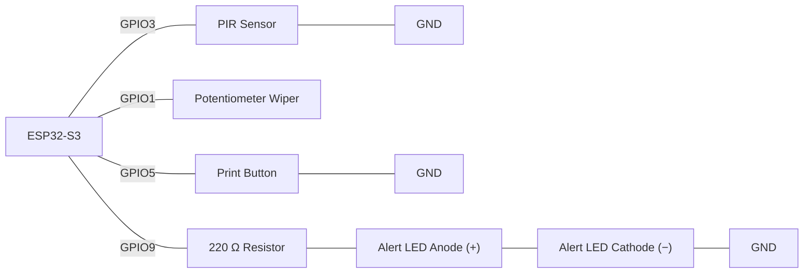

# Task - Structured Data (Structs & Dictionaries) 

Build a non-blocking motion-event logger that stores every detected event as a struct record kept sorted by timestamp, shows how many events have been logged on an LED, and looks up a per-zone alert threshold by name from a small key-value struct table.

**Scenario:**

A workshop bench station watches a PIR sensor covering one named zone ("bench"). Each time motion is newly detected (not on every pass while it stays present), the event is logged as one struct record a timestamp and a simulated intensity reading taken from a potentiometer at that instant inserted so the log always stays in timestamp order. An LED lights whenever the zone's logged intensity exceeds an alert threshold looked up by the zone's name from a small table, rather than a hard-coded number. A button lets staff print the full log to Serial on demand.

**Components required:**
- ESP32-S3 development board
- 1 × PIR sensor
- 1 × potentiometer
- 1 × push button (`INPUT_PULLUP`) — print log on demand
- 1 × LED (alert indicator)
- 1 × 220 Ω resistor
- Jumper wires, breadboard

>
> **Wiring:**
>



**Requirements:**
- Define `struct Event { unsigned long timestamp; int intensity; };` and declare `const int MAX_EVENTS = 10;`, `Event events[MAX_EVENTS];`, and `int event_count`.
- Edge-detect the PIR reading (track a `lastMotionState`) so a new event is logged only on the transition from no-motion to motion not on every pass while motion continues.
- On a newly detected event: read the potentiometer, call `log_event()` to build one `Event` record with `millis()` and the reading, append it (guarded against exceeding `MAX_EVENTS`), then run an insertion step that swaps the whole record leftward past any earlier event with a **larger** timestamp the log must stay sorted by timestamp after every single insert, not re-sorted from scratch.
- Define `struct ZoneThreshold { String zone; int limit; };` and a small table (at least one entry, `{"bench", <a chosen limit>}`). Write `int get_threshold(String zone)` that linearly searches the table and returns the matching `limit`, or `-1` if the zone isn't found.
- In `loop()`, light the alert LED whenever the most recently logged event's `intensity` exceeds `get_threshold("bench")` check the sentinel before trusting the lookup.
- Edge-detect the button so a fresh press calls `print_log()`, printing every stored event's `timestamp` and `intensity` in order.
- Do not use `delay()` anywhere in `loop()` the PIR and button must both be read every single pass.


>
> Wokwi Link : https://wokwi.com/projects/473961269590110209

**Finished:** https://wokwi.com/projects/474038550328820737

### Questions

- Why does `log_event()` need to hold the newly-built `Event` record in a temporary variable before the insertion loop, rather than writing straight into `events[event_count]` and shifting other records around it?
  ```
  Because we do this before the insertion, we can safely hold the newly-built Event while the other events are shifted around. This keeps the events in the correct order, so for example instead of 100, 200, 113, it will be 100, 113, 200. This means when the events are printed, they will be in the correct timestamp order.
  ```

- What would happen to the logged data if the PIR reading were used directly (`if (motionDetected)`) instead of edge-detected against `lastMotionState`?
  ```
  That way it will create duplicate entries, and it will keep spamming the log with HIGH readings, which will cause a problem of spamming instead of a more manageable and cleaner way. We made it so that when the motion is detected, we would get only one log instead of spamming.
  ```

- Why does `get_threshold()` need to return a sentinel value like `-1` for an unrecognised zone name, rather than just returning `0`?
  ```
  This is a check to know whether the zone is found or not found. For example, if we made it 0 and the bench threshold is 0 already, it would give it to us and we wouldn't know whether this is found or not found, so the check system will just be ruined. While if we do -1, we use it as a special value to mean not found, so if a zone doesn't exist, we would know because it will return -1.

  ```

- Why does `log_event()` need to check `event_count` against `MAX_EVENTS` before writing, rather than trusting the array is always big enough?
  ```
  We check event_count against MAX_EVENTS because the array can only hold 10 events. If we don't check and try to add more than 10 events, we could write outside the array and cause problems.

  ```

- In `print_log()`, why does the loop condition need to be `i < event_count` rather than `i < MAX_EVENTS`?
  ```
  Because MAX_EVENTS is the maximum number of events that the array can hold, which is 10, but we don't want to print all 10. We need to print event_count because they are the events that are actually used.

  ```

- Why can't `delay()`-based code (from Week 4) be used anywhere in this program's `loop()`?
  ```
  delay() is used in a simple program. Now since we are trying to use multiple components at the same time, using delay() will cause a lot of probelms becasue it will keep stopping/blocking the program each time the program goes through the code.

  ```

### Spot-the-Bug Worksheet

**Format:** For each round, read the snippet and write down what's wrong **before** revealing the answer.

**Round 1:**
```cpp
struct Event {
  unsigned long timestamp;
  int intensity;
}

Event events[MAX_EVENTS];
```
<details><summary>Answer</summary>The struct definition is missing its trailing semicolon after the closing brace. <code>struct Event { ... };</code> needs a <code>;</code> immediately after <code>}</code> — without it, the compiler fails trying to parse what follows as part of the same declaration.</details>

**Round 2:**
```cpp
struct ZoneThreshold {
  String zone;
  int limit;
};

int get_threshold(String zone) {
  for (int i = 0; i < NUM_ZONES; i++) {
    if (thresholds[i].zone == zone) {
      return thresholds[i].limit;
    }
  }
}
```
<details><summary>Answer</summary>There's no <code>return</code> after the loop for the case where no zone matches — the function falls off the end without a defined sentinel value, so callers have nothing reliable to check for "zone not found." It needs a <code>return -1;</code> (or similar sentinel) after the loop.</details>

**Round 3:**
```cpp
void loop() {
  bool motionDetected = digitalRead(pirPin) == HIGH;

  if (motionDetected) {
    log_event();
  }
}
```
<details><summary>Answer</summary>There's no edge detection — <code>log_event()</code> is called on <em>every single pass</em> of <code>loop()</code> for as long as motion stays detected, flooding the array with dozens of near-identical entries for what was really one event, and quickly exhausting <code>MAX_EVENTS</code>. It needs to compare against a stored <code>lastMotionState</code> and only log on the rising edge.</details>

**Round 4:**
```cpp
void log_event(unsigned long t, int intensity) {
  events[event_count] = {t, intensity};
  event_count++;

  int i = event_count - 1;
  while (i > 0 && events[i - 1].timestamp > events[i].timestamp) {
    events[i] = events[i - 1];
    i--;
  }
}
```
<details><summary>Answer</summary>There's no check against <code>MAX_EVENTS</code> before writing to <code>events[event_count]</code>. Once <code>event_count</code> reaches the array's capacity, this writes past the end of the array — a guard such as <code>if (event_count &gt;= MAX_EVENTS) return;</code> is needed at the top of the function.</details>

**Round 5:**
```cpp
struct Event {
  unsigned long timestamp;
  int intensity;
};

Event a = {1000, 512};
Event b = {1000, 512};

if (a == b) {
  Serial.println("Duplicate event");
}
```
<details><summary>Answer</summary>C++ does not automatically define <code>==</code> for a user-defined struct — comparing two struct variables directly with <code>==</code> does not compile (or does not compare field values as intended) unless <code>operator==</code> is explicitly written for that struct. Each field needs to be compared individually instead: <code>if (a.timestamp == b.timestamp && a.intensity == b.intensity)</code>.</details>

**Round 6:**
```cpp
int get_threshold(String zone) {
  for (int i = 0; i <= NUM_ZONES; i++) {
    if (thresholds[i].zone == zone) return thresholds[i].limit;
  }
  return -1;
}
```
<details><summary>Answer</summary>The loop condition should be <code>i &lt; NUM_ZONES</code>, not <code>i &lt;= NUM_ZONES</code>. As written, the loop also checks <code>thresholds[NUM_ZONES]</code> — one slot past the end of the array — which is out of bounds.</details>

**Round 7:**
```cpp
void print_log() {
  for (int i = 0; i < event_count; i++) {
    Serial.print(events[i].timestamp);
    Serial.print(" ");
    Serial.println(events[i].limit);
  }
}
```
<details><summary>Answer</summary><code>events[i]</code> is an <code>Event</code>, whose fields are <code>timestamp</code> and <code>intensity</code> — it has no <code>limit</code> field (that field belongs to the unrelated <code>ZoneThreshold</code> struct). This is a compile error, and the fix is to print <code>events[i].intensity</code> instead.</details>
